### [Diagram] Analyze the following C# code base. Generate the appropriate Mermaid diagrams, a sequence diagram, an application flowchart(s), and class diagrams based on the provided source code. Please also create valid mermaid C4 Diagrams If their are other Mermaid diagrams that would help to understand the provided code base.
> **Date Generated**: 9/13/2026 10:02:09 AM
> ## Question: 
> Analyze the following C# code base. Generate the appropriate Mermaid diagrams, a sequence diagram, an application flowchart(s), and class diagrams based on the provided source code. Please also create valid mermaid C4 Diagrams If their are other Mermaid diagrams that would help to understand the provided code base.
> **Method Call Duration**: 45:11
 ## Response: 
# Ragnar – Repository Augmented Generator & Resolver: Architecture Diagrams

## 1. C4 Context Diagram

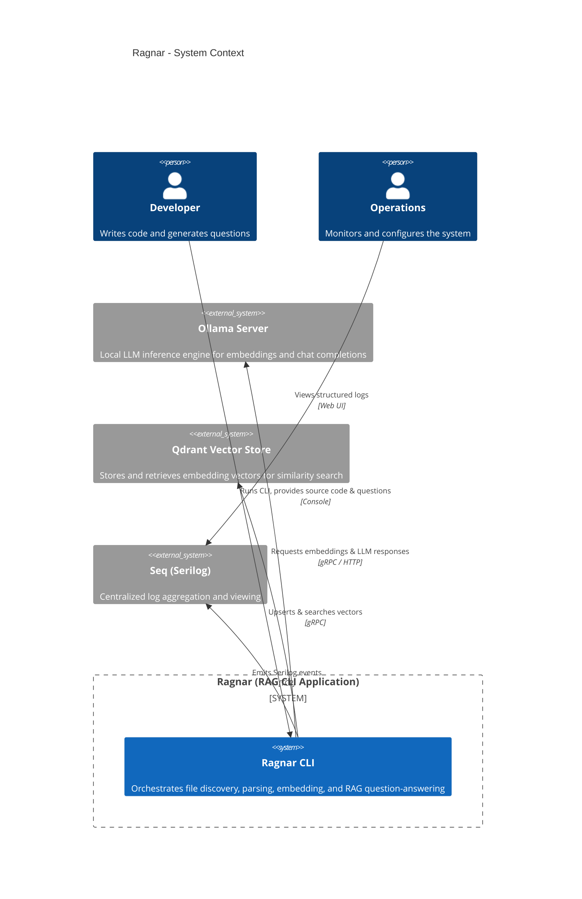

## 2. C4 Container Diagram

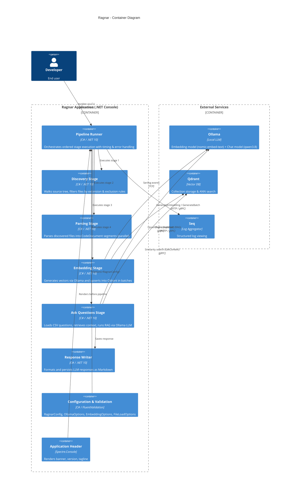

## 3. C4 Component Diagram (Ragnar Core)

```mermaid
C4Component
    title Ragnar - Component Diagram (Core Pipeline)

    Container_Ext(cli, "CLI Entry Point", "Console App")

    Component(pipeline_runner, "PipelineRunner", "Orchestrator", "Sequential stage execution, timing, error wrapping")
    Component(discovery_stage, "DiscoveryStage", "Stage 1", "Directory walk, extension filter, exclusion list")
    Component(parsing_stage, "ParsingStage", "Stage 2", "Parallel file → CodeDocument parsing via IFileParseFactory")
    Component(vector_stage, "VectorStoreStage", "Stage 3", "Embed + upsert to Qdrant in batches")
    Component(question_stage, "QuestionExecutionStage", "Stage 4", "CSV questions → RAG query → LLM response")
    Component(response_writer, "ResponseWriter", "Output", "Markdown file persistence per category")

    Component(ollama_factory, "OllamaClientFactory", "Infrastructure", "Caches OllamaApiClient per service type")
    Component(embedding_svc, "OllamaEmbeddingService", "Infrastructure", "Single & batch embedding with timeout CTS")
    Component(vector_repo, "VectorStoreRepository", "Infrastructure", "Batched upsert to Qdrant with per-batch error recovery")
    Component(question_provider, "CsvFileQuestionProvider", "Data Access", "CSV → Question objects via IRecordParser")
    Component(question_aggregator, "IQuestionSourceAggregator", "Builder", "Combines categories, files, filters → sorted questions")
    Component(vector_search, "IVectorSearchService", "Retrieval", "ANN similarity search in Qdrant")
    Component(prompt_provider, "IChatPromptProvider", "Prompts", "System + user prompt templates")
    Component(summary_svc, "ISummarizePromptProvider", "Prompts", "High-level code summary generation")

    Component(config, "RagnarConfig", "Configuration", "ApplicationOptions, EmbeddingOptions, OllamaOptions, FileLoadOptions")
    Component(validator, "OllamaOptionsValidator", "Validation", "FluentValidation rules for host, port, timeout, model")
    Component(file_parser, "BaseFileParser", "Parsing", "ReadFileAsync + abstract ParseAsync")
    Component(fs_ext, "FileSystemEntryExtensions", "Utilities", "HasAllowedExtension check")
    Component(table_builder, "DataTableBuilder / ConsoleTableRenderer", "UI", "Spectre.Console table rendering")
    Component(branding, "ApplicationHeader", "UI", "Banner + version display")
    Component(path_resolver, "PathResolver", "Filesystem", "Resolves response directory per category")
    Component(file_writer, "FileWriter", "IO", "Async file write")
    Component(stopwatch_ext, "StopwatchExtensions", "Utilities", "mm:ss elapsed formatting")

    Rel(cli, branding, "Renders branding")
    Rel(cli, pipeline_runner, "Starts pipeline")
    Rel(pipeline_runner, discovery_stage, "Stage 1")
    Rel(pipeline_runner, parsing_stage, "Stage 2")
    Rel(pipeline_runner, vector_stage, "Stage 3")
    Rel(pipeline_runner, question_stage, "Stage 4")

    Rel(discovery_stage, fs_ext, "Filters by extension")
    Rel(parsing_stage, file_parser, "Parses each file")
    Rel(vector_stage, embedding_svc, "Generates vectors")
    Rel(vector_stage, vector_repo, "Upserts to Qdrant")
    Rel(question_stage, question_aggregator, "Loads & filters questions")
    Rel(question_stage, vector_search, "Retrieves context")
    Rel(question_stage, prompt_provider, "Builds prompt")
    Rel(question_stage, response_writer, "Saves response")

    Rel(embedding_svc, ollama_factory, "Resolves embedding client")
    Rel(vector_repo, config, "Batch size, collection name")
    Rel(ollama_factory, config, "Host, port, model, timeout")
    Rel(validator, config, "Validates OllamaOptions")
    Rel(response_writer, path_resolver, "Resolves directory")
    Rel(response_writer, file_writer, "Writes file")
    Rel(question_provider, question_aggregator, "Supplies CSV questions")
```

## 4. Class Diagram

```mermaid
classDiagram
    direction TB

    %% Pipeline
    class IPipelineStage~T~ {
        <<interface>>
        +string Name
        +bool ShouldRun
        +Task ExecuteAsync(T context, CancellationToken)
    }

    class PipelineRunner {
        -List~IPipelineStage~_stages
        +AddStage(IPipelineStage) PipelineRunner
        +ExecuteAsync(EmbeddingContext, CancellationToken) Task~EmbeddingContext~
    }

    class EmbeddingContext {
        +List~string~ DiscoveredFiles
        +CodeDocument[] Documents
    }

    %% Stages
    class DiscoveryStage {
        +string Name
        +bool ShouldRun
        +ExecuteAsync(EmbeddingContext, CancellationToken) Task
    }

    class ParsingStage {
        -IFileParseFactory _parseFactory
        -ILogger _logger
        -IOutputWriter _writer
        +string Name = "Parsing files…"
        +bool ShouldRun = true
        +ExecuteAsync(EmbeddingContext, CancellationToken) Task
    }

    class VectorStoreStage {
        +string Name
        +bool ShouldRun
        +ExecuteAsync(EmbeddingContext, CancellationToken) Task
    }

    class QuestionExecutionStage {
        -string _collectionName
        +string Name = "Ask Questions Stage"
        +bool ShouldRun = true
        +ExecuteAsync(EmbeddingContext, CancellationToken) Task
        -LoadQuestionsAsync(CancellationToken) Task~IReadOnlyList~Question~~
        -ShowTable(IReadOnlyList~Question~) void
    }

    %% Interfaces
    class IFileParser {
        <<interface>>
        +ParseAsync(string, CancellationToken) Task~IEnumerable~CodeDocument~~
        +ReadFileAsync(string, CancellationToken) Task~string~
    }

    class BaseFileParser {
        <<abstract>>
        -ILogger _logger
        #ParseAsync(string, CancellationToken) Task~IEnumerable~CodeDocument~~
        +ReadFileAsync(string, CancellationToken) Task~string~
    }

    class IEmbeddingService {
        <<interface>>
        +GenerateAsync(string, CancellationToken) Task~ReadOnlyMemory~float~~
        +GenerateBatchAsync(IReadOnlyCollection~string~, CancellationToken) Task~GeneratedEmbeddings~
    }

    class OllamaEmbeddingService {
        -IEmbeddingGenerator _generator
        +GenerateAsync(string, CancellationToken) Task~ReadOnlyMemory~float~~
        +GenerateBatchAsync(IReadOnlyCollection~string~, CancellationToken) Task~GeneratedEmbeddings~
        -CreateTimeoutCts(CancellationToken) CancellationTokenSource
    }

    class IQuestionEmbedding {
        <<interface>>
        +GenerateEmbeddingAsync(string, CancellationToken) Task~ReadOnlyMemory~float~~
        +GetContext(string, CancellationToken, Filter?) Task~string~
    }

    class IVectorStoreRepository {
        <<interface>>
        +UpsertBatchAsync(IEnumerable~CodeDocument~, CancellationToken) Task~UpdateResult~
    }

    class VectorStoreRepository {
        -ApplicationOptions _appOptions
        +UpsertBatchAsync(IEnumerable~CodeDocument~, CancellationToken) Task~UpdateResult~
    }

    class IVectorSearchService {
        <<interface>>
        +RetrieveContextAsync(string, ReadOnlyMemory~float~, Filter?, CancellationToken) Task~string~
    }

    class IQuestionProvider {
        <<interface>>
        +string ProviderName
        +LoadQuestionsAsync(string, CancellationToken) Task~IEnumerable~Question~~
    }

    class CsvFileQuestionProvider {
        +string ProviderName = "CSV File"
        +LoadQuestionsAsync(string, CancellationToken) Task~IEnumerable~Question~~
    }

    class IQuestionSourceAggregator {
        <<interface>>
        +GetCategories() IQuestionSourceAggregator
        +GetFileConfig() IQuestionSourceAggregator
        +GetCsvFilesAsync(string, CancellationToken) Task~IQuestionSourceAggregator~
        +WithCategoryFilter() IQuestionSourceAggregator
        +Build() List~Question~
    }

    class IResponseWriter {
        <<interface>>
        +WriteResponseAsync(SaveDetails, CancellationToken) Task~string~
    }

    class ResponseWriter {
        +WriteResponseAsync(SaveDetails, CancellationToken) Task~string~
    }

    class IPathResolver {
        <<interface>>
        +ResolveResponseDirectory(QuestionCategory?) string
    }

    class PathResolver {
        +ResolveResponseDirectory(QuestionCategory?) string
    }

    class IWriter {
        <<interface>>
        +WriteAsync(string, string, CancellationToken) Task
    }

    class FileWriter {
        +WriteAsync(string, string, CancellationToken) Task
    }

    class IOutputFormatter {
        <<interface>>
        +string FileExtension
        +Format(SaveDetails) string
    }

    class IChatPromptProvider {
        <<interface>>
        +string System
        +GetTemplate(string, string) string
    }

    class SummarizePromptProvider {
        +string System
        +GetTemplate(string, string) string
    }

    class ISummaryService {
        <<interface>>
        +SummarizeAllResponsesAsync(CancellationToken) Task
    }

    class IOllamaClientFactory {
        <<interface>>
        +ResolveClient(OllamaServiceType) OllamaApiClient
    }

    class OllamaClientFactory {
        +ResolveClient(OllamaServiceType) OllamaApiClient
    }

    class OllamaOptionsValidator {
        +OllamaOptionsValidator()
    }

    class IApplicationHeader {
        <<interface>>
        +RenderBranding() void
    }

    class ApplicationHeader {
        -string _versionNumber
        +RenderBranding() void
    }

    class IFilterStrategy {
        <<interface>>
        +QuestionCategory SupportedCategory
        +CreateFilter(int) Filter
    }

    class XmlCommentFilterStrategy {
        +QuestionCategory SupportedCategory = XML
        +CreateFilter(int) Filter
    }

    class ITableRenderer {
        <<interface>>
        +DataTableBuilder Table
        +Render() void
    }

    class ConsoleTableRenderer {
        +DataTableBuilder Table
        +Render() void
    }

    class DataTableBuilder {
        -List~string~ _columns
        -List~List~string~~ _rows
        +bool ShowRowSeparators
        +bool Expand
        +AddColumns(params string[]) DataTableBuilder
        +AddRow(params string[]) DataTableBuilder
        +IReadOnlyList~string~ Columns
        +IReadOnlyList~List~string~~ Rows
        +ToTable() Table
    }

    class IOutputWriter {
        <<interface>>
        +Write(IConsole)
        +WriteLine()
        +MarkupLine(string, Styles)
        +WriteRule()
    }

    %% Models
    class Question {
        +bool IsActive
        +string Text
        +string FileName
        +QuestionCategory Category
    }

    class CodeDocument {
        +string ElementName
        +string Code
        +AsPoint() PointStruct
    }

    class SaveDetails {
        +Question Question
        +string Content
    }

    class RagnarConfig {
        +ApplicationOptions ApplicationOptions
        +EmbeddingOptions EmbeddingOptions
        +OllamaOptions OllamaOptions
        +FileLoadOptions FileLoadOptions
    }

    class ApplicationOptions {
        +string SourceDirectory
        +string VectorStoreName
        +string OutputFolder
        +List~string~ CategoriesToProcess
        +bool IncludeOriginalPrompt
    }

    class EmbeddingOptions {
        +int Dimension
        +string EmbeddingModel
        +string Host
        +int Port
        +TimeSpan Timeout
        +int BatchSize
    }

    class OllamaOptions {
        +string Host
        +int Port
        +string LlmModel
        +TimeSpan Timeout
    }

    class FileLoadOptions {
        +List~string~ AllowedFileExtensions
        +List~string~ ExcludedFiles
        +List~string~ ExcludedDirectories
    }

    class UpdateResult {
        +UpdateStatus Status
    }

    class QuestionCategory {
        <<enum>>
        General
        CSharp
        XML
        Other
        Uncategorized
    }

    class OllamaServiceType {
        <<enum>>
        Ollama
        Embedding
    }

    %% Relationships
    IPipelineStage <|.. DiscoveryStage
    IPipelineStage <|.. ParsingStage
    IPipelineStage <|.. VectorStoreStage
    IPipelineStage <|.. QuestionExecutionStage
    PipelineRunner o-- IPipelineStage : executes

    IFileParser <|.. BaseFileParser
    BaseFileParser <|-- CSharpFileParser : (implied)

    IEmbeddingService <|.. OllamaEmbeddingService
    IQuestionProvider <|.. CsvFileQuestionProvider
    IVectorStoreRepository <|.. VectorStoreRepository
    IResponseWriter <|.. ResponseWriter
    IPathResolver <|.. PathResolver
    IWriter <|.. FileWriter
    IChatPromptProvider <|.. SummarizePromptProvider
    IOllamaClientFactory <|.. OllamaClientFactory
    IApplicationHeader <|.. ApplicationHeader
    IFilterStrategy <|.. XmlCommentFilterStrategy
    ITableRenderer <|.. ConsoleTableRenderer
    OllamaOptionsValidator --|> AbstractValidator : extends

    QuestionExecutionStage --> IQuestionSourceAggregator : uses
    QuestionExecutionStage --> IQuestionEmbedding : uses
    QuestionExecutionStage --> IRagOrchestrator : uses
    QuestionExecutionStage --> IOutputWriter : uses
    QuestionExecutionStage --> RagnarConfig : config

    VectorStoreRepository --> IEmbeddingService : embeds
    VectorStoreRepository --> IQdrantClient : upserts
    VectorStoreRepository --> RagnarConfig : config

    OllamaEmbeddingService --> IOllamaClientFactory : resolves
    OllamaEmbeddingService --> RagnarConfig : timeout

    ResponseWriter --> IOutputFormatter : formats
    ResponseWriter --> IPathResolver : resolves path
    ResponseWriter --> IWriter : writes file

    DataTableBuilder --> Table : produces
    ConsoleTableRenderer --> DataTableBuilder : uses

    Question --> QuestionCategory
    RagnarConfig *-- ApplicationOptions
    RagnarConfig *-- EmbeddingOptions
    RagnarConfig *-- OllamaOptions
    RagnarConfig *-- FileLoadOptions

    OllamaOptionsValidator ..> OllamaOptions : validates
```

## 5. Sequence Diagram – Full Pipeline Execution

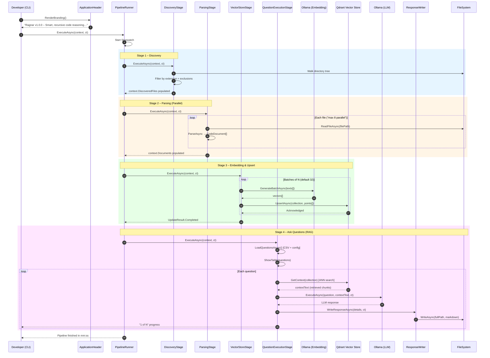

## 6. Application Flowchart

```mermaid
flowchart TD
    START([Application Start]) --> BRAND[Render Application Header & Version]
    BRAND --> LOADCFG[Load & Validate RagnarConfig<br/>OllamaOptionsValidator]
    LOADCFG --> VALIDATE{Config Valid?}
    VALIDATE -->|No| ERROR[Log Fatal & Exit]
    VALIDATE -->|Yes| DI[Build DI Container<br/>Resolve PipelineRunner + Stages]

    DI --> S1[Stage 1: Discovery]
    S1 --> WALK[Walk SourceDirectory]
    WALK --> FILTER[Filter by AllowedFileExtensions<br/>Exclude ExcludedFiles & ExcludedDirectories]
    FILTER --> HASFILES{Files Found?}
    HASFILES -->|No| SKIP[Log 'No files' & Continue]
    HASFILES -->|Yes| S2[Stage 2: Parsing]

    S2 --> PARALLEL["Parallel.ForEachAsync<br/>MaxDegreeOfParallelism = min(CPU, 8)"]
    PARALLEL --> READFILE[ReadFileAsync per file]
    READFILE --> PARSE[ParseAsync → CodeDocument segments]
    PARSE --> COLLECT[Collect into ConcurrentBag]
    COLLECT --> S3[Stage 3: Embedding & Upsert]

    S3 --> BATCH[Split documents into batches<br/>BatchSize from config]
    BATCH --> GENVEC[Ollama GenerateBatchAsync]
    GENVEC --> BUILDPT[Build Qdrant PointStructs]
    BUILDPT --> UPSERT[Qdrant UpsertAsync]
    UPSERT --> BATCHDONE{More Batches?}
    BATCHDONE -->|Yes| GENVEC
    BATCHDONE -->|No| RESULT{All Batches OK?}
    RESULT -->|Yes| S4[Stage 4: Ask Questions]
    RESULT -->|No| LOGERR[Log failures & Continue]

    LOGERR --> S4
    S4 --> LOADQ[LoadQuestionsAsync<br/>CSV files + Category Filter]
    LOADQ --> TABLE[Render Spectre.Console Table]
    TABLE --> GETCTX[Qdrant GetContext – ANN Search]
    GETCTX --> LOOP{Questions Remaining?}
    LOOP -->|Yes| RAGQ[Run RAG: Prompt + Context → Ollama LLM]
    RAGQ --> SAVE[ResponseWriter.WriteResponseAsync]
    SAVE --> PROGRESS[Write 'n of total' progress]
    PROGRESS --> LOOP
    LOOP -->|No| DONE[Pipeline Complete]

    DONE --> LOG[Log Total Elapsed Time]
    LOG --> EXIT([Application Exit])

    style START fill:#4CAF50,color:#fff
    style EXIT fill:#4CAF50,color:#fff
    style ERROR fill:#f44336,color:#fff
    style S1 fill:#2196F3,color:#fff
    style S2 fill:#FF9800,color:#fff
    style S3 fill:#4CAF50,color:#fff
    style S4 fill:#9C27B0,color:#fff
```

## 7. Component Interaction / Collaboration Diagram

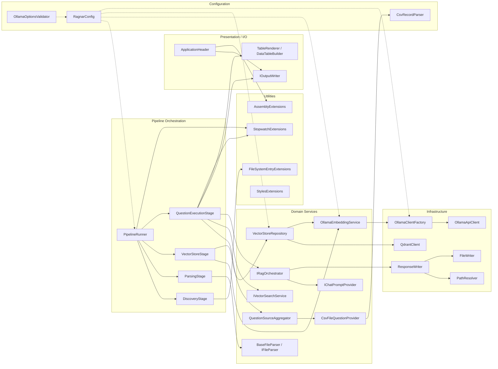

## 8. State Diagram – Pipeline Stage Lifecycle

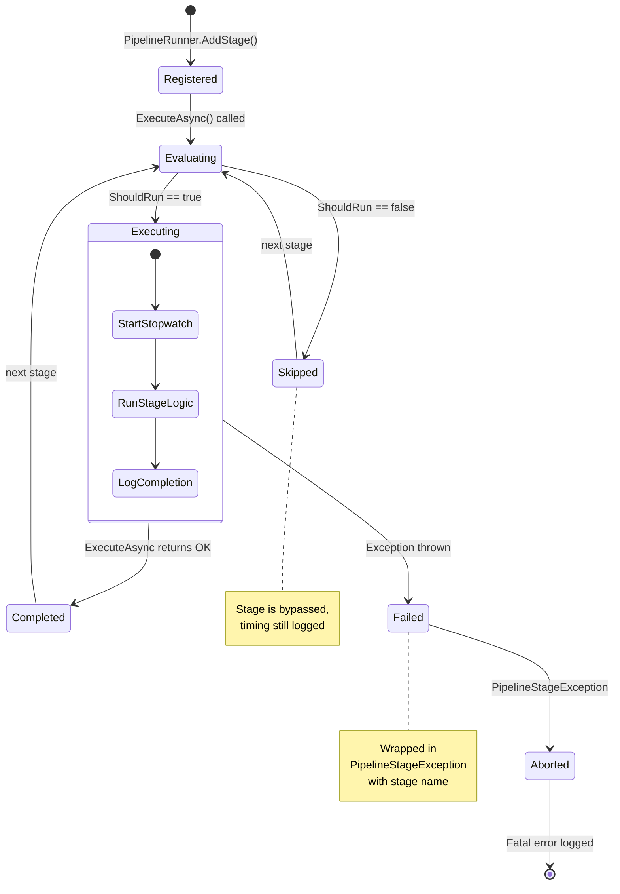

## 9. Deployment / Infrastructure Diagram

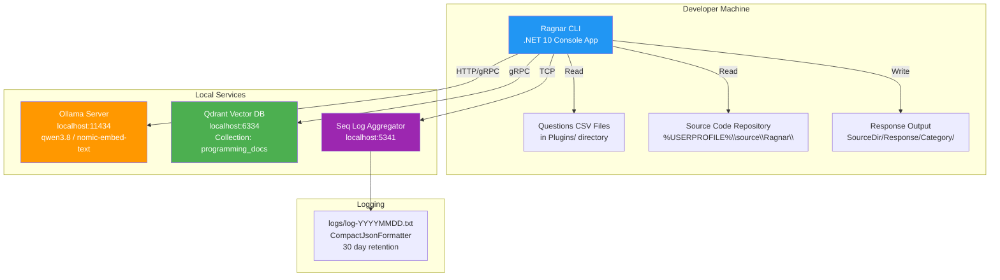

## 10. Data Flow Diagram (Question RAG Path)

```mermaid
flowchart LR
    subgraph "Input"
        QCSV[CSV File<br/>Text, Category,<br/>IsEnabled, FileName]
    end

    subgraph "Retrieval"
        EMB[Generate Question<br/>Embedding via Ollama]
        ANN[ANN Search in Qdrant<br/>Collection: programming_docs]
        CTX["Retrieved Context Text<br/>(top-k relevant chunks)"]
    end

    subgraph "Generation"
        PROMPT[Build Prompt<br/>System + Context + Question]
        LLM[Ollama LLM<br/>qwen3.8]
        RESP[LLM Response]
    end

    subgraph "Output"
        FMT[Format as Markdown<br/>IOutputFormatter]
        DIR[Resolve Path<br/>SourceDir/Response/Category/]
        FILE[Write<br/>timestamped .md file]
    end

    QCSV -->|Parse| QOBJ[Question Object]
    QOBJ --> EMB
    EMB --> ANN
    ANN --> CTX
    CTX --> PROMPT
    QOBJ --> PROMPT
    PROMPT --> LLM
    LLM --> RESP
    RESP --> FMT
    FMT --> DIR
    DIR --> FILE

    style QCSV fill:#FF9800,color:#fff
    style LLM fill:#2196F3,color:#fff
    style FILE fill:#4CAF50,color:#fff
```

## 11. Dependency / NuGet Package Relationship (Implied)

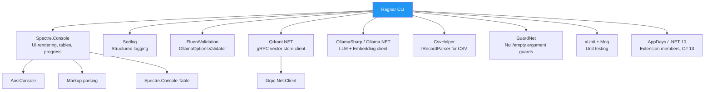

## Summary of Key Architectural Patterns Identified

| Pattern | Where Applied |
|---------|--------------|
| **Pipeline / Chain of Responsibility** | `PipelineRunner` → ordered `IPipelineStage` execution |
| **Builder** | `IQuestionSourceAggregator`, `DataTableBuilder`, `OllamaClientFactory` |
| **Strategy** | `IFilterStrategy` / `XmlCommentFilterStrategy`, `IFileParser` implementations |
| **Repository** | `IVectorStoreRepository` / `VectorStoreRepository` |
| **Factory** | `IOllamaClientFactory` / `OllamaClientFactory` (cached clients) |
| **Decorator / Template Method** | `BaseFileParser` (abstract + `ReadFileAsync`) |
| **Configuration via Options** | `IOptions<RagnarConfig>` throughout |
| **CQRS-lite (Read/Write split)** | `IVectorSearchService` (read) vs `IVectorStoreRepository` (write) |
| **Timeout / Cancellation** | `CancellationTokenSource.CreateLinkedTokenSource` in `OllamaEmbeddingService` |
| **Batch processing with error recovery** | `VectorStoreRepository.UpsertBatchAsync` continues after per-batch failure |
