### <span style="color:darkblue;">[Diagram]</span> Analyze the following C# code base. Generate the appropriate Mermaid diagrams, a sequence diagram, an application flowchart(s), and class diagrams based on the provided source code. Please also create valid mermaid C4 Diagrams If their are other Mermaid diagrams that would help to understand the provided code base.
> **Date Generated**: 9/15/2026 3:22:42 AM
> ## Question: 
> Analyze the following C# code base. Generate the appropriate Mermaid diagrams, a sequence diagram, an application flowchart(s), and class diagrams based on the provided source code. Please also create valid mermaid C4 Diagrams If their are other Mermaid diagrams that would help to understand the provided code base.
> **Method Call Duration**: 02:06:09
 ## Response: 
# Ragnar — Codebase Architecture & Diagrams

## 1. C4 Context Diagram

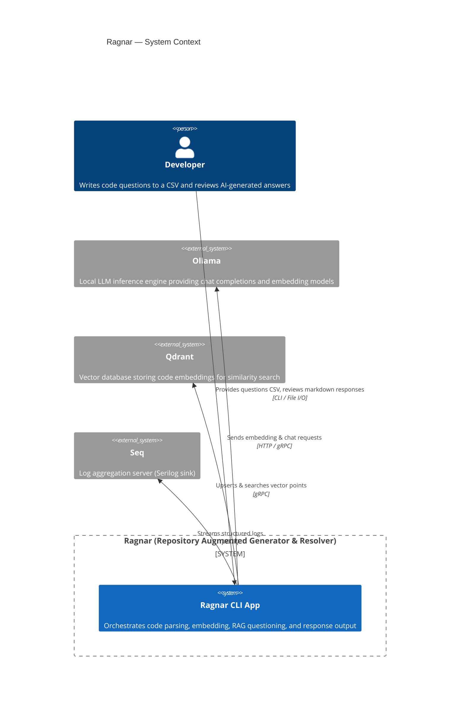

## 2. C4 Container Diagram

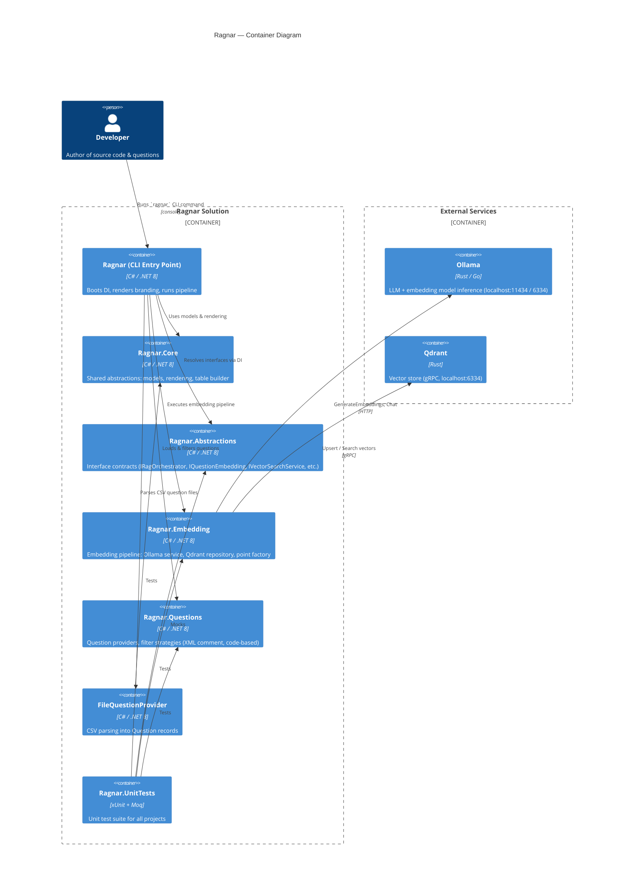

## 3. C4 Component Diagram (Ragnar CLI)

```mermaid
C4Component
    title Ragnar CLI — Component Diagram

    Container_Boundary(cli, "Ragnar CLI") {
        Component(header, "ApplicationHeader", "Branding", "Renders title, tagline, version to console")
        Component(pipelineRunner, "PipelineRunner", "Orchestration", "Executes ordered IPipelineStage<EmbeddingContext> sequentially")

        Component(parseStage, "ParsingStage", "Stage", "Parses discovered files → CodeDocuments in parallel")
        Component(fileParseFactory, "IFileParseFactory", "Factory", "Creates language-specific parsers (C#, XML, etc.)")
        Component(questionStage, "QuestionExecutionStage", "Stage", "Loads questions, embeds, searches, runs RAG per question")

        Component(csvProvider, "CsvFileQuestionProvider", "Provider", "Parses CSV → IEnumerable<Question>")
        Component(csvParser, "CsvRecordParser", "Parser", "Stream-based CSV deserialization")
        Component(filterStrategy, "XmlCommentFilterStrategy", "Filter", "Excludes test-related / short XML comments")

        Component(ollamaFactory, "OllamaClientFactory", "Factory", "Creates & caches OllamaApiClient per service type")
        Component(ollamaEmbedding, "OllamaEmbeddingService", "Service", "Single & batch embedding via Ollama")
        Component(vectorRepo, "VectorStoreRepository", "Repository", "Batch upsert of points to Qdrant")
        Component(pointFactory, "IPointStructFactory", "Factory", "Builds Qdrant PointStruct objects")

        Component(ragOrch, "IRagOrchestrator", "Service", "Coordinates retrieve → prompt → generate per question")
        Component(questionEmbed, "IQuestionEmbedding", "Service", "Embeds question + retrieves context from Qdrant")
        Component(vectorSearch, "IVectorSearchService", "Service", "Similarity search in Qdrant collection")
        Component(summarizeSvc, "ISummaryService", "Service", "Summarizes all responses via LLM")
        Component(promptProvider, "SummarizePromptProvider", "Provider", "System + template prompts for summarization")

        Component(responseWriter, "ResponseWriter", "Output", "Formats & persists markdown per question")
        Component(pathResolver, "PathResolver", "Utility", "Resolves category-specific output directories")
        Component(fileWriter, "FileWriter", "I/O", "Async file write (File.WriteAllTextAsync)")
        Component(outputFormatter, "IOutputFormatter", "Formatter", "Markdown formatting of SaveDetails")
        Component(outputWriter, "IOutputWriter", "Console", "AnsiConsole / Spectre.Console output")
        Component(consoleRenderer, "ConsoleTableRenderer", "Rendering", "Renders DataTableBuilder → AnsiConsole table")
        Component(dataTableBuilder, "DataTableBuilder", "Rendering", "Fluent builder for Spectre.Console Table")

        Component(config, "RagnarConfig", "Configuration", "ApplicationOptions, EmbeddingOptions, FileLoadOptions, OllamaOptions")
        Component(validator, "OllamaOptionsValidator", "Validation", "FluentValidation rules for Ollama config")
        Component(extensions, "Extensions", "Utility", "StopwatchExtensions, StringExtensions, AssemblyExtensions")
    }

    Container(ollama, "Ollama", "External")
    Container(qdrant, "Qdrant", "External")

    Rel(header, outputWriter, "Writes branding")
    Rel(pipelineRunner, parseStage, "Executes stage 1")
    Rel(pipelineRunner, questionStage, "Executes stage 2")
    Rel(parseStage, fileParseFactory, "Parses files")
    Rel(questionStage, csvProvider, "Loads questions")
    Rel(csvProvider, csvParser, "Parses records")
    Rel(questionStage, filterStrategy, "Applies category filter")
    Rel(questionStage, questionEmbed, "Embeds + retrieves context")
    Rel(questionStage, ragOrch, "Executes RAG per question")
    Rel(questionEmbed, vectorSearch, "Similarity search")
    Rel(vectorSearch, qdrant, "gRPC search")
    Rel(questionEmbed, ollamaEmbedding, "Generate question vector")
    Rel(ollamaEmbedding, ollamaFactory, "Resolves client")
    Rel(ollamaFactory, ollama, "HTTP / API")
    Rel(vectorRepo, ollamaEmbedding, "Batch embed docs")
    Rel(vectorRepo, pointFactory, "Build points")
    Rel(vectorRepo, qdrant, "Upsert points")
    Rel(ragOrch, summarizeSvc, "Generate answer")
    Rel(summarizeSvc, promptProvider, "Builds prompt")
    Rel(responseWriter, pathResolver, "Resolves dir")
    Rel(responseWriter, outputFormatter, "Formats markdown")
    Rel(responseWriter, fileWriter, "Writes file")
    Rel(consoleRenderer, dataTableBuilder, "Builds table")
    Rel(pipelineRunner, outputWriter, "Progress display")
    Rel(config, validator, "Validates options")

    UpdateLayoutConfig($c4ShapeInRow="3", $c4ComponentInRow="3")
```

## 4. Sequence Diagram — Full Pipeline Execution

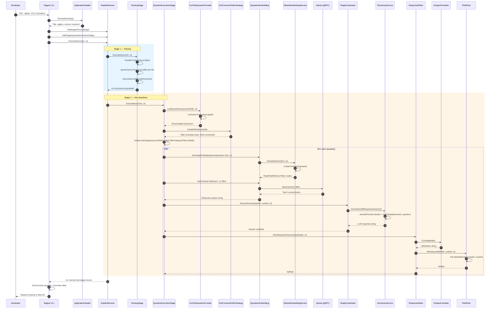

## 5. Application Flowchart

```mermaid
flowchart TD
    Start([CLI Invocation]) --> Branding[ApplicationHeader.RenderBranding]
    Branding --> BuildPipeline[Configure PipelineRunner with stages]
    BuildPipeline --> RunPipeline[PipelineRunner.ExecuteAsync]

    RunPipeline --> CheckStage{ShouldRun?}
    CheckStage -->|No| NextStage[Skip to next stage]
    CheckStage -->|Yes| ExecuteStage[stage.ExecuteAsync]

    subgraph Stage1 ["Stage 1: Parsing"]
        ExecuteStage --> NoFiles{DiscoveredFiles.Count == 0?}
        NoFiles -->|Yes| SkipParse[Log: No files to parse]
        NoFiles -->|No| ParallelParse[Parallel.ForEachAsync files]
        ParallelParse --> ParseEach[parseFactory.ParseAsync per file]
        ParseEach --> AddDoc[documents.Add CodeDocument]
        AddDoc --> SetDocs[ctx.Documents = documents]
    end

    subgraph Stage2 ["Stage 2: Ask Questions"]
        SetDocs --> LoadQ[Load questions from CSV]
        LoadQ --> FilterQ[Apply category filters]
        FilterQ --> BuildQ[builder.GetCategories().GetFileConfig().WithCategoryFilter().Build]
        BuildQ --> NoQuestions{questions.Count == 0?}
        NoQuestions -->|Yes| EndPipeline[Pipeline complete]
        NoQuestions -->|No| LoopQ[For each question]
        LoopQ --> GenEmb[Generate question embedding via Ollama]
        GenEmb --> SearchVec[Vector search in Qdrant]
        SearchVec --> RetrieveCtx[Retrieve top-K context]
        RetrieveCtx --> RAGExec[RAG: Prompt LLM with context + question]
        RAGExec --> WriteResp[WriteResponseAsync → markdown file]
        WriteResp --> MoreQ{More questions?}
        MoreQ -->|Yes| LoopQ
        MoreQ -->|No| EndPipeline
    end

    NextStage --> MoreStages{More stages?}
    MoreStages -->|Yes| CheckStage
    MoreStages -->|No| EndPipeline
    EndPipeline --> Timing[Log total elapsed time]
    Timing --> End([Process Exits])

    style Stage1 fill:#e3f2fd,stroke:#1565c0
    style Stage2 fill:#fff3e0,stroke:#e65100
    style EndPipeline fill:#c8e6c9,stroke:#2e7d32
```

## 6. Class Diagram — Core Domain

```mermaid
classDiagram
    direction TB

    class PipelineRunner {
        -List~IPipelineStage~_stages
        +AddStage(stage) PipelineRunner
        +ExecuteAsync(ctx, ct) Task~EmbeddingContext~
    }

    class IPipelineStage {
        <<interface>>
        +string Name
        +bool ShouldRun
        +ExecuteAsync(ctx, ct) Task
    }

    class ParsingStage {
        -IFileParseFactory parseFactory
        -ILogger logger
        -IOutputWriter writer
        +Name "Parsing files…"
        +ShouldRun true
        +ExecuteAsync(ctx, ct) Task
    }

    class QuestionExecutionStage {
        -IRagOrchestrator rag
        -IOptions~RagnarConfig~ config
        -IOutputWriter writer
        -IQuestionEmbedding embedding
        -ILogger logger
        -IQuestionSourceAggregator builder
        +Name "Ask Questions Stage"
        +ExecuteAsync(ctx, ct) Task
    }

    class EmbeddingContext {
        +List~string~ DiscoveredFiles
        +List~CodeDocument~ Documents
    }

    class CodeDocument {
        +string ElementName
        +string Code
        +string FileName
        +AsPoint() PointData
    }

    class Question {
        +bool IsActive
        +string Text
        +string FileName
        +QuestionCategory Category
    }

    class QuestionCategory {
        <<enum>>
        General
        CSharp
        XML
        Other
        Uncategorized
    }

    class SaveDetails {
        +Question Question
        +string Content
        +string ElapsedTime
    }

    PipelineRunner --> IPipelineStage : executes
    IPipelineStage <|-- ParsingStage
    IPipelineStage <|-- QuestionExecutionStage
    PipelineRunner --> EmbeddingContext : passes through
    ParsingStage --> CodeDocument : produces
    QuestionExecutionStage --> Question : processes
    Question --> QuestionCategory
    QuestionExecutionStage --> SaveDetails : creates
    SaveDetails --> Question : contains

    class IQuestionProvider {
        <<interface>>
        +string ProviderName
        +LoadQuestionsAsync(fileName, ct) Task~IEnumerable~Question~~
    }

    class CsvFileQuestionProvider {
        -IRecordParser~QuestionRecord~ csvParser
        +ProviderName "CSV File"
        +LoadQuestionsAsync(fileName, ct) Task~IEnumerable~Question~~
    }

    IQuestionProvider <|-- CsvFileQuestionProvider

    class IQuestionSourceAggregator {
        <<interface>>
        +GetCategories() IQuestionSourceAggregator
        +GetFileConfig() IQuestionSourceAggregator
        +GetCsvFilesAsync(dir, ct) Task~IQuestionSourceAggregator~
        +WithCategoryFilter() IQuestionSourceAggregator
        +Build() List~Question~
    }

    class IFilterStrategy {
        <<interface>>
        +QuestionCategory SupportedCategory
        +CreateFilter(sizeThreshold) Filter
    }

    class XmlCommentFilterStrategy {
        +SupportedCategory QuestionCategory.XML
        +CreateFilter(threshold) Filter
    }

    IFilterStrategy <|-- XmlCommentFilterStrategy

    class IEmbeddingService {
        <<interface>>
        +GenerateAsync(input, ct) Task~ReadOnlyMemory~float~~
        +GenerateBatchAsync(inputs, ct) Task~GeneratedEmbeddings~
    }

    class OllamaEmbeddingService {
        -IEmbeddingGenerator _generator
        -ILogger logger
        -IOllamaClientFactory clientFactory
        -IOptions~RagnarConfig~ config
        +GenerateAsync(input, ct) Task~ReadOnlyMemory~float~~
        +GenerateBatchAsync(inputs, ct) Task~GeneratedEmbeddings~
        -CreateTimeoutCts(parent) CancellationTokenSource
    }

    IEmbeddingService <|-- OllamaEmbeddingService

    class IVectorStoreRepository {
        <<interface>>
        +UpsertBatchAsync(docs, ct) Task~UpdateResult~
    }

    class VectorStoreRepository {
        -ILogger logger
        -IEmbeddingService embeddingService
        -IQdrantClient qdrantClient
        -IPointStructFactory generatorService
        -IOptions~RagnarConfig~ config
        +UpsertBatchAsync(docs, ct) Task~UpdateResult~
    }

    IVectorStoreRepository <|-- VectorStoreRepository

    class IOllamaClientFactory {
        <<interface>>
        +ResolveClient(serviceType) OllamaApiClient
    }

    class OllamaClientFactory {
        -IHttpClientFactory httpClientFactory
        -IOptions~RagnarConfig~ config
        -Dictionary~OllamaServiceType, OllamaApiClient~ _cache
        +ResolveClient(type) OllamaApiClient
    }

    IOllamaClientFactory <|.. OllamaClientFactory

    class IQuestionEmbedding {
        <<interface>>
        +GenerateEmbeddingAsync(question, ct) Task~ReadOnlyMemory~float~~
        +GetContext(storeName, ct, filter) Task~string~
    }

    class IVectorSearchService {
        <<interface>>
        +RetrieveContextAsync(collection, vector, filter, ct) Task~string~
    }

    class IRagOrchestrator {
        <<interface>>
        +ExecuteAsync(question, context, ct) Task
    }

    class ISummaryService {
        <<interface>>
        +SummarizeAllResponsesAsync(ct) Task
    }

    class IChatPromptProvider {
        <<interface>>
        +string System
        +GetTemplate(content, question) string
    }

    class SummarizePromptProvider {
        +System string
        +GetTemplate(content, question) string
    }

    IChatPromptProvider <|-- SummarizePromptProvider

    class IResponseWriter {
        <<interface>>
        +WriteResponseAsync(details, ct) Task~string~
    }

    class ResponseWriter {
        -IOutputFormatter formatter
        -IPathResolver pathResolver
        -IWriter fileWriter
        +WriteResponseAsync(details, ct) Task~string~
    }

    IResponseWriter <|.. ResponseWriter

    class IOutputFormatter {
        <<interface>>
        +string FileExtension
        +Format(details) string
    }

    class IPathResolver {
        <<interface>>
        +ResolveResponseDirectory(category) string
    }

    class PathResolver {
        -ApplicationOptions _applicationOptions
        +ResolveResponseDirectory(category) string
    }

    IPathResolver <|.. PathResolver

    class IWriter {
        <<interface>>
        +WriteAsync(path, content, ct) Task
    }

    class FileWriter {
        +WriteAsync(path, content, ct) Task
    }

    IWriter <|.. FileWriter

    class IApplicationHeader {
        <<interface>>
        +RenderBranding() void
    }

    class ApplicationHeader {
        -string _versionNumber
        -IOutputWriter writer
        +RenderBranding() void
    }

    IApplicationHeader <|.. ApplicationHeader

    class RagnarConfig {
        +ApplicationOptions ApplicationOptions
        +EmbeddingOptions EmbeddingOptions
        +FileLoadOptions FileLoadOptions
        +OllamaOptions OllamaOptions
    }

    class ApplicationOptions {
        +string OutputFolder
        +string SourceDirectory
        +string VectorStoreName
        +List~string~ CategoriesToProcess
        +bool IncludeOriginalPrompt
    }

    class EmbeddingOptions {
        +int BatchSize
        +ulong Dimension
        +string EmbeddingModel
        +string Host
        +int Port
        +TimeSpan Timeout
    }

    class OllamaOptions {
        +string Host
        +int Port
        +string LlmModel
        +TimeSpan Timeout
    }

    class FileLoadOptions {
        +List~string~ AllowedFileExtensions
        +List~string~ ExcludedFiles
        +List~string~ ExcludedDirectories
    }

    RagnarConfig *-- ApplicationOptions
    RagnarConfig *-- EmbeddingOptions
    RagnarConfig *-- OllamaOptions
    RagnarConfig *-- FileLoadOptions

    class OllamaOptionsValidator {
        +RuleFor(Host)
        +RuleFor(Port)
        +RuleFor(Timeout)
        +RuleFor(LlmModel)
    }

    class DataTableBuilder {
        -List~string~ _columns
        -List~List~string~~ _rows
        +bool ShowRowSeparators
        +bool Expand
        +AddColumns(params columns) DataTableBuilder
        +AddRow(params cells) DataTableBuilder
        +IReadOnlyList~string~ Columns
        +IReadOnlyList~List~string~~ Rows
        +ToTable() Table
    }

    class ConsoleTableRenderer {
        -DataTableBuilder builder
        +DataTableBuilder Table
        +Render() void
    }

    ConsoleTableRenderer --> DataTableBuilder

    OllamaEmbeddingService --> IOllamaClientFactory : uses
    VectorStoreRepository --> IEmbeddingService : uses
    VectorStoreRepository --> IQdrantClient : uses
    QuestionExecutionStage --> IRagOrchestrator : uses
    QuestionExecutionStage --> IQuestionEmbedding : uses
    QuestionExecutionStage --> IQuestionSourceAggregator : uses
    QuestionExecutionStage --> IOutputWriter : uses
    ResponseWriter --> IOutputFormatter : uses
    ResponseWriter --> IPathResolver : uses
    ResponseWriter --> IWriter : uses
    CsvFileQuestionProvider --> IRecordParser : uses
    ApplicationHeader --> IOutputWriter : uses
    PipelineRunner --> IOutputWriter : uses
    OllamaOptionsValidator ..> OllamaOptions : validates
```

## 7. Class Diagram — Pipeline & Embedding Flow

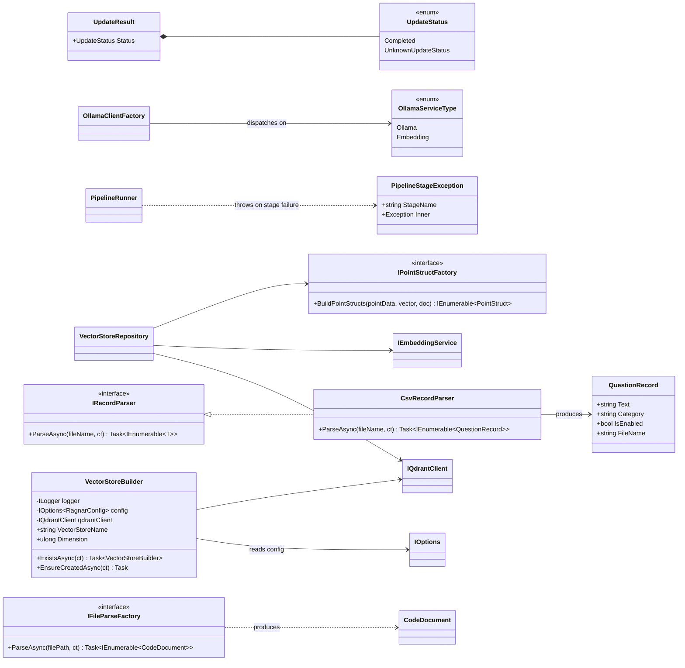

## 8. State Diagram — Pipeline Stage Lifecycle

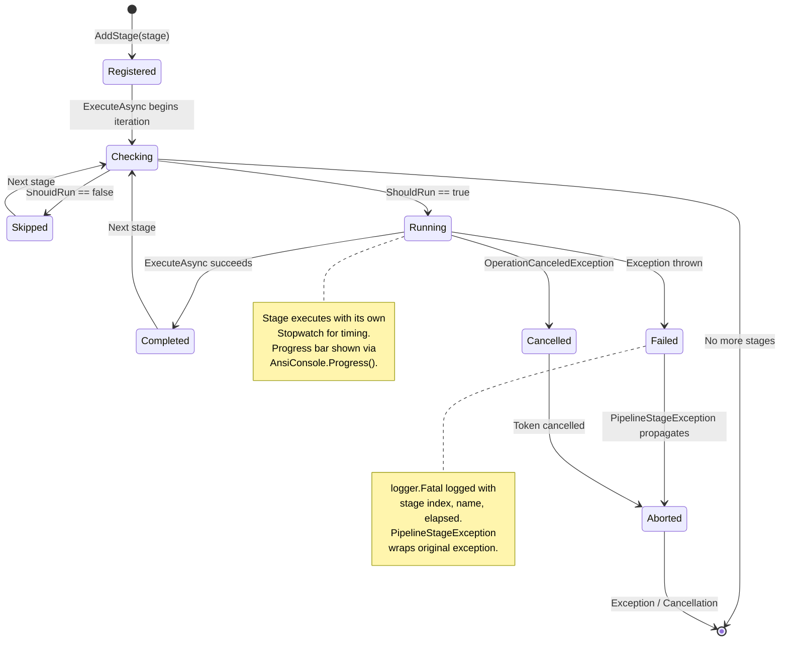

## 9. Component / Dependency Flow Diagram

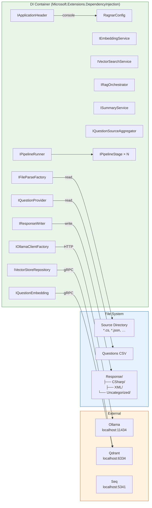

## 10. Deployment / Runtime Diagram

```mermaid
C4Deployment
    title Ragnar — Runtime Deployment

    Person_Boundary(dev, "Developer") {
        Person(dev_user, "Developer", "Author")
    }

    Node_Boundary(machine, "Developer Machine") {
        Node(cli, "Ragnar CLI", "C# / .NET 8", "Console application with Spectre.Console UI")
        Node(ollama_local, "Ollama Server", "Rust/Go", "LLM + embedding models (nomic-embed-text, qwen3.8)")
        Node(qdrant_local, "Qdrant Server", "Rust", "Vector DB with gRPC API")
        Node(seq_local, "Seq Server", "C#/.NET", "Log viewer (Serilog sink)")
        Node(fs, "File System", "NTFS", "Source code, CSV questions, Response output")
    }

    Rel(dev_user, cli, "Invokes", "console")
    Rel(cli, ollama_local, "Embeddings + Chat", "HTTP :11434 / :6334")
    Rel(cli, qdrant_local, "Upsert + Search", "gRPC")
    Rel(cli, seq_local, "Structured logs", "HTTP :5341")
    Rel(cli, fs, "Read source / CSV\nWrite .md responses", "File I/O")

    UpdateLayoutConfig($c4DeploymentInRow="3")
```

## 11. Data Flow Diagram — Embedding Pipeline

```mermaid
flowchart TD
    subgraph Ingestion["1. Ingestion"]
        A[Discover source files\nby extension + exclusions] --> B[Parse each file\n→ CodeDocument list]
    end

    subgraph Embedding["2. Embedding"]
        B --> C[Chunk into batches\nof BatchSize = 64]
        C --> D["Format: 'Context: {name}\nCode:\n{code}'"]
        D --> E["Ollama /api/embed\nbatch request"]
        E --> F[float[] vectors\n(768-dim)]
    end

    subgraph Storage["3. Storage (Qdrant)"]
        F --> G[Build PointStruct\nid, vector, payload]
        G --> H[gRPC UpsertAsync\nto 'programming_docs']
    end

    subgraph Query["4. Query (per question)"]
        I[Question text from CSV] --> J[Ollama /api/embed\nsingle request]
        J --> K[float[] question vector]
        K --> L[Qdrant Search\nwith optional Filter]
        L --> M[Top-K scored hits\n→ context string]
    end

    subgraph RAG["5. RAG + Output"]
        M --> N[Build prompt:\nSystem + context + question]
        N --> O[Ollama /api/chat\nqwen3.8]
        O --> P[LLM response]
        P --> Q[Format → Markdown]
        Q --> R[Write to\nResponse/{Category}/\n{file}_{timestamp}.md]
    end

    Ingestion --> Embedding --> Storage --> Query --> RAG

    style Ingestion fill:#e3f2fd,stroke:#1565c0
    style Embedding fill:#fff3e0,stroke:#e65100
    style Storage fill:#f3e5f5,stroke:#7b1fa2
    style Query fill:#e8f5e9,stroke:#2e7d32
    style RAG fill:#fce4ec,stroke:#c62828
```

## 12. Configuration & Validation Diagram

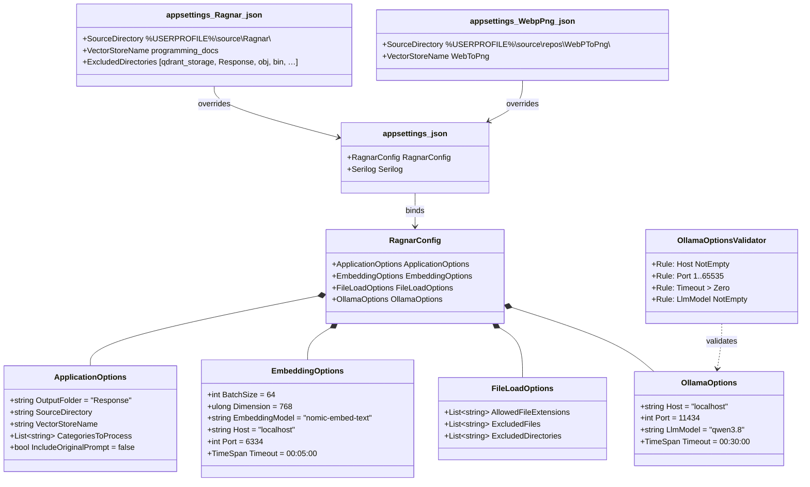

## 13. Testing Architecture Diagram

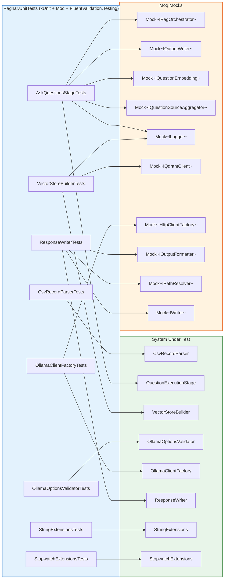

## 14. Filter Strategy Pattern Diagram

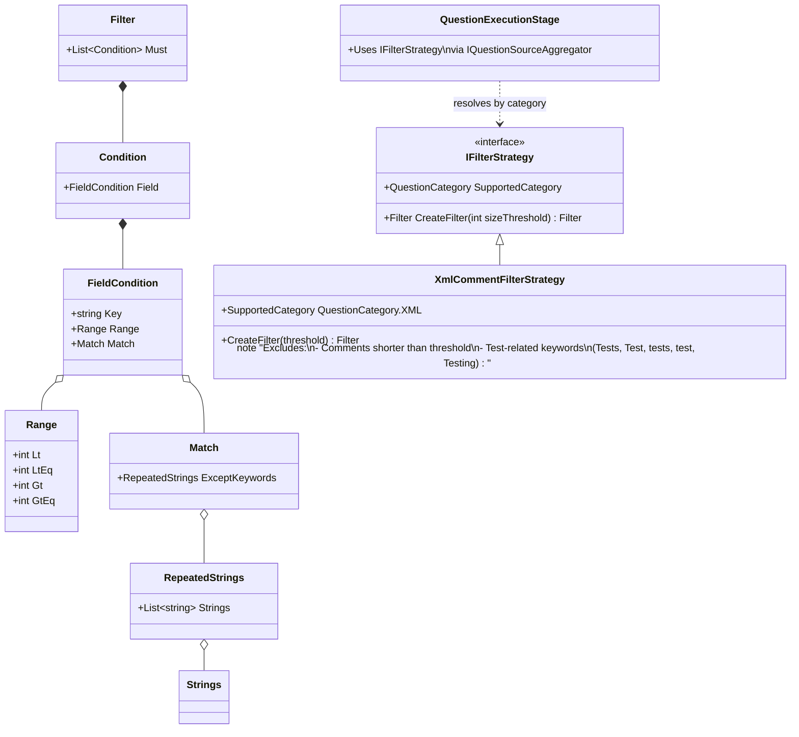

## 15. Overall Solution Architecture (High-Level)

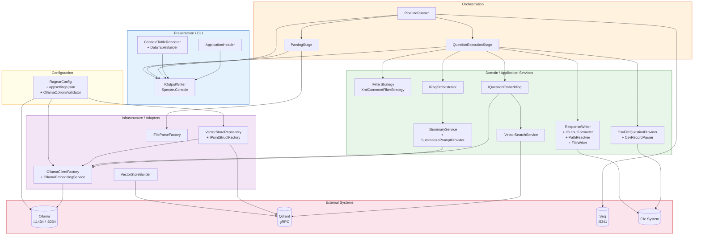

---

## Summary Table

| # | Diagram Type | Purpose |
|---|---|---|
| 1 | **C4 Context** | Ragnar's relationship with Developer, Ollama, Qdrant, Seq |
| 2 | **C4 Container** | Solution projects and their external dependencies |
| 3 | **C4 Component** | Internal components within the CLI and their wiring |
| 4 | **Sequence** | Step-by-step interaction from CLI invocation → response file |
| 5 | **Flowchart** | Decision-driven pipeline execution with branches |
| 6 | **Class (Domain)** | All domain classes, interfaces, and their relationships |
| 7 | **Class (Pipeline)** | Embedding pipeline, factories, and supporting types |
| 8
