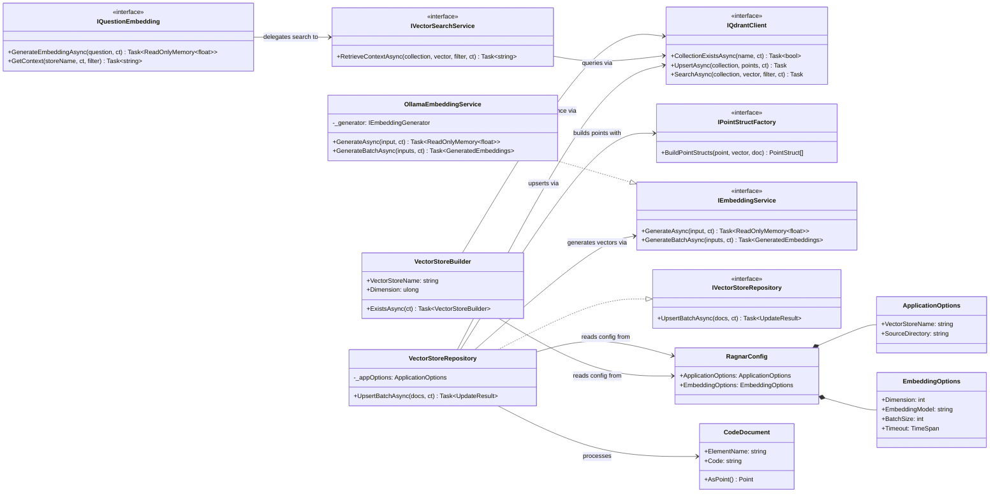
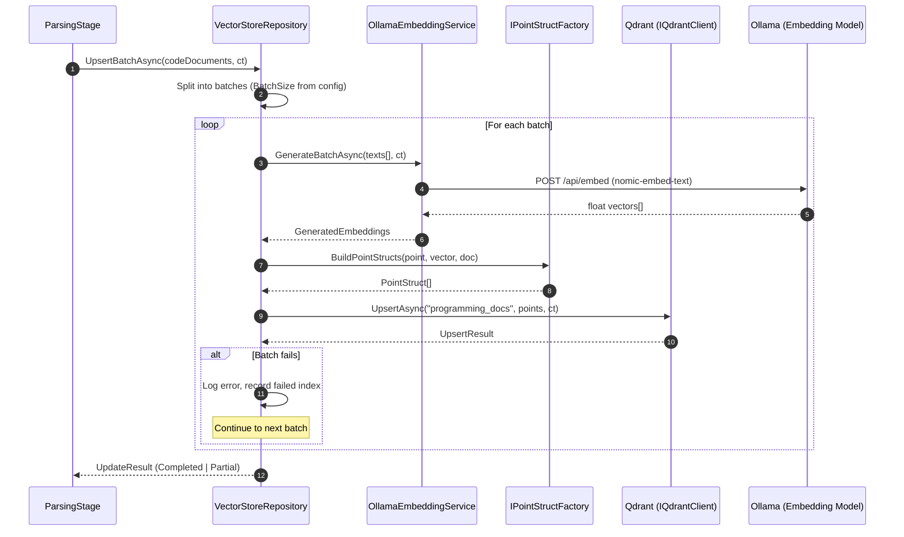
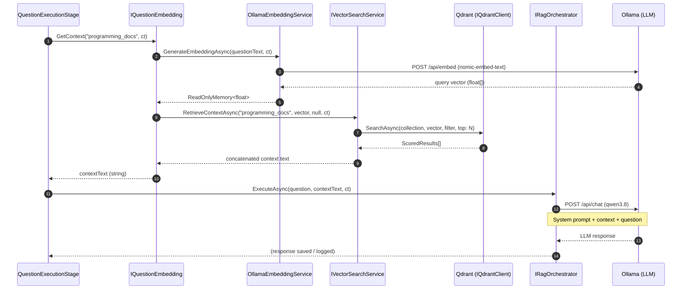
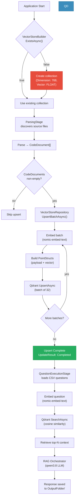
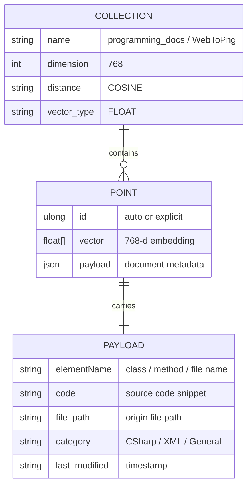
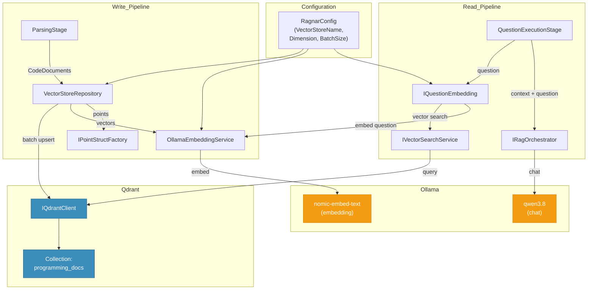

### [Diagram] Analyze the C# code base. Generate the appropriate Mermaid diagrams for the Qdrant database.
> **Date Generated**: 9/13/2026 10:56:29 AM
> ## Question: 
> Analyze the C# code base. Generate the appropriate Mermaid diagrams for the Qdrant database.
> **Method Call Duration**: 54:19
 ## Response: 
# Qdrant Database — Mermaid Diagrams

Below are the relevant Mermaid diagrams that map the Qdrant database interactions found across the codebase.

---

## 1. Class Diagram — Qdrant Write & Read Path

---

## 2. Sequence Diagram — Embedding Upsert (Write to Qdrant)

---

## 3. Sequence Diagram — Question Retrieval (Read from Qdrant)

---

## 4. Flowchart — Qdrant Collection Lifecycle

---

## 5. ERD-Style Diagram — Qdrant Point Structure (Inferred)

---

## 6. Dependency Graph — Services Touching Qdrant

---

### Key Observations

| Aspect | Detail from Code |
|--------|-----------------|
| **Collection name** | Driven by `RagnarConfig.ApplicationOptions.VectorStoreName` (e.g. `"programming_docs"`, `"WebToPng"`) |
| **Vector dimension** | `EmbeddingOptions.Dimension = 768` (matches `nomic-embed-text`) |
| **Batch size** | `EmbeddingOptions.BatchSize` (default 32 in `VectorStoreRepository`) |
| **Upsert strategy** | Embed → build `PointStruct[]` → single `UpsertAsync` per batch; failures are logged and processing continues |
| **Query strategy** | Single `SearchAsync` per question with optional `Filter`; top-k results concatenated into context string |
| **Timeout guard** | `OllamaEmbeddingService.CreateTimeoutCts` links parent CT with `EmbeddingOptions.Timeout` |
| **No explicit collection DDL in production code** | `VectorStoreBuilder.ExistsAsync` checks existence; creation is implied but not shown in the provided snippets |
