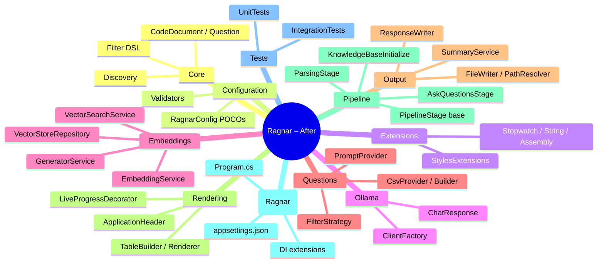

### <span style="color:darkblue;">[General]</span> Can you suggest how to better organize based on features the code into visual studio projects and namespaces? Please generate an updated mermaid Diagrams of the updated code compared to the current implementation. Please provide a step by step guide on migrating each file over to the updated structure.
> **Date Generated**: 9/12/2026 5:34:10 PM
> ## Question: 
> Can you suggest how to better organize based on features the code into visual studio projects and namespaces? Please generate an updated mermaid Diagrams of the updated code compared to the current implementation. Please provide a step by step guide on migrating each file over to the updated structure.
> **Method Call Duration**: 40:13
 ## Response: 
# Ragnar – Feature-Based Project & Namespace Reorganisation

## 1. Proposed Project Structure

```
Ragnar.sln
├── src/
│   ├── Ragnar/                        ← root host (Program.cs, DI, appsettings.json)
│   ├── Ragnar.Core/                   ← domain models, shared interfaces, enums
│   ├── Ragnar.Pipeline/               ← pipeline stages, context, orchestration
│   ├── Ragnar.Embeddings/             ← Qdrant, vector store, embedding services
│   ├── Ragnar.Ollama/                 ← Ollama client, chat streaming, generation
│   ├── Ragnar.Questions/              ← question providers, CSV, builder
│   ├── Ragnar.Output/                 ← response writer, formatter, path resolver
│   ├── Ragnar.Rendering/              ← Spectre.Console tables, progress, branding
│   ├── Ragnar.Configuration/          ← config POCOs, validators, options
│   └── Ragnar.Extensions/             ← extension methods, small utilities
├── tests/
│   ├── Ragnar.UnitTests/
│   └── Ragnar.IntegrationTests/
```

### Dependency graph (bottom-up)

```
Ragnar (host)
 ├── Ragnar.Pipeline
 │    ├── Ragnar.Core
 │    ├── Ragnar.Embeddings
 │    ├── Ragnar.Ollama
 │    ├── Ragnar.Questions
 │    ├── Ragnar.Output
 │    ├── Ragnar.Rendering
 │    └── Ragnar.Configuration
 ├── Ragnar.Embeddings
 │    ├── Ragnar.Core
 │    ├── Ragnar.Ollama
 │    └── Ragnar.Configuration
 ├── Ragnar.Ollama
 │    ├── Ragnar.Core
 │    └── Ragnar.Configuration
 ├── Ragnar.Questions
 │    ├── Ragnar.Core
 │    └── Ragnar.Configuration
 ├── Ragnar.Output
 │    ├── Ragnar.Core
 │    └── Ragnar.Configuration
 ├── Ragnar.Rendering
 │    └── Ragnar.Core
 ├── Ragnar.Configuration
 │    └── Ragnar.Core
 ├── Ragnar.Extensions
 │    └── Ragnar.Core
 └── Ragnar.Core   (no dependencies beyond BCL / Serilog)
```

---

## 2. Namespace per project

| Project | Root namespace | Example types |
|---|---|---|
| Ragnar.Core | `Ragnar.Core` | `CodeDocument`, `Question`, `QuestionCategory`, `UpdateResult`, `UpdateStatus`, `SaveDetails`, `GenerateRequest` |
| Ragnar.Pipeline | `Ragnar.Pipeline` | `IPipelineStage<T>`, `EmbeddingContext`, `AskQuestionsStage`, `ParsingStage`, `IKnowledgeBaseInitialize` |
| Ragnar.Embeddings | `Ragnar.Embeddings` | `IVectorStoreRepository`, `VectorStoreRepository`, `IEmbeddingService`, `OllamaEmbeddingService`, `IVectorSearchService`, `IGeneratorService`, `IQuestionEmbedding` |
| Ragnar.Ollama | `Ragnar.Ollama` | `IOllamaClientFactory`, `OllamaClientFactory`, `IOllamaGenerationService`, `OllamaChatResponse`, `OllamaServiceType` |
| Ragnar.Questions | `Ragnar.Questions` | `IQuestionProvider`, `CsvFileQuestionProvider`, `IQuestionCombineBuilder`, `QuestionCombineBuilder`, `IRecordParser<T>`, `CsvRecordParser`, `SummarizePromptProvider`, `IPromptProvider` |
| Ragnar.Output | `Ragnar.Output` | `IResponseWriter`, `ResponseWriter`, `IOutputFormatter`, `IWriter`, `FileWriter`, `IPathResolver`, `PathResolver`, `ISummaryService` |
| Ragnar.Rendering | `Ragnar.Rendering` | `ITableRenderer`, `TableBuilder`, `ConsoleTableRenderer`, `ITableBuilder`, `IApplicationHeader`, `ApplicationHeader`, `LiveProgressDecorator`, `TableRendererFactory` |
| Ragnar.Configuration | `Ragnar.Configuration` | `RagnarConfig`, `ApplicationOptions`, `EmbeddingOptions`, `OllamaOptions`, `FileLoadOptions`, `OllamaOptionsValidator` |
| Ragnar.Extensions | `Ragnar.Extensions` | `StopwatchExtensions`, `StringExtensions`, `AssemblyExtensions`, `StylesExtensions` |
| Ragnar (host) | `Ragnar` | `Program`, DI registrations |

---

## 3. Mermaid Diagrams

### 3a – Current (implicit) structure – single blob

```mermaid
graph TD
    subgraph "Ragnar (single project)"
        direction TB
        VSR[VectorStoreRepository]
        AQS[AskQuestionsStage]
        CFQP[CsvFileQuestionProvider]
        ISV[ISummaryService]
        OOV[OllamaOptionsValidator]
        SWE[StopwatchExtensions]
        IOCF[IOllamaClientFactory]
        SPR[SummarizePromptProvider]
        OES[OllamaEmbeddingService]
        IQCB[IQuestionCombineBuilder]
        AEX[AssemblyExtensions]
        IKBI[IKnowledgeBaseInitialize]
        RW[ResponseWriter]
        XFCS[XmlCommentFilterStrategy]
        IPP[IPromptProvider]
        IGS[IGeneratorService]
        TB[TableBuilder]
        PR[PathResolver]
        AH[ApplicationHeader]
        OCR[OllamaChatResponse]
        IQE[IQuestionEmbedding]
        IAH[IApplicationHeader]
        IVSS[IVectorSearchService]
        CTR[ConsoleTableRenderer]
        IOF[IOutputFormatter]
        FW[FileWriter]
        DF[DiscoverFiles]
        PS[ParsingStage]
        SE[StylesExtensions]
    end

    VSR --> OES
    VSR --> IGS
    AQS --> IQE
    AQS --> AQS
    CFQP --> IQCB
    OES --> IOCF
    OCR --> IOCF
    RW --> IOF
    RW --> PR
    PS --> AQS
    AQS --> AH

    style VSR fill:#f9f,stroke:#333
    style AQS fill:#f9f,stroke:#333
    style OES fill:#f9f,stroke:#333
    style OCR fill:#f9f,stroke:#333
```



> *Everything lives in one assembly; cross-cutting concerns are tangled.*

### 3b – Proposed feature-based structure

```mermaid
graph TB
    subgraph "Ragnar (host)"
        P[Program / DI]
    end

    subgraph "Ragnar.Pipeline"
        IPS[IPipelineStage]
        EC[EmbeddingContext]
        AQS[AskQuestionsStage]
        PS[ParsingStage]
        IKBI[IKnowledgeBaseInitialize]
    end

    subgraph "Ragnar.Embeddings"
        IVMR[IVectorStoreRepository]
        VSR[VectorStoreRepository]
        IES[IEmbeddingService]
        OES[OllamaEmbeddingService]
        IVSS[IVectorSearchService]
        IGS[IGeneratorService]
        IQE[IQuestionEmbedding]
    end

    subgraph "Ragnar.Ollama"
        IOCF[IOllamaClientFactory]
        OCF[OllamaClientFactory]
        IOGS[IOllamaGenerationService]
        OCR[OllamaChatResponse]
        OST[OllamaServiceType]
    end

    subgraph "Ragnar.Questions"
        IQP[IQuestionProvider]
        CFQP[CsvFileQuestionProvider]
        IQCB[IQuestionCombineBuilder]
        QCB[QuestionCombineBuilder]
        IRP[IRecordParser]
        CRP[CsvRecordParser]
        IPP[IPromptProvider]
        SPR[SummarizePromptProvider]
        XFCS[XmlCommentFilterStrategy]
    end

    subgraph "Ragnar.Output"
        IRW[IResponseWriter]
        RW[ResponseWriter]
        IOF[IOutputFormatter]
        IW[IWriter]
        FW[FileWriter]
        IPR[IPathResolver]
        PR[PathResolver]
        ISV[ISummaryService]
    end

    subgraph "Ragnar.Rendering"
        ITR[ITableRenderer]
        TB[TableBuilder]
        CTR[ConsoleTableRenderer]
        ITB[ITableBuilder]
        IAH[IApplicationHeader]
        AH[ApplicationHeader]
        LPD[LiveProgressDecorator]
        TRF[TableRendererFactory]
    end

    subgraph "Ragnar.Configuration"
        RC[RagnarConfig]
        AO[ApplicationOptions]
        EO[EmbeddingOptions]
        OOV[OllamaOptionsValidator]
        FLO[FileLoadOptions]
    end

    subgraph "Ragnar.Extensions"
        SWE[StopwatchExtensions]
        AEX[AssemblyExtensions]
        SE[StylesExtensions]
        STR[StringExtensions]
    end

    subgraph "Ragnar.Core"
        CD[CodeDocument]
        Q[Question]
        QCAT[QuestionCategory]
        UR[UpdateResult]
        SD[SaveDetails]
        GR[GenerateRequest]
        IDI[IDiscoverFiles]
        DF[DiscoverFiles]
    end

    %% Pipeline → others
    AQS --> IQE
    AQS --> IKBI
    PS --> IDI
    EC --> CD

    %% Embeddings → Ollama + Core
    OES --> IOCF
    VSR --> IES
    VSR --> IGS
    IQE --> IVSS

    %% Ollama → Core
    OCR --> IOCF
    OCF --> OST

    %% Questions → Core
    CFQP --> IQP
    QCB --> IQCB
    SPR --> IPP
    XFCS --> QCAT

    %% Output → Core
    RW --> IOF
    RW --> PR
    PR --> RC

    %% Rendering → Core
    AH --> IAH
    TB --> ITB

    %% Configuration → Core
    RC --> AO
    RC --> EO
    OOV --> RC

    %% Extensions → Core
    SWE --> CD
    AEX --> CD

    %% Host wires everything
    P --> AQS
    P --> PS
    P --> VSR
    P --> OCF
    P --> QCB
    P --> RW
    P --> AH

    %% Styling
    classDef core fill:#e1f5fe,stroke:#01579b
    classDef pipe fill:#fff3e0,stroke:#e65100
    classDef emb fill:#f3e5f5,stroke:#4a148c
    classDef oll fill:#e8f5e9,stroke:#1b5e20
    classDef ques fill:#fce4ec,stroke:#880e4f
    classDef out fill:#fffde7,stroke:#f57f17
    classDef rend fill:#e0f2f1,stroke:#004d40
    classDef cfg fill:#f1f8e9,stroke:#33691e
    classDef ext fill:#efebe9,stroke:#3e2723
    classDef host fill:#fafafa,stroke:#212121

    class CD,Q,QCAT,UR,SD,GR,IDI,DF core
    class IPS,EC,AQS,PS,IKBI pipe
    class IVMR,VSR,IES,OES,IVSS,IGS,IQE emb
    class IOCF,OCF,IOGS,OCR,OST oll
    class IQP,CFQP,IQCB,QCB,IRP,CRP,IPP,SPR,XFCS ques
    class IRW,RW,IOF,IW,FW,IPR,PR,ISV out
    class ITR,TB,CTR,ITB,IAH,AH,LPD,TRF rend
    class RC,AO,EO,OOV,FLO cfg
    class SWE,AEX,SE,STR ext
    class P host
```



---

## 4. File-by-file migration table

| # | Current file / type | Target project | Target namespace | Action |
|---|---|---|---|---|
| 1 | `CodeDocument`, `Question`, `QuestionCategory`, `UpdateResult`, `UpdateStatus`, `SaveDetails`, `GenerateRequest`, `Filter`, `Range`, `Match`, `Condition`, `FieldCondition`, `RepeatedStrings` | **Ragnar.Core** | `Ragnar.Core` / `Ragnar.Core.Model` | Move as-is (or split into `Ragnar.Core.Model`, `Ragnar.Core.Filtering`) |
| 2 | `IDiscoverFiles`, `DiscoverFiles` | **Ragnar.Core** (or `Ragnar.Pipeline`) | `Ragnar.Core.Discovery` | Move; it is a domain service, not a stage |
| 3 | `RagnarConfig`, `ApplicationOptions`, `EmbeddingOptions`, `OllamaOptions`, `FileLoadOptions` | **Ragnar.Configuration** | `Ragnar.Configuration` | Move POCOs |
| 4 | `OllamaOptionsValidator` | **Ragnar.Configuration** | `Ragnar.Configuration.Validation` | Move |
| 5 | `IPromptProvider`, `SummarizePromptProvider` | **Ragnar.Questions** | `Ragnar.Questions.Prompts` | Move |
| 6 | `IQuestionProvider`, `CsvFileQuestionProvider`, `IRecordParser<T>`, `CsvRecordParser` | **Ragnar.Questions** | `Ragnar.Questions.Providers` / `Ragnar.Questions.Parsing` | Move |
| 7 | `IQuestionCombineBuilder`, `QuestionCombineBuilder` (impl) | **Ragnar.Questions** | `Ragnar.Questions` | Move |
| 8 | `XmlCommentFilterStrategy` | **Ragnar.Questions** | `Ragnar.Questions.Filtering` | Move |
| 9 | `IOllamaClientFactory`, `OllamaClientFactory`, `OllamaServiceType` | **Ragnar.Ollama** | `Ragnar.Ollama` | Move |
| 10 | `IOllamaGenerationService`, `OllamaChatResponse` | **Ragnar.Ollama** | `Ragnar.Ollama.Generation` | Move |
| 11 | `IEmbeddingService`, `OllamaEmbeddingService` | **Ragnar.Embeddings** | `Ragnar.Embeddings` | Move |
| 12 | `IVectorStoreRepository`, `VectorStoreRepository` | **Ragnar.Embeddings** | `Ragnar.Embeddings` | Move |
| 13 | `IVectorSearchService` (interface + impl) | **Ragnar.Embeddings** | `Ragnar.Embeddings.Search` | Move |
| 14 | `IGeneratorService` (interface + impl) | **Ragnar.Embeddings** | `Ragnar.Embeddings` | Move |
| 15 | `IQuestionEmbedding` (interface + impl) | **Ragnar.Embeddings** | `Ragnar.Embeddings` | Move |
| 16 | `IPipelineStage<T>`, `EmbeddingContext` | **Ragnar.Pipeline** | `Ragnar.Pipeline` | Move |
| 17 | `IKnowledgeBaseInitialize` | **Ragnar.Pipeline** | `Ragnar.Pipeline` | Move |
| 18 | `AskQuestionsStage` | **Ragnar.Pipeline** | `Ragnar.Pipeline.Stages` | Move |
| 19 | `ParsingStage` | **Ragnar.Pipeline** | `Ragnar.Pipeline.Stages` | Move |
| 20 | `IResponseWriter`, `ResponseWriter` | **Ragnar.Output** | `Ragnar.Output` | Move |
| 21 | `IOutputFormatter` (+ impl) | **Ragnar.Output** | `Ragnar.Output` | Move |
| 22 | `IWriter`, `FileWriter` | **Ragnar.Output** | `Ragnar.Output` | Move |
| 23 | `IPathResolver`, `PathResolver` | **Ragnar.Output** | `Ragnar.Output` | Move |
| 24 | `ISummaryService` (+ impl) | **Ragnar.Output** | `Ragnar.Output` | Move |
| 25 | `ITableRenderer`, `ITableBuilder`, `TableBuilder` | **Ragnar.Rendering** | `Ragnar.Rendering` | Move |
| 26 | `ConsoleTableRenderer` | **Ragnar.Rendering** | `Ragnar.Rendering` | Move |
| 27 | `LiveProgressDecorator`, `TableRendererFactory` | **Ragnar.Rendering** | `Ragnar.Rendering.Decorators` | Move |
| 28 | `IApplicationHeader`, `ApplicationHeader` | **Ragnar.Rendering** | `Ragnar.Rendering` | Move |
| 29 | `StylesExtensions` | **Ragnar.Extensions** | `Ragnar.Extensions.Spectre` | Move |
| 30 | `StopwatchExtensions` | **Ragnar.Extensions** | `Ragnar.Extensions` | Move |
| 31 | `AssemblyExtensions` | **Ragnar.Extensions** | `Ragnar.Extensions` | Move |
| 32 | `StringExtensions` (+ `CharacterCount`, `LastFolder`, `IsExcluded`) | **Ragnar.Extensions** | `Ragnar.Extensions` | Move |
| 33 | `appsettings.json` (main) | **Ragnar** (host) | – | Keep in host; split into partial config if needed |
| 34 | `appsettings.Development.json` / project-specific | **Ragnar** (host) or test projects | – | Keep |
| 35 | `Program.cs`, DI extensions | **Ragnar** (host) | `Ragnar` / `Ragnar.DependencyInjection` | Keep; add per-feature DI extension methods |
| 36 | All `*Tests.cs` classes | **Ragnar.UnitTests** | Mirror target namespace | Move and update `using` directives |

---

## 5. Step-by-step migration guide

### Phase 0 – Prepare the solution

1. **Create the new solution layout**

   ```bash
   cd Ragnar
   mkdir -p src tests
   ```

2. **Create each project** (run from solution root):

   ```bash
   dotnet new classlib -n Ragnar.Core          -o src/Ragnar.Core
   dotnet new classlib -n Ragnar.Configuration -o src/Ragnar.Configuration
   dotnet new classlib -n Ragnar.Extensions    -o src/Ragnar.Extensions
   dotnet new classlib -n Ragnar.Ollama        -o src/Ragnar.Ollama
   dotnet new classlib -n Ragnar.Embeddings    -o src/Ragnar.Embeddings
   dotnet new classlib -n Ragnar.Questions     -o src/Ragnar.Questions
   dotnet new classlib -n Ragnar.Output        -o src/Ragnar.Output
   dotnet new classlib -n Ragnar.Rendering     -o src/Ragnar.Rendering
   dotnet new classlib -n Ragnar.Pipeline      -o src/Ragnar.Pipeline
   dotnet new classlib -n Ragnar               -o src/Ragnar
   dotnet new xunit    -n Ragnar.UnitTests     -o tests/Ragnar.UnitTests
   dotnet new xunit    -n Ragnar.IntegrationTests -o tests/Ragnar.IntegrationTests
   ```

3. **Wire up project references** (each `.csproj`):

   | Project | References |
   |---|---|
   | `Ragnar.Core` | *(none – BCL only + Serilog)* |
   | `Ragnar.Configuration` | `Ragnar.Core` |
   | `Ragnar.Extensions` | `Ragnar.Core`, `Spectre.Console` |
   | `Ragnar.Ollama` | `Ragnar.Core`, `Ragnar.Configuration`, `OllamaSharp` |
   | `Ragnar.Embeddings` | `Ragnar.Core`, `Ragnar.Ollama`, `Ragnar.Configuration`, `Qdrant.Client` |
   | `Ragnar.Questions` | `Ragnar.Core`, `Ragnar.Configuration`, `CsvHelper` |
   | `Ragnar.Output` | `Ragnar.Core`, `Ragnar.Configuration` |
   | `Ragnar.Rendering` | `Ragnar.Core`, `Spectre.Console` |
   | `Ragnar.Pipeline` | `Ragnar.Core`, `Ragnar.Embeddings`, `Ragnar.Ollama`, `Ragnar.Questions`, `Ragnar.Output`, `Ragnar.Rendering`, `Ragnar.Configuration` |
   | `Ragnar` (host) | All of the above + `Microsoft.Extensions.*` + `Serilog` |
   | `Ragnar.UnitTests` | All src projects + `NSubstitute`/`Moq` + `FluentValidation.Testing` |
   | `Ragnar.IntegrationTests` | `Ragnar` (host) + test data |

4. **Add shared NuGet packages** to a `Directory.Packages.props` (central package management) so every project uses the same versions of `Spectre.Console`, `Serilog`, `Qdrant.Client`, `OllamaSharp`, `FluentValidation`, `CsvHelper`.

---

### Phase 1 – Foundation layer (Core + Configuration + Extensions)

> *No external project depends on the others yet, so these can be moved first.*

#### Step 1.1 – Ragnar.Core

1. Open the current `Core.Model` folder (or wherever `CodeDocument`, `Question`, `QuestionCategory`, `UpdateResult`, `UpdateStatus`, `SaveDetails`, `GenerateRequest`, `Filter`, `Range`, `Match`, `Condition`, `FieldCondition`, `RepeatedStrings` live).
2. **Cut** each `.cs` file and **paste** into `src/Ragnar.Core/`.
3. Update the namespace line in every file:
   ```csharp
   // before
   namespace Ragnar.Core.Model;
   // after (unchanged – already correct)
   namespace Ragnar.Core.Model;
   ```
4. Move `IDiscoverFiles` and `DiscoverFiles` into `src/Ragnar.Core/Discovery/`.
5. Update namespace to `Ragnar.Core.Discovery`.
6. Build: `dotnet build src/Ragnar.Core`.

#### Step 1.2 – Ragnar.Configuration

1. **Cut** `RagnarConfig.cs`, `ApplicationOptions.cs`, `EmbeddingOptions.cs`, `OllamaOptions.cs`, `FileLoadOptions.cs`.
2. **Paste** into `src/Ragnar.Configuration/`.
3. **Cut** `OllamaOptionsValidator.cs` → `src/Ragnar.Configuration/Validation/`.
4. Update namespaces:
   ```csharp
   namespace Ragnar.Configuration;
   // validator
   namespace Ragnar.Configuration.Validation;
   ```
5. Add `<ProjectReference Include="..\Ragnar.Core\Ragnar.Core.csproj" />`.
6. Build: `dotnet build src/Ragnar.Configuration`.

#### Step 1.3 – Ragnar.Extensions

1. **Cut** `StopwatchExtensions.cs`, `AssemblyExtensions.cs`, `StringExtensions.cs`, `StylesExtensions.cs`.
2. **Paste** into `src/Ragnar.Extensions/`.
3. Update namespaces:
   ```csharp
   namespace Ragnar.Extensions;
   // or
   namespace Ragnar.Extensions.Spectre;   // for StylesExtensions
   ```
4. Add reference to `Ragnar.Core` and `Spectre.Console`.
5. Build: `dotnet build src/Ragnar.Extensions`.

---

### Phase 2 – Service layers (Ollama → Embeddings → Questions → Output → Rendering)

#### Step 2.1 – Ragnar.Ollama

1. **Cut** `IOllamaClientFactory.cs`, `OllamaClientFactory.cs`, `OllamaServiceType.cs` → `src/Ragnar.Ollama/`.
2. **Cut** `IOllamaGenerationService.cs`, `OllamaChatResponse.cs` → `src/Ragnar.Ollama/Generation/`.
3. Update all namespaces to `Ragnar.Ollama` / `Ragnar.Ollama.Generation`.
4. Add references: `Ragnar.Core`, `Ragnar.Configuration`, `OllamaSharp`.
5. Build: `dotnet build src/Ragnar.Ollama`.

#### Step 2.2 – Ragnar.Embeddings

1. **Cut** `IEmbeddingService.cs`, `OllamaEmbeddingService.cs` → `src/Ragnar.Embeddings/`.
2. **Cut** `IVectorStoreRepository.cs`, `VectorStoreRepository.cs` → `src/Ragnar.Embeddings/`.
3. **Cut** `IVectorSearchService.cs` (+ impl) → `src/Ragnar.Embeddings/Search/`.
4. **Cut** `IGeneratorService.cs` (+ impl) → `src/Ragnar.Embeddings/`.
5. **Cut** `IQuestionEmbedding.cs` (+ impl) → `src/Ragnar.Embeddings/`.
6. Update namespaces to `Ragnar.Embeddings` / `Ragnar.Embeddings.Search`.
7. Add references: `Ragnar.Core`, `Ragnar.Ollama`, `Ragnar.Configuration`, `Qdrant.Client`.
8. Build: `dotnet build src/Ragnar.Embeddings`.

#### Step 2.3 – Ragnar.Questions

1. **Cut** `IQuestionProvider.cs`, `CsvFileQuestionProvider.cs` → `src/Ragnar.Questions/Providers/`.
2. **Cut** `IRecordParser.cs`, `CsvRecordParser.cs` → `src/Ragnar.Questions/Parsing/`.
3. **Cut** `IQuestionCombineBuilder.cs` (+ `QuestionCombineBuilder`) → `src/Ragnar.Questions/`.
4. **Cut** `IPromptProvider.cs`, `SummarizePromptProvider.cs` → `src/Ragnar.Questions/Prompts/`.
5. **Cut** `XmlCommentFilterStrategy.cs` → `src/Ragnar.Questions/Filtering/`.
6. Update namespaces accordingly.
7. Add references: `Ragnar.Core`, `Ragnar.Configuration`, `CsvHelper`.
8. Build: `dotnet build src/Ragnar.Questions`.

#### Step 2.4 – Ragnar.Output

1. **Cut** `IResponseWriter.cs`, `ResponseWriter.cs` → `src/Ragnar.Output/`.
2. **Cut** `IOutputFormatter.cs` (+ impl) → `src/Ragnar.Output/`.
3. **Cut** `IWriter.cs`, `FileWriter.cs` → `src/Ragnar.Output/`.
4. **Cut** `IPathResolver.cs`, `PathResolver.cs` → `src/Ragnar.Output/`.
5. **Cut** `ISummaryService.cs` (+ impl) → `src/Ragnar.Output/`.
6. Update namespaces to `Ragnar.Output`.
7. Add references: `Ragnar.Core`, `Ragnar.Configuration`.
8. Build: `dotnet build src/Ragnar.Output`.

#### Step 2.5 – Ragnar.Rendering

1. **Cut** `ITableRenderer.cs`, `ITableBuilder.cs`, `TableBuilder.cs` → `src/Ragnar.Rendering/`.
2. **Cut** `ConsoleTableRenderer.cs` → `src/Ragnar.Rendering/`.
3. **Cut** `LiveProgressDecorator.cs`, `TableRendererFactory.cs` → `src/Ragnar.Rendering/Decorators/`.
4. **Cut** `IApplicationHeader.cs`, `ApplicationHeader.cs` → `src/Ragnar.Rendering/`.
5. Update namespaces to `Ragnar.Rendering` / `Ragnar.Rendering.Decorators`.
6. Add references: `Ragnar.Core`, `Spectre.Console`.
7. Build: `dotnet build src/Ragnar.Rendering`.

---

### Phase 3 – Orchestration layer (Pipeline)

#### Step 3.1 – Ragnar.Pipeline

1. **Cut** `IPipelineStage.cs`, `EmbeddingContext.cs` → `src/Ragnar.Pipeline/`.
2. **Cut** `IKnowledgeBaseInitialize.cs` → `src/Ragnar.Pipeline/`.
3. **Cut** `AskQuestionsStage.cs` → `src/Ragnar.Pipeline/Stages/`.
4. **Cut** `ParsingStage.cs` → `src/Ragnar.Pipeline/Stages/`.
5. Update namespaces to `Ragnar.Pipeline` / `Ragnar.Pipeline.Stages`.
6. Add references to **all** other `src/` projects (see dependency table in §2).
7. Build: `dotnet build src/Ragnar.Pipeline`.

---

### Phase 4 – Host & tests

#### Step 4.1 – Ragnar (host)

1. Keep `Program.cs` in `src/Ragnar/`.
2. Move DI registration into **extension-method files** for clean wiring:
   ```csharp
   // src/Ragnar/DependencyInjection/ServiceCollectionExtensions.cs
   namespace Ragnar.DependencyInjection;

   public static class ServiceCollectionExtensions
   {
       public static IServiceCollection AddRagnarCore(this IServiceCollection s) { /* … */ }
       public static IServiceCollection AddRagnarOllama(this IServiceCollection s) { /* … */ }
       public static IServiceCollection AddRagnarEmbeddings(this IServiceCollection s) { /* … */ }
       public static IServiceCollection AddRagnarQuestions(this IServiceCollection s) { /* … */ }
       public static IServiceCollection AddRagnarOutput(this IServiceCollection s) { /* … */ }
       public static IServiceCollection AddRagnarRendering(this IServiceCollection s) { /* … */ }
       public static IServiceCollection AddRagnarPipeline(this IServiceCollection s) { /* … */ }
   }
   ```
3. Keep `appsettings.json` / `appsettings.Development.json` in `src/Ragnar/`.
4. Build & run: `dotnet run --project src/Ragnar`.

#### Step 4.2 – Tests

1. **Cut** all `*Tests.cs` files into `tests/Ragnar.UnitTests/`.
2. Mirror the source namespace in each test class:
   ```csharp
   namespace Ragnar.UnitTests.Embeddings;
   namespace Ragnar.UnitTests.Ollama;
   namespace Ragnar.UnitTests.Questions;
   namespace Ragnar.UnitTests.Configuration;
   namespace Ragnar.UnitTests.Extensions;
   namespace Ragnar.UnitTests.Rendering;
   namespace Ragnar.UnitTests.Output;
   namespace Ragnar.UnitTests.Pipeline;
   ```
3. Add project references to every `src/` project.
4. Run: `dotnet test tests/Ragnar.UnitTests`.

---

### Phase 5 – Clean-up & verification

| Task | Detail |
|---|---|
| **Delete old folders** | Remove the original single-project source tree once every file has been moved. |
| **`usings` audit** | Run `dotnet build --warnaserror` across the solution; fix any missing `using` directives introduced by the namespace split. |
| **InternalsVisibleTo** | If any `internal` types were shared, add `[assembly: InternalsVisibleTo("Ragnar.UnitTests")]` to each src project. |
| **Directory.Build.props** | Centralise `<LangVersion>`, `<Nullable>enable</Nullable>`, `<ImplicitUsings>enable</ImplicitUsings>`, and shared `<PackageReference>` versions. |
| **CI pipeline** | Update build/test steps to point at the new solution file and per-project NuGet publish targets if you ship packages. |
| **Smoke test** | Run the full end-to-end flow: `dotnet run --project src/Ragnar -- embedding` then `dotnet run --project src/Ragnar -- ask-questions`. |
| **Binary-size / TFM check** | Confirm the host project still targets the intended TFM (e.g. `net8.0`) and that no transitive dependency conflicts appeared. |

---

## 6. Visual "before → after" summary



> **Key benefit:** each feature area now has a *single* compile boundary. You can build `Ragnar.Ollama` without pulling in Qdrant, test `Ragnar.Questions` without an LLM client, and the host project is a thin composition root – exactly the seam a multi-project, feature-first layout is meant to give you.
