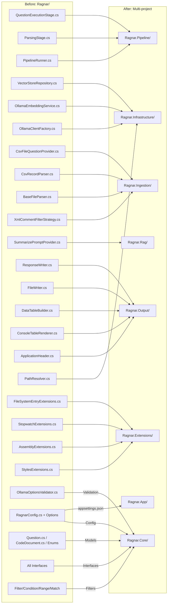

### <span style="color:darkblue;">[General]</span> Can you suggest how to better organize based on features the code into visual studio projects and namespaces? Please generate an updated mermaid Diagrams of the updated code compared to the current implementation. Please provide a step by step guide on migrating each file over to the updated structure.
> **Date Generated**: 9/13/2026 4:03:27 PM
> ## Question: 
> Can you suggest how to better organize based on features the code into visual studio projects and namespaces? Please generate an updated mermaid Diagrams of the updated code compared to the current implementation. Please provide a step by step guide on migrating each file over to the updated structure.
> **Method Call Duration**: 17:25
 ## Response: 
# Feature-Based Project & Namespace Reorganization

## Analysis of Current State

Your codebase is a single-user RAG CLI tool with clear feature boundaries (embeddings, vector storage, file parsing, question management, RAG orchestration, console output, pipeline execution) but currently lacks project-level separation. Everything appears to live in 1–2 projects, making cross-cutting concerns (config, extensions, output) difficult to locate and test in isolation.

---

## Proposed Project Structure (10 Projects)

```
Ragnar.sln
├── src/
│   ├── Ragnar.Core/              ← shared abstractions (no deps)
│   ├── Ragnar.Infrastructure/    ← Ollama + Qdrant + Path resolution
│   ├── Ragnar.Pipeline/          ← runner + stages
│   ├── Ragnar.Ingestion/         ← file parsing, discovery, question loading
│   ├── Ragnar.Rag/               ← RAG orchestration, prompts, summarization
│   ├── Ragnar.Output/            ← console rendering, tables, file writing
│   ├── Ragnar.Extensions/        ← utility extension methods
│   └── Ragnar.App/               ← console entry point + DI
├── tests/
│   ├── Ragnar.UnitTests/
│   └── Ragnar.IntegrationTests/
```

### Dependency Graph

```
Ragnar.App
 ├── Ragnar.Pipeline
 │    ├── Ragnar.Ingestion
 │    │    ├── Ragnar.Infrastructure
 │    │    └── Ragnar.Core
 │    ├── Ragnar.Rag
 │    │    ├── Ragnar.Infrastructure
 │    │    └── Ragnar.Core
 │    ├── Ragnar.Output
 │    │    └── Ragnar.Core
 │    └── Ragnar.Core
 ├── Ragnar.Extensions
 └── Ragnar.Core
```

---

## Mermaid Diagrams

### 1. Current (Flat) Structure

```mermaid
graph TD
    subgraph "RagnarSingleProject"
        QES[QuestionExecutionStage]
        PARSING[ParsingStage]
        PRUNNER[PipelineRunner]
        VSR[VectorStoreRepository]
        OES[OllamaEmbeddingService]
        OCF[OllamaClientFactory]
        CFP[CsvFileQuestionProvider]
        CSV[CsvRecordParser]
        BFP[BaseFileParser]
        XF[XmlCommentFilterStrategy]
        SUMP[SummarizePromptProvider]
        SW[ResponseWriter]
        FW[FileWriter]
        DTP[DataTableBuilder]
        CTR[ConsoleTableRenderer]
        AH[ApplicationHeader]
        PR[PathResolver]
        FSX[FileSystemEntryExtensions]
        SWX[StopwatchExtensions]
        ASX[AssemblyExtensions]
        STX[StylesExtensions]
        OOV[OllamaOptionsValidator]
        CFG[RagnarConfig + Options]
        MODELS[Question / CodeDocument / Enum]
        IFACES[All Interfaces]
        FILTERS[Filter / Condition / Range / Match]
    end

    style "RagnarSingleProject" fill:#fff3cd,stroke:#ffc107
```

### 2. New Feature-Based Structure

```mermaid
graph TD
    subgraph "RagnarCore"
        CORE_M[Models: Question, CodeDocument, EmbeddingContext, SaveDetails]
        CORE_E[Enums: QuestionCategory, OllamaServiceType, UpdateStatus]
        CORE_I[Interfaces: IPipelineStage, IFileParser, IQuestionProvider,<br/>IRagOrchestrator, IVectorSearchService, IEmbeddingService,<br/>IOllamaClientFactory, IChatPromptProvider, ISummaryService,<br/>IQuestionEmbedding, IOutputFormatter, IApplicationHeader,<br/>IPathResolver, ITableBuilder, ITableRenderer, IWriter]
        CORE_C[Config: RagnarConfig, OllamaOptions, EmbeddingOptions,<br/>FileLoadOptions, ApplicationOptions]
        CORE_F[Filters: Filter, Condition, FieldCondition, Range, Match, RepeatedStrings]
        CORE_V[Validation: OllamaOptionsValidator]
    end

    subgraph "RagnarExtensions"
        EXT_T[StopwatchExtensions]
        EXT_S[StringExtensions]
        EXT_A[AssemblyExtensions]
        EXT_C[StylesExtensions]
        EXT_F[FileSystemEntryExtensions]
    end

    subgraph "RagnarInfrastructure"
        INF_OE[OllamaEmbeddingService]
        INF_OCF[OllamaClientFactory]
        INF_VSR[VectorStoreRepository]
        INF_VSB[VectorStoreBuilder]
        INF_VSS[VectorSearchService]
        INF_PR[PathResolver]
    end

    subgraph "RagnarIngestion"
        ING_BFP[BaseFileParser / CSharpFileParser]
        ING_CSV[CsvRecordParser]
        ING_CFP[CsvFileQuestionProvider]
        ING_XF[XmlCommentFilterStrategy]
        ING_AGG[QuestionSourceAggregator]
        ING_PF[IFileParseFactory impl]
    end

    subgraph "RagnarRag"
        RAG_ORCH[RagOrchestrator]
        RAG_SUM[SummarizePromptProvider]
        RAG_SVC[SummaryService]
    end

    subgraph "RagnarPipeline"
        PL_RUN[PipelineRunner]
        PL_PARSING[ParsingStage]
        PL_ASK[QuestionExecutionStage]
        PL_EXC[PipelineStageException]
    end

    subgraph "RagnarOutput"
        OUT_AH[ApplicationHeader]
        OUT_DT[DataTableBuilder]
        OUT_CTR[ConsoleTableRenderer]
        OUT_TF[TableRendererFactory]
        OUT_RW[ResponseWriter]
        OUT_FW[FileWriter]
        OUT_FMT[MarkdownOutputFormatter]
        OUT_W[IOutputWriter impl]
    end

    subgraph "RagnarApp"
        APP_PROG[Program.cs]
        APP_DI[ServiceCollectionExtensions]
    end

    subgraph "RagnarUnitTests"
        UT_CORE[Core tests]
        UT_EXT[Extensions tests]
        UT_INF[Infrastructure tests]
        UT_ING[Ingestion tests]
        UT_RAG[Rag tests]
        UT_PL[Pipeline tests]
        UT_OUT[Output tests]
    end

    subgraph "RagnarIntegrationTests"
        IT_ALL[End-to-end pipeline tests]
    end

    %% Dependencies
    APP_PROG --> PL_RUN
    APP_PROG --> OUT_AH
    APP_DI --> INF_OE
    APP_DI --> ING_CFP
    APP_DI --> RAG_ORCH

    PL_PARSING --> ING_BFP
    PL_ASK --> RAG_ORCH
    PL_ASK --> ING_CFP
    PL_PARSING --> OUT_W

    RAG_ORCH --> INF_VSS
    RAG_ORCH --> INF_OE
    RAG_SVC --> INF_OE

    ING_BFP --> CORE_M
    ING_CSV --> CORE_I
    ING_CFP --> ING_CSV
    ING_XF --> CORE_F
    ING_AGG --> ING_CFP

    INF_OE --> CORE_C
    INF_OCF --> CORE_C
    INF_VSR --> CORE_M
    INF_VSB --> CORE_C
    INF_VSS --> CORE_I
    INF_PR --> CORE_C

    OUT_AH --> EXT_A
    OUT_AH --> OUT_W
    OUT_DT --> CORE_I
    OUT_CTR --> OUT_DT
    OUT_RW --> CORE_I
    OUT_FW --> CORE_I
    OUT_FMT --> CORE_M

    EXT_T --> CORE_E
    EXT_A --> CORE_M

    UT_CORE --> CORE_M
    UT_CORE --> CORE_V
    UT_EXT --> EXT_T
    UT_EXT --> EXT_S
    UT_EXT --> EXT_A
    UT_EXT --> EXT_F
    UT_INF --> INF_OE
    UT_INF --> INF_OCF
    UT_INF --> INF_VSR
    UT_ING --> ING_CSV
    UT_ING --> ING_XF
    UT_PL --> PL_ASK
    UT_PL --> PL_PARSING
    UT_OUT --> OUT_AH

    style "RagnarCore" fill:#e3f2fd,stroke:#2196f3
    style "RagnarExtensions" fill:#f3e5f5,stroke:#9c27b0
    style "RagnarInfrastructure" fill:#e8f5e9,stroke:#4caf50
    style "RagnarIngestion" fill:#fff3e0,stroke:#ff9800
    style "RagnarRag" fill:#fce4ec,stroke:#e91e63
    style "RagnarPipeline" fill:#e0f7fa,stroke:#00bcd4
    style "RagnarOutput" fill:#fffde7,stroke:#fdd835
    style "RagnarApp" fill:#efebe9,stroke:#795548
    style "RagnarUnitTests" fill:#f5f5f5,stroke:#9e9e9e
    style "RagnarIntegrationTests" fill:#fafafa,stroke:#bdbdbd
```

### 3. Side-by-Side File Mapping (Before → After)



---

## File → Project → Namespace Mapping Table

| # | File (current) | New Project | New Namespace | Rationale |
|---|---|---|---|---|
| 1 | `QuestionExecutionStage.cs` | **Ragnar.Pipeline** | `Ragnar.Pipeline.Stages` | Pipeline stage; depends on RAG + Questions |
| 2 | `ParsingStage.cs` | **Ragnar.Pipeline** | `Ragnar.Pipeline.Stages` | Pipeline stage; depends on Ingestion |
| 3 | `PipelineRunner.cs` | **Ragnar.Pipeline** | `Ragnar.Pipeline` | Orchestration core |
| 4 | `PipelineStageException.cs` | **Ragnar.Pipeline** | `Ragnar.Pipeline` | Pipeline-specific exception |
| 5 | `VectorStoreRepository.cs` | **Ragnar.Infrastructure** | `Ragnar.Infrastructure.VectorStore` | Qdrant persistence |
| 6 | `VectorStoreBuilder.cs` | **Ragnar.Infrastructure** | `Ragnar.Infrastructure.VectorStore` | Qdrant collection mgmt |
| 7 | `OllamaEmbeddingService.cs` | **Ragnar.Infrastructure** | `Ragnar.Infrastructure.Embeddings` | Ollama embedding calls |
| 8 | `OllamaClientFactory.cs` | **Ragnar.Infrastructure** | `Ragnar.Infrastructure.Embeddings` | Client caching |
| 9 | `VectorSearchService.cs` (impl) | **Ragnar.Infrastructure** | `Ragnar.Infrastructure.VectorStore` | Similarity search |
| 10 | `PathResolver.cs` | **Ragnar.Infrastructure** | `Ragnar.Infrastructure.Paths` | Directory resolution |
| 11 | `CsvFileQuestionProvider.cs` | **Ragnar.Ingestion** | `Ragnar.Ingestion.Questions` | CSV → Question mapping |
| 12 | `CsvRecordParser.cs` | **Ragnar.Ingestion** | `Ragnar.Ingestion.Parsing` | CSV deserialization |
| 13 | `BaseFileParser.cs` / parsers | **Ragnar.Ingestion** | `Ragnar.Ingestion.Parsing` | Code file → CodeDocument |
| 14 | `XmlCommentFilterStrategy.cs` | **Ragnar.Ingestion** | `Ragnar.Ingestion.Filtering` | Category-specific filter |
| 15 | `IQuestionSourceAggregator` (impl) | **Ragnar.Ingestion** | `Ragnar.Ingestion.Questions` | Fluent question builder |
| 16 | `RagOrchestrator.cs` | **Ragnar.Rag** | `Ragnar.Rag` | RAG execution |
| 17 | `SummarizePromptProvider.cs` | **Ragnar.Rag** | `Ragnar.Rag.Prompts` | Prompt templates |
| 18 | `SummaryService.cs` | **Ragnar.Rag** | `Ragnar.Rag` | Summarization orchestration |
| 19 | `ApplicationHeader.cs` | **Ragnar.Output** | `Ragnar.Output.Branding` | Console branding |
| 20 | `DataTableBuilder.cs` | **Ragnar.Output** | `Ragnar.Output.Tables` | Table construction |
| 21 | `ConsoleTableRenderer.cs` | **Ragnar.Output** | `Ragnar.Output.Tables` | Table rendering |
| 22 | `TableRendererFactory.cs` | **Ragnar.Output** | `Ragnar.Output.Tables` | Table factory |
| 23 | `ResponseWriter.cs` | **Ragnar.Output** | `Ragnar.Output.Writing` | Markdown response files |
| 24 | `FileWriter.cs` | **Ragnar.Output** | `Ragnar.Output.IO` | Low-level file write |
| 25 | `IOutputFormatter` (impl) | **Ragnar.Output** | `Ragnar.Output.Formatting` | Markdown formatting |
| 26 | `IOutputWriter` (impl) | **Ragnar.Output** | `Ragnar.Output` | Spectre console writer |
| 27 | `FileSystemEntryExtensions.cs` | **Ragnar.Extensions** | `Ragnar.Extensions.FileSystem` | File filter helper |
| 28 | `StopwatchExtensions.cs` | **Ragnar.Extensions** | `Ragnar.Extensions.Time` | Time formatting |
| 29 | `AssemblyExtensions.cs` | **Ragnar.Extensions** | `Ragnar.Extensions.Assembly` | Version helpers |
| 30 | `StylesExtensions.cs` | **Ragnar.Extensions** | `Ragnar.Extensions.Console` | Null-safe styles |
| 31 | `StringExtensions.cs` | **Ragnar.Extensions** | `Ragnar.Extensions.Text` | Span helpers |
| 32 | `OllamaOptionsValidator.cs` | **Ragnar.Core** | `Ragnar.Core.Configuration` | Config validation (no infra dep) |
| 33 | `RagnarConfig` + sub-options | **Ragnar.Core** | `Ragnar.Core.Configuration` | POCO config |
| 34 | `Question`, `CodeDocument`, enums | **Ragnar.Core** | `Ragnar.Core.Models` | Shared domain |
| 35 | All interfaces (`IPipelineStage`, `IFileParser`, etc.) | **Ragnar.Core** | `Ragnar.Core` (root) or feature sub-ns | Contracts |
| 36 | `Filter`, `Condition`, `Range`, `Match`, `RepeatedStrings` | **Ragnar.Core** | `Ragnar.Core.Filters` | Filter POCOs |
| 37 | `appsettings.json` | **Ragnar.App** | *(N/A – file)* | Runtime config |
| 38 | `Program.cs` + DI | **Ragnar.App** | `Ragnar.App` | Entry point |
| 39 | All `*Tests.cs` | **Ragnar.UnitTests** | `Ragnar.UnitTests.{Feature}` | Test isolation |

---

## Step-by-Step Migration Guide

> **Principle:** Migrate bottom-up (fewest dependencies first) so every project compiles at each step.

### Phase 0 – Scaffolding (30 min)

1. **Create the solution folder structure:**
   ```
   mkdir src tests
   cd src
   dotnet new classlib -n Ragnar.Core
   dotnet new classlib -n Ragnar.Extensions
   dotnet new classlib -n Ragnar.Infrastructure
   dotnet new classlib -n Ragnar.Ingestion
   dotnet new classlib -n Ragnar.Rag
   dotnet new classlib -n Ragnar.Pipeline
   dotnet new classlib -n Ragnar.Output
   dotnet new console  -n Ragnar.App
   cd ../tests
   dotnet new xunit   -n Ragnar.UnitTests
   dotnet new xunit   -n Ragnar.IntegrationTests
   ```

2. **Add project references (respect the dependency graph above):**
   ```
   Ragnar.Core          → (none)
   Ragnar.Extensions    → Ragnar.Core
   Ragnar.Infrastructure→ Ragnar.Core
   Ragnar.Ingestion     → Ragnar.Core
   Ragnar.Rag           → Ragnar.Core
   Ragnar.Pipeline      → Ragnar.Core, Ragnar.Ingestion, Ragnar.Rag, Ragnar.Output
   Ragnar.Output        → Ragnar.Core, Ragnar.Extensions
   Ragnar.App           → all of the above
   Ragnar.UnitTests     → all src projects
   Ragnar.IntegrationTests → all src projects
   ```

3. **Add NuGet packages** to the projects that need them:
   - `Ragnar.Core`: `FluentValidation`
   - `Ragnar.Infrastructure`: `OllamaSharp`, `Qdrant.Client`, `Microsoft.Extensions.Options`
   - `Ragnar.Ingestion`: `CsvHelper`
   - `Ragnar.Output`: `Spectre.Console`
   - `Ragnar.Pipeline`: `Spectre.Console`
   - `Ragnar.App`: `Microsoft.Extensions.Hosting`, `Serilog.*`
   - Test projects: `Moq`, `FluentValidation.Testing`, `Microsoft.NET.Test.Sdk`

---

### Phase 1 – `Ragnar.Core` (the foundation)

Move **all types that have zero or only POCO/interface dependencies**:

| Step | File(s) to move | Target namespace | Notes |
|------|----------------|-----------------|-------|
| 1.1 | `Question.cs`, `CodeDocument.cs`, `EmbeddingContext.cs`, `SaveDetails.cs`, `UpdateResult.cs`, `QuestionRecord.cs` | `Ragnar.Core.Models` | Pure POCOs / records |
| 1.2 | `QuestionCategory.cs`, `OllamaServiceType.cs`, `UpdateStatus.cs` | `Ragnar.Core.Enums` | Enums |
| 1.3 | `Filter.cs`, `Condition.cs`, `FieldCondition.cs`, `Range.cs`, `Match.cs`, `RepeatedStrings.cs` | `Ragnar.Core.Filters` | Filter POCOs (no logic) |
| 1.4 | `RagnarConfig.cs`, `OllamaOptions.cs`, `EmbeddingOptions.cs`, `FileLoadOptions.cs`, `ApplicationOptions.cs` | `Ragnar.Core.Configuration` | Config POCOs |
| 1.5 | `OllamaOptionsValidator.cs` | `Ragnar.Core.Configuration` | Depends only on `OllamaOptions` |
| 1.6 | **All interfaces**: `IPipelineStage<T>`, `IFileParser`, `IQuestionProvider`, `IQuestionEmbedding`, `IQuestionSourceAggregator`, `IRagOrchestrator`, `IEmbeddingService`, `IOllamaClientFactory`, `IVectorSearchService`, `IVectorStoreRepository`, `IChatPromptProvider`, `ISummaryService`, `IOutputFormatter`, `IResponseWriter`, `IWriter`, `IOutputWriter`, `IApplicationHeader`, `ITableBuilder`, `ITableRenderer`, `IPathResolver`, `IFilterStrategy`, `IFileParseFactory` | `Ragnar.Core` (root) or feature sub-ns | Keep in one namespace for discoverability, or split: `Ragnar.Core.Pipeline`, `Ragnar.Core.Files`, `Ragnar.Core.Questions`, `Ragnar.Core.Rag`, `Ragnar.Core.Output`, `Ragnar.Core.VectorStore` |

> **Compile check:** `dotnet build src/Ragnar.Core`

---

### Phase 2 – `Ragnar.Extensions`

| Step | File(s) to move | Target namespace | Notes |
|------|----------------|-----------------|-------|
| 2.1 | `StopwatchExtensions.cs` | `Ragnar.Extensions.Time` | References only `System.Diagnostics` |
| 2.2 | `StringExtensions.cs` | `Ragnar.Extensions.Text` | Span-based helpers |
| 2.3 | `AssemblyExtensions.cs` | `Ragnar.Extensions.Assembly` | C# 13 extension blocks |
| 2.4 | `StylesExtensions.cs` | `Ragnar.Extensions.Console` | Needs `Spectre.Console` package |
| 2.5 | `FileSystemEntryExtensions.cs` | `Ragnar.Extensions.FileSystem` | Needs `Spectre.Console` package |

> **Compile check:** `dotnet build src/Ragnar.Extensions`

---

### Phase 3 – `Ragnar.Infrastructure`

| Step | File(s) to move | Target namespace | Notes |
|------|----------------|-----------------|-------|
| 3.1 | `OllamaClientFactory.cs` | `Ragnar.Infrastructure.Embeddings` | Implements `IOllamaClientFactory` |
| 3.2 | `OllamaEmbeddingService.cs` | `Ragnar.Infrastructure.Embeddings` | Implements `IEmbeddingService` |
| 3.3 | `VectorStoreRepository.cs` | `Ragnar.Infrastructure.VectorStore` | Implements `IVectorStoreRepository` |
| 3.4 | `VectorStoreBuilder.cs` | `Ragnar.Infrastructure.VectorStore` | Qdrant collection ops |
| 3.5 | `VectorSearchService.cs` (if separate file) | `Ragnar.Infrastructure.VectorStore` | Implements `IVectorSearchService` |
| 3.6 | `PathResolver.cs` | `Ragnar.Infrastructure.Paths` | Implements `IPathResolver` |

> **Compile check:** `dotnet build src/Ragnar.Infrastructure`

---

### Phase 4 – `Ragnar.Ingestion`

| Step | File(s) to move | Target namespace | Notes |
|------|----------------|-----------------|-------|
| 4.1 | `BaseFileParser.cs` + concrete parsers | `Ragnar.Ingestion.Parsing` | Implements `IFileParser` |
| 4.2 | `IFileParseFactory` (impl) | `Ragnar.Ingestion.Parsing` | Factory for parsers |
| 4.3 | `CsvRecordParser.cs` | `Ragnar.Ingestion.Parsing` | CSV → `QuestionRecord` |
| 4.4 | `CsvFileQuestionProvider.cs` | `Ragnar.Ingestion.Questions` | Implements `IQuestionProvider` |
| 4.5 | `XmlCommentFilterStrategy.cs` | `Ragnar.Ingestion.Filtering` | Implements `IFilterStrategy` |
| 4.6 | `QuestionSourceAggregator` (fluent builder impl) | `Ragnar.Ingestion.Questions` | Implements `IQuestionSourceAggregator` |

> **Compile check:** `dotnet build src/Ragnar.Ingestion`

---

### Phase 5 – `Ragnar.Rag`

| Step | File(s) to move | Target namespace | Notes |
|------|----------------|-----------------|-------|
| 5.1 | `SummarizePromptProvider.cs` | `Ragnar.Rag.Prompts` | Implements `IChatPromptProvider` |
| 5.2 | `SummaryService.cs` (impl of `ISummaryService`) | `Ragnar.Rag` | Orchestration |
| 5.3 | `RagOrchestrator.cs` (impl of `IRagOrchestrator`) | `Ragnar.Rag` | Main RAG flow |

> **Compile check:** `dotnet build src/Ragnar.Rag`

---

### Phase 6 – `Ragnar.Output`

| Step | File(s) to move | Target namespace | Notes |
|------|----------------|-----------------|-------|
| 6.1 | `ApplicationHeader.cs` | `Ragnar.Output.Branding` | Uses `AssemblyExtensions` from Extensions |
| 6.2 | `DataTableBuilder.cs` | `Ragnar.Output.Tables` | Implements `ITableBuilder` |
| 6.3 | `ConsoleTableRenderer.cs` | `Ragnar.Output.Tables` | Implements `ITableRenderer` |
| 6.4 | `TableRendererFactory.cs` | `Ragnar.Output.Tables` | Static factory |
| 6.5 | `FileWriter.cs` | `Ragnar.Output.IO` | Implements `IWriter` |
| 6.6 | `ResponseWriter.cs` | `Ragnar.Output.Writing` | Implements `IResponseWriter` |
| 6.7 | Markdown formatter (impl of `IOutputFormatter`) | `Ragnar.Output.Formatting` | |
| 6.8 | `IOutputWriter` implementation (Spectre wrapper) | `Ragnar.Output` | |

> **Compile check:** `dotnet build src/Ragnar.Output`

---

### Phase 7 – `Ragnar.Pipeline`

| Step | File(s) to move | Target namespace | Notes |
|------|----------------|-----------------|-------|
| 7.1 | `PipelineStageException.cs` | `Ragnar.Pipeline` | |
| 7.2 | `PipelineRunner.cs` | `Ragnar.Pipeline` | Core orchestration |
| 7.3 | `ParsingStage.cs` | `Ragnar.Pipeline.Stages` | Implements `IPipelineStage<EmbeddingContext>` |
| 7.4 | `QuestionExecutionStage.cs` | `Ragnar.Pipeline.Stages` | Implements `IPipelineStage<EmbeddingContext>` |

> **Compile check:** `dotnet build src/Ragnar.Pipeline`

---

### Phase 8 – `Ragnar.App` (entry point)

| Step | Action | Notes |
|------|--------|-------|
| 8.1 | Create `Program.cs` with `Host.CreateApplicationBuilder` | Top-level DI |
| 8.2 | Create `ServiceCollectionExtensions.cs` | Register all concrete types → interfaces |
| 8.3 | Copy `appsettings.json` (Ragnar + Serilog) into `Ragnar.App/` | Set `CopyToOutputDirectory = PreserveNewest` |
| 8.4 | Add `Serilog` sinks, `FluentValidation` auto-discovery, `OllamaSharp`, `Qdrant.Client` | Packages consumed transitively |
| 8.5 | Wire up `PipelineRunner` with stages in `Program.cs` | `runner.AddStage(parsingStage).AddStage(questionStage)` |

> **Compile check:** `dotnet build src/Ragnar.App`

---

### Phase 9 – Tests

| Step | File(s) to move | Target namespace | Notes |
|------|----------------|-----------------|-------|
| 9.1 | `OllamaOptionsValidatorTests.cs` | `Ragnar.UnitTests.Core` | |
| 9.2 | `StringExtensionsTests.cs` | `Ragnar.UnitTests.Extensions` | |
| 9.3 | `OllamaClientFactoryTests.cs` | `Ragnar.UnitTests.Infrastructure` | |
| 9.4 | `VectorStoreBuilderTests.cs` | `Ragnar.UnitTests.Infrastructure` | |
| 9.5 | `CsvRecordParserTests.cs` | `Ragnar.UnitTests.Ingestion` | |
| 9.6 | `XmlCommentFilterStrategyTests.cs` | `Ragnar.UnitTests.Ingestion` | |
| 9.7 | `AskQuestionsStageTests.cs` | `Ragnar.UnitTests.Pipeline` | |
| 9.8 | *(add)* `ParsingStageTests.cs` | `Ragnar.UnitTests.Pipeline` | |
| 9.9 | *(add)* `ApplicationHeaderTests.cs` | `Ragnar.UnitTests.Output` | |
| 9.10 | *(add)* `DataTableBuilderTests.cs` | `Ragnar.UnitTests.Output` | |
| 9.11 | Integration tests (full pipeline with real Ollama + Qdrant) | `Ragnar.IntegrationTests` | Use `IHost` fixture |

> **Compile + test check:** `dotnet test tests/Ragnar.UnitTests`

---

### Phase 10 – Cleanup & Verification

1. **Delete the old single project** from the solution.
2. **Run `dotnet build` on the entire solution** – resolve any `using` or namespace mismatches.
3. **Run full test suite** – `dotnet test Ragnar.sln`.
4. **Run the app end-to-end** – `dotnet run --project src/Ragnar.App` with a real Ollama + Qdrant.
5. **Add a `.editorconfig` / `.globalconfig`** at repo root with:
   ```
   [*.cs]
   csharp_style_namespace_declarations = file_scoped:warning
   dotnet_style_require_accessibility_modifiers = always:warning
   ```
6. **Add `Directory.Build.props`** to enforce:
   - `<LangVersion>latest</LangVersion>`
   - `<Nullable>enable</Nullable>`
   - `<TreatWarningsAsErrors>true</TreatWarningsAsErrors>`
   - Common package versions via Central Package Management (CPM).
7. **Add `Directory.Packages.props`** for CPM:
   ```xml
   <ItemGroup>
     <PackageVersion Include="Spectre.Console" Version="0.49.1" />
     <PackageVersion Include="Qdrant.Client" Version="3.8.1" />
     <PackageVersion Include="OllamaSharp" Version="3.2.0" />
     <PackageVersion Include="FluentValidation" Version="11.11.0" />
     <PackageVersion Include="CsvHelper" Version="33.1.0" />
     <PackageVersion Include="Serilog" Version="4.2.0" />
     <!-- … -->
   </ItemGroup>
   ```

---

## Namespace Convention Summary

```
Ragnar.Core                    → interfaces, shared contracts
Ragnar.Core.Models             → POCO / record domain types
Ragnar.Core.Enums              → enumerations
Ragnar.Core.Configuration      → options POCOs + validators
Ragnar.Core.Filters            → filter / condition POCOs

Ragnar.Extensions              → (static extension classes)
Ragnar.Extensions.Time
Ragnar.Extensions.Text
Ragnar.Extensions.Assembly
Ragnar.Extensions.Console
Ragnar.Extensions.FileSystem

Ragnar.Infrastructure.Embeddings
Ragnar.Infrastructure.VectorStore
Ragnar.Infrastructure.Paths

Ragnar.Ingestion.Parsing
Ragnar.Ingestion.Questions
Ragnar.Ingestion.Filtering

Ragnar.Rag
Ragnar.Rag.Prompts

Ragnar.Pipeline
Ragnar.Pipeline.Stages

Ragnar.Output.Branding
Ragnar.Output.Tables
Ragnar.Output.IO
Ragnar.Output.Writing
Ragnar.Output.Formatting

Ragnar.App                     → Program, DI

Ragnar.UnitTests.{Core|Extensions|Infrastructure|Ingestion|Rag|Pipeline|Output}
Ragnar.IntegrationTests
```

---

## Key Benefits of This Layout

| Concern | Before | After |
|---------|--------|-------|
| **Compile isolation** | One giant DLL; a typo in a table builder breaks everything | `Ragnar.Output` compiles independently of Qdrant code |
| **Test speed** | All tests in one assembly | `Ragnar.UnitTests` can be split by feature; CI can parallelise |
| **Dependency visibility** | Hard to tell if `FileWriter` accidentally calls Ollama | Project-reference graph enforces the boundary at build time |
| **Onboarding** | New dev opens one project with 60+ files | New dev opens `Ragnar.Ingestion/` (6 files) to understand file loading |
| **Reusability** | Core models can't be referenced without pulling in Spectre/Qdrant | `Ragnar.Core` has zero heavy deps → consumable by a future WPF/Blazor front-end |
| **Feature deletion** | Removing "summaries" means hunting through one project | Delete `Ragnar.Rag/SummarizeService.cs` + its tests; rebuild; done |

This structure keeps the solution at a manageable **8 src + 2 test = 10 projects**, each with a single clear responsibility and a namespace that mirrors the folder path 1-to-1.
