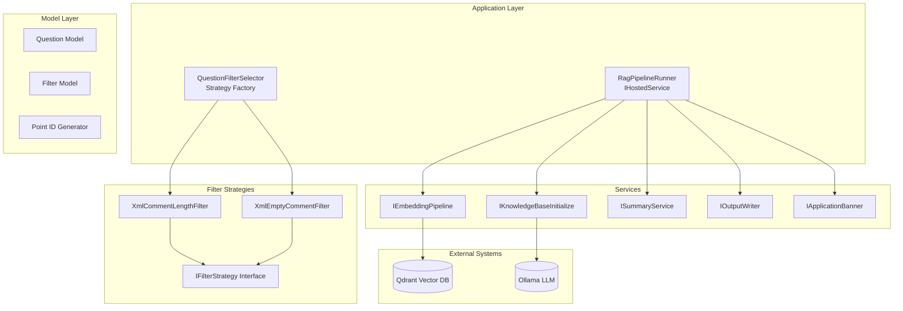
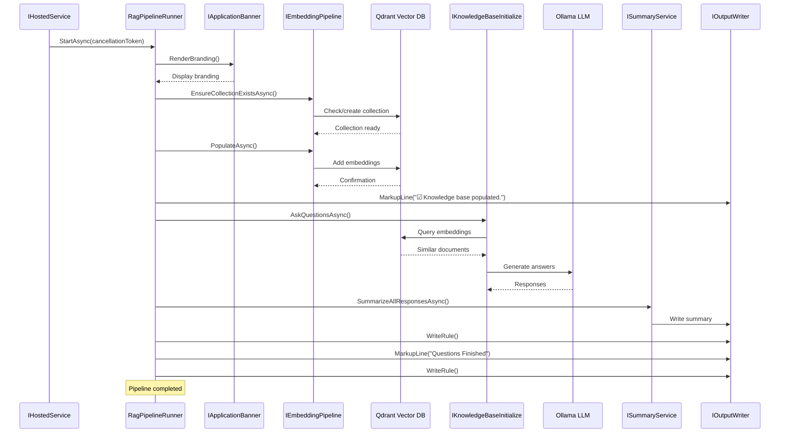
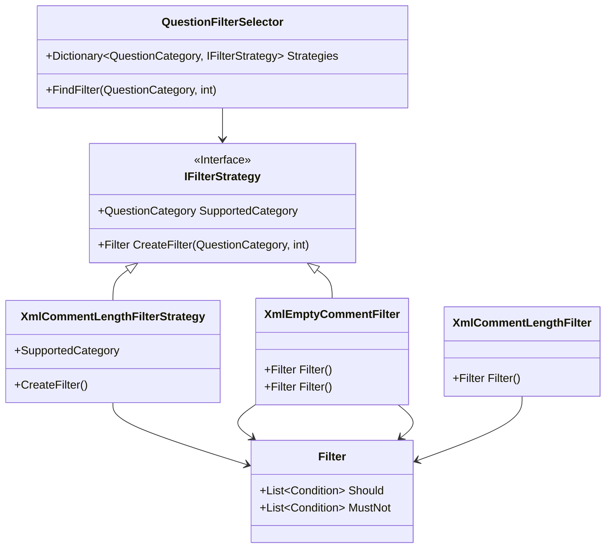
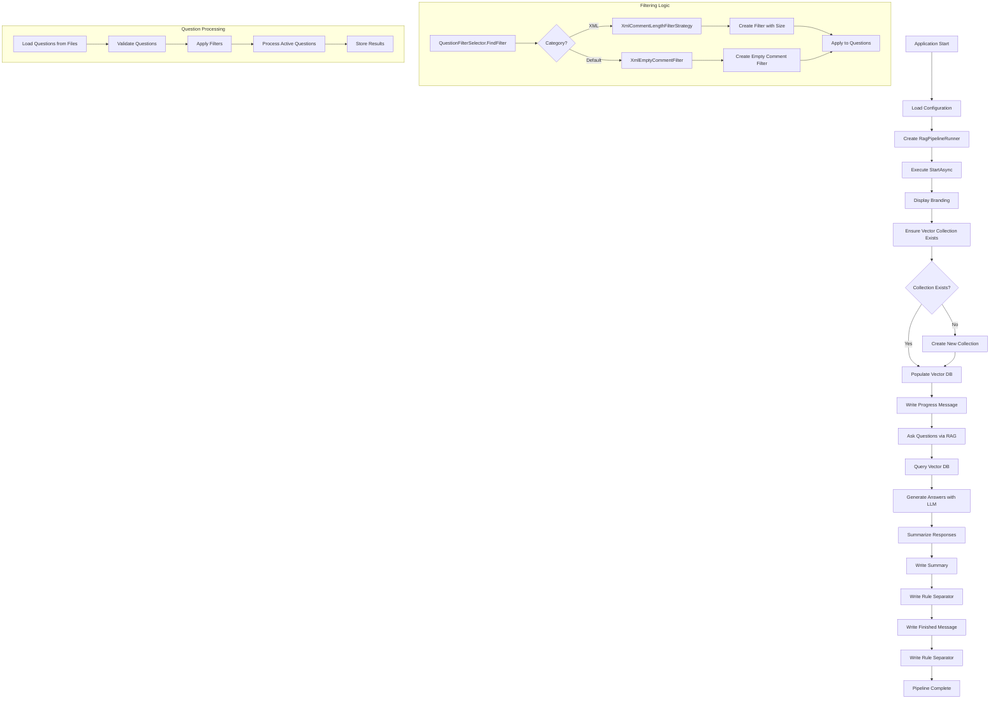
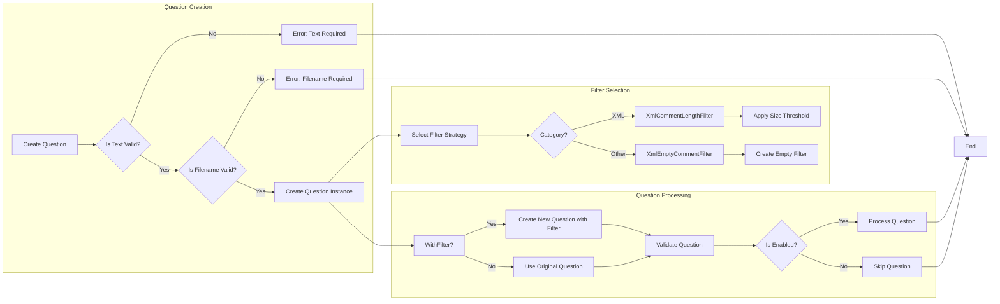
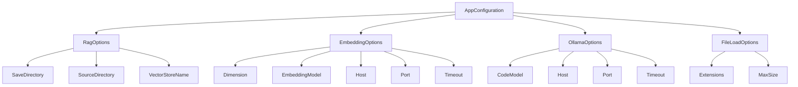
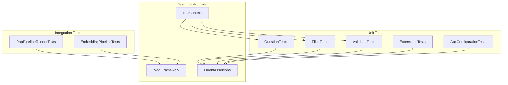

### <span style="color:darkblue;">[Diagram]</span> Analyze the following C# code base. Generate the appropriate Mermaid diagrams, a sequence diagram, an application flowchart(s), and class diagrams based on the provided source code. If their are other types of diagrams please generate those as well.
> **Date Generated**: 8/5/2026 11:55:16 PM
> ## Question: 
> Analyze the following C# code base. Generate the appropriate Mermaid diagrams, a sequence diagram, an application flowchart(s), and class diagrams based on the provided source code. If their are other types of diagrams please generate those as well.
> **Method Call Duration**: 17:58
 ## Response: 
Based on the provided C# code snippets, I can see this is a **RAG (Retrieval-Augmented Generation) pipeline application** for analyzing code comments, with filtering strategies, question management, and integration with embedding services (likely Qdrant vector DB and Ollama LLM). Let me analyze the architecture and generate appropriate diagrams.

## Key Components Identified

1. **Question Management System**
   - `Question` model with enabled/disabled states
   - `QuestionFilterSelector` with strategy pattern for filtering
   - Various filter strategies (`XmlCommentLengthFilter`, `XmlEmptyCommentFilter`)
   - Validation logic

2. **RAG Pipeline Components**
   - `RagPipelineRunner` (hosted service)
   - `IEmbeddingPipeline` for vector embeddings
   - `IKnowledgeBaseInitialize` for question processing

3. **Configuration & Options**
   - `AppConfiguration` with nested options classes
   - `AssemblyInfo` for assembly metadata

4. **Testing Infrastructure**
   - Extensive xUnit test classes for all components

## Diagrams

### 1. Application Architecture Diagram



### 2. Class Diagram (Core Components)

```mermaid
classDiagram
    class Question {
        +bool IsEnabled
        +string Text
        +string Filename
        +QuestionCategory Category
        +Filter? Filter
        +static IsActive()
        +static IsDisabled()
        +static FromFilePathAndIndex()
        +WithFilter()
        +ValidateQuestion()
        +ToActiveOrDisabledQuestion()
    }
    
    class Filter {
        +List~Condition~ Should
        +List~Condition~ MustNot
    }
    
    class Point {
        +static FromFilePathAndIndex()
    }
    
    class IFilterStrategy {
        <<Interface>>
        +SupportedCategory
        +CreateFilter()
    }
    
    class XmlCommentLengthFilterStrategy {
        +SupportedCategory
        +CreateFilter()
    }
    
    class XmlEmptyCommentFilter {
        +Filter Filter()
    }
    
    class QuestionFilterSelector {
        +Dictionary~QuestionCategory, IFilterStrategy~ Strategies
        +FindFilter()
    }
    
    class RagPipelineRunner {
        +StartAsync()
        +StopAsync()
    }
    
    class AppConfiguration {
        +RagOptions RagOptions
        +EmbeddingOptions EmbeddingOptions
        +OllamaOptions OllamaOptions
        +FileLoadOptions FileLoadOptions
    }
    
    class IAssemblyInfo {
        <<Interface>>
        +Assembly Assembly
    }
    
    class AssemblyInfo {
        +Assembly Assembly
    }
    
    class QuestionValidator {
        +Validate()
    }
    
    class FilterInputValidator {
        +Validate()
    }
    
    class QuestionExtensions {
        +ActiveOnly()
        +InActiveOnly()
        +MatchesCategories()
        +WithFilter()
        +ValidateQuestion()
        +ToActiveOrDisabledQuestion()
    }
    
    class StopwatchExtensions {
        +ElapsedTimeString()
    }
    
    class IHostedService {
        <<Interface>>
        +StartAsync()
        +StopAsync()
    }
    
    class IEmbeddingPipeline {
        <<Interface>>
        +EnsureCollectionExistsAsync()
        +PopulateAsync()
    }
    
    class IKnowledgeBaseInitialize {
        <<Interface>>
        +AskQuestionsAsync()
    }
    
    class ISummaryService {
        <<Interface>>
        +SummarizeAllResponsesAsync()
    }
    
    class IOutputWriter {
        <<Interface>>
        +WriteLine()
        +MarkupLine()
        +WriteRule()
    }
    
    class IApplicationBanner {
        <<Interface>>
        +RenderBranding()
    }
    
    Question --> Filter
    Question --> Point
    QuestionFilterSelector --> IFilterStrategy
    XmlCommentLengthFilterStrategy ..|> IFilterStrategy
    XmlEmptyCommentFilter ..|> IFilterStrategy
    RagPipelineRunner ..|> IHostedService
    RagPipelineRunner --> IEmbeddingPipeline
    RagPipelineRunner --> IKnowledgeBaseInitialize
    RagPipelineRunner --> ISummaryService
    RagPipelineRunner --> IOutputWriter
    RagPipelineRunner --> IApplicationBanner
    AppConfiguration --> RagOptions
    AppConfiguration --> EmbeddingOptions
    AppConfiguration --> OllamaOptions
    AppConfiguration --> FileLoadOptions
    AssemblyInfo ..|> IAssemblyInfo
    QuestionValidator --> Question
    FilterInputValidator --> (QuestionCategory, int)
    StopwatchExtensions --> Stopwatch
```

### 3. Sequence Diagram: RAG Pipeline Execution



### 4. Strategy Pattern Implementation



### 5. Application Flowchart



### 6. Question Management Flow



### 7. Configuration Structure



### 8. Testing Strategy



## Key Insights

1. **Architecture Pattern**: Clean architecture with clear separation of concerns
   - Domain models (Question, Filter, Point)
   - Services (RAG pipeline, embedding, summary)
   - Configuration options
   - Testing infrastructure

2. **Design Patterns**:
   - Strategy pattern for filtering
   - Factory pattern for filter selection
   - Dependency injection for services
   - Extension methods for question operations

3. **Key Features**:
   - XML comment analysis with length-based filtering
   - Vector database integration (Qdrant)
   - LLM integration (Ollama)
   - Comprehensive validation and testing

4. **Extensibility**: The strategy pattern allows easy addition of new filter types for different question categories.

This system appears to be a code documentation quality analyzer that uses RAG techniques to help developers understand and improve their code comments.
