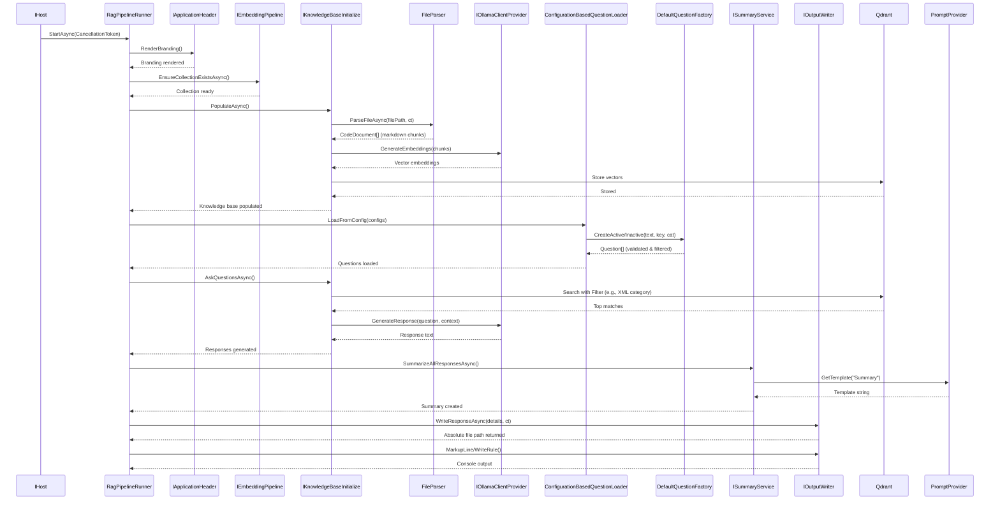

### <span style="color:darkblue;">[Diagram]</span> Analyze the following C# code base. Generate the appropriate Mermaid diagrams, a sequence diagram, an application flowchart(s), and class diagrams based on the provided source code. If their are other types of diagrams please generate those as well.
> **Date Generated**: 8/16/2026 4:06:11 PM
> ## Question: 
> Analyze the following C# code base. Generate the appropriate Mermaid diagrams, a sequence diagram, an application flowchart(s), and class diagrams based on the provided source code. If their are other types of diagrams please generate those as well.
> **Method Call Duration**: 20:07
 ## Response: 
Based on the provided C# codebase, here are the architectural diagrams that capture the structure, runtime flow, and component interactions of your RAG pipeline application.

### 1. Class Diagram (Architecture & Dependencies)
This diagram illustrates the core classes, interfaces, inheritance chains, and dependency relationships extracted from your source files.

```mermaid
classDiagram
    %% Core Interfaces
    interface IHostedService
    interface IFileParser
    interface IFileValidator
    interface IQuestionFactory
    interface IOllamaClientProvider
    interface ISummaryService
    interface IOutputWriter
    interface IKnowledgeBaseInitialize
    interface IEmbeddingPipeline
    interface ISystemPromptProvider

    %% Implementations & Core Classes
    class RagPipelineHostBuilder { +CreateDefaultBuilder() }
    class RagPipelineRunner { +StartAsync() +StopAsync() }
    class FileParser { +ParseFileAsync() }
    class AFileParser { <<abstract>> +ReadFileAsync() }
    class FileValidator { +IsValid() }
    class DefaultQuestionFactory { +CreateActive() +CreateInactive() }
    class ConfigurationBasedQuestionLoader { +LoadFromConfig() }
    class OllamaClientProvider { +FindClient() }
    class ResponseWriter { +WriteResponseAsync() }
    class SummarizePromptProvider { +Template }

    %% Configuration & Data Models
    class ApplicationConfiguration
    class OllamaOptions
    class EmbeddingOptions
    class FileLoadOptions
    class Question { +IsEnabled, Text, Filename, Category, Filter }
    class CodeDocument { +FileName, Comment, Code, ElementType }
    class Filter

    %% Relationships: Inheritance & Implementation
    IHostedService <|-- RagPipelineRunner
    IFileParser <|-- AFileParser
    AFileParser <|-- FileParser
    IFileValidator <|-- FileValidator
    IQuestionFactory <|-- DefaultQuestionFactory
    IOllamaClientProvider <|-- OllamaClientProvider
    ISummaryService <|-- SummaryService
    IOutputWriter <|-- AnsiConsoleOutputWriter
    IKnowledgeBaseInitialize <|-- KnowledgeBaseInitialization
    IEmbeddingPipeline <|-- EmbeddingPipeline
    ISystemPromptProvider <|-- SummarizePromptProvider

    %% Relationships: Composition & Usage
    RagPipelineHostBuilder --> ApplicationConfiguration : configures
    RagPipelineHostBuilder --> OllamaOptions : binds
    RagPipelineHostBuilder --> FileLoadOptions : validates
    ConfigurationBasedQuestionLoader --> QuestionFactoryDelegate : uses delegate
    DefaultQuestionFactory --> Question : creates instances
    FileParser --> CodeDocument : produces chunks
    ResponseWriter --> SaveDetails : formats markdown
    SummarizePromptProvider --> ISystemPromptProvider : implements
    
    note for RagPipelineHostBuilder "Static DI & Service Registration\nHandles plugins, resilience, options binding"
    note for RagPipelineRunner "IHostedService orchestrator\nRuns the RAG pipeline lifecycle"
```



### 2. Sequence Diagram (RAG Pipeline Execution)
This diagram maps the asynchronous execution flow inside `RagPipelineRunner.StartAsync()`, showing how services coordinate during runtime.



### 3. Application Flowchart (High-Level System Architecture)
This flowchart visualizes the bootstrapping, dependency injection setup, and high-level pipeline stages.

```mermaid
graph TD
    A[Host Startup] --> B[RagPipelineHostBuilder.CreateDefaultBuilder]
    
    subgraph DI & Configuration Setup
        B --> C[Bind Options:<br/>ApplicationOptions, EmbeddingOptions,<br/>FileLoadOptions, OllamaOptions]
        C --> D[Validate DataAnnotations<br/>& Post-Configure Paths]
        D --> E[Register HTTP Clients with Resilience<br/>(Timeouts, Circuit Breakers, Jitter)]
        E --> F[Discover & Load Plugins via Reflection<br/>IQuestionProvider DLLs]
    end
    
    subgraph Pipeline Execution (IHostedService)
        G[RagPipelineRunner.StartAsync] --> H1[Rend Branding]
        H1 --> H2[Ensure Qdrant Collection Exists]
        H2 --> H3[Populate Knowledge Base]
        H3 --> H4[Parse Files -> Split Markdown Chunks]
        H4 --> H5[Generate Embeddings via Ollama]
        H5 --> H6[Store Vectors in Qdrant]
        H6 --> H7[Load Questions & Apply Filters<br/>(Active/Inactive, XML Category)]
        H7 --> H8[Vector Search + LLM Query]
        H8 --> H9[Summarize Responses via Prompt Provider]
        H9 --> H10[Write Markdown Output Files]
    end
    
    F --> G
    G --> H2
    H10 --> I[Pipeline Complete & Host Stops]
    
    style B fill:#e1f5fe,stroke:#01579b
    style G fill:#fff3e0,stroke:#e65100
    style H4 fill:#e8f5e9,stroke:#2e7d32
    style H8 fill:#fce4ec,stroke:#880e4f
```

### Key Architectural Insights from the Codebase:
1. **Centralized Bootstrap**: `RagPipelineHostBuilder` acts as the single source of truth for DI registration, configuration binding, resilience policy setup, and plugin discovery. This follows the *Facade* pattern to simplify host initialization.
2. **Pipeline Orchestration**: `RagPipelineRunner` implements `IHostedService` and strictly sequences the RAG workflow: Branding → Collection Prep → Embedding/Storage → Question Loading → Vector Search + LLM → Summarization → Output.
3. **Factory & Loader Pattern**: Questions are decoupled from creation logic using `DefaultQuestionFactory` (validation & instantiation) and `ConfigurationBasedQuestionLoader` (transformation, filtering, and XML-specific filter injection).
4. **Extensibility**: 
   - File parsing is abstracted via `AFileParser` → `FileParser`.
   - Prompting uses `ISystemPromptProvider` with keyed DI (`"Common"` vs `"Summary"`).
   - Plugins are loaded dynamically from a `Questions/Plugins` directory using reflection.
5. **Resilience & Configuration**: HTTP clients to Ollama use Polly's standard resilience handler (retry, circuit breaker, jitter). All options are strongly typed and validated at startup via `ValidateDataAnnotations().ValidateOnStart()`.

You can render these diagrams in any Mermaid-compatible viewer (VS Code, GitHub, Draw.io, or [Mermaid Live Editor](https://mermaid.live)). Let me know if you need a specific component diagram, state machine for the pipeline phases, or database schema visualization!
