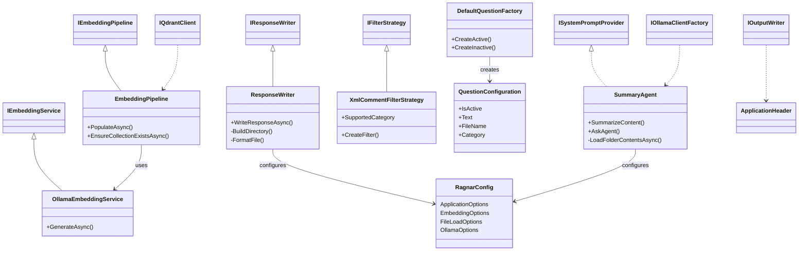
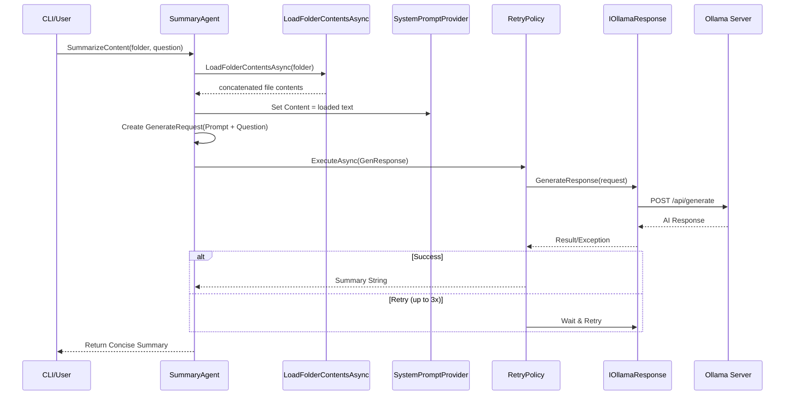
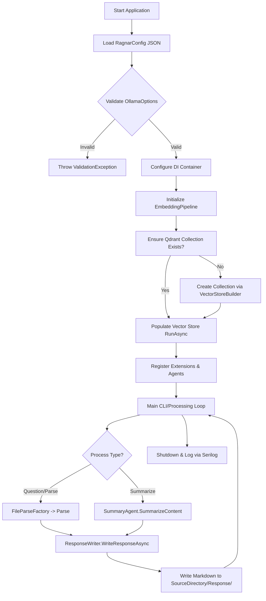
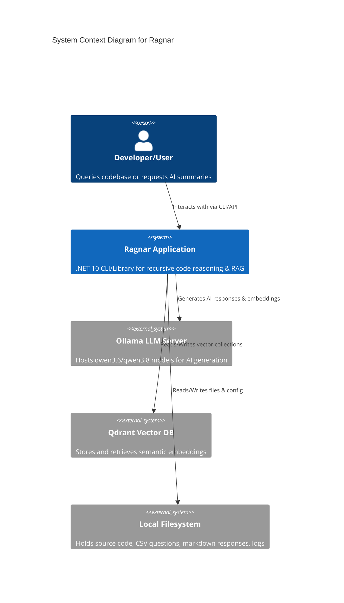
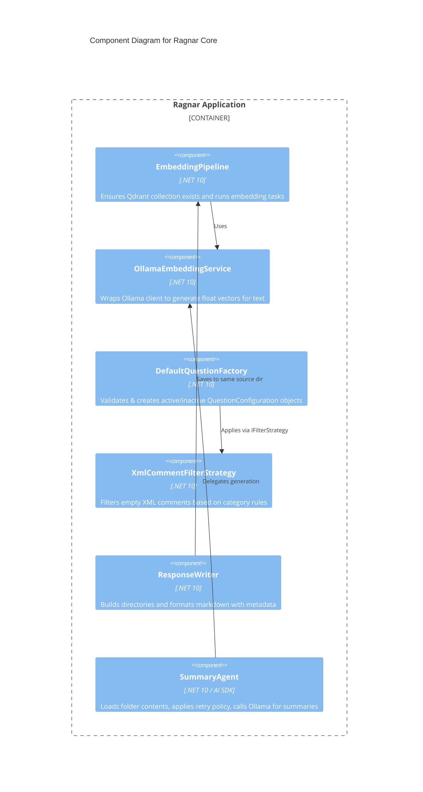
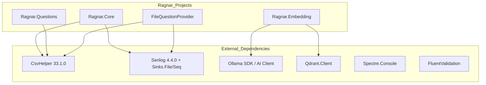

### <span style="color:darkblue;">[Diagram]</span> Analyze the following C# code base. Generate the appropriate Mermaid diagrams, a sequence diagram, an application flowchart(s), and class diagrams based on the provided source code. Please also create valid mermaid C4 Diagrams If their are other Mermaid diagrams that would help to understand the provided code base.
> **Date Generated**: 8/24/2026 12:37:59 PM
> ## Question: 
> Analyze the following C# code base. Generate the appropriate Mermaid diagrams, a sequence diagram, an application flowchart(s), and class diagrams based on the provided source code. Please also create valid mermaid C4 Diagrams If their are other Mermaid diagrams that would help to understand the provided code base.
> **Method Call Duration**: 32:42
 ## Response: 
Based on the provided C# codebase snippets, configuration files, and metadata, here is a comprehensive set of Mermaid diagrams that capture the architecture, runtime behavior, and structural relationships of the **Ragnar** application.

### 1. Class Diagram
Illustrates core domain classes, interfaces, utility extensions, and their dependencies.



### 2. Sequence Diagram: Summary Agent Workflow
Captures the runtime interaction when processing a directory summary request, including file loading, prompt assembly, retry policy execution, and LLM communication.



### 3. Application Flowchart: Startup & Processing Pipeline
Maps the high-level application lifecycle from configuration loading through embedding, question processing, and response generation.



### 4. C4 Architecture Diagrams
Provides a layered architectural view (Context → Container → Component) aligned with the codebase structure.

#### Context Diagram


#### Container Diagram
```mermaid
C4Container
  title Container Diagram for Ragnar
  Container_Boundary(app, "Ragnar Application") {
    Container(cli, "CLI Entry Point", ".NET 10 / C# 14", "Application startup, DI setup, branding, and main loop")
    Container(embedding, "Embedding Pipeline", ".NET 10", "Manages vector store initialization and text embedding via Ollama")
    Container(questions, "Question Processor", ".NET 10", "Parses CSV/Code files, filters XML comments, creates QuestionConfigurations")
    Container(responses, "Response Writer", ".NET 10", "Formats markdown responses and saves to categorized directories")
    Container(agent, "Summary Agent", ".NET 10 / AI SDK", "Orchestrates folder content loading, LLM prompting, and retry policies")
  }

  Rel(cli, embedding, "Initializes & triggers")
  Rel(cli, questions, "Delegates parsing")
  Rel(questions, responses, "Saves processed results")
  Rel(agent, embedding, "Uses OllamaClientFactory")
  Rel(embedding, qdrant, "Stores vectors")
  Rel(agent, ollama, "Generates AI text")
```

#### Component Diagram


### 5. Additional Recommended Diagrams & Analysis Notes

#### Dependency/Package Diagram (NuGet & Project Structure)
Highlights external dependencies and internal project boundaries derived from the `project.assets.json` and `.csproj` metadata.


#### Key Architectural Insights from Codebase:
1. **Configuration-Driven & Validated**: `RagnarConfig` is loaded at startup and validated via `OllamaOptionsValidator`. Paths support environment variable expansion (`%USERPROFILE%`).
2. **Vector RAG Pipeline**: `EmbeddingPipeline` handles Qdrant collection lifecycle, while `OllamaEmbeddingService` bridges text to float vectors using Ollama's embedding model.
3. **Strategy Pattern for Filtering**: `XmlCommentFilterStrategy` implements `IFilterStrategy`, allowing extensible filtering rules (e.g., empty XML comments) without modifying core logic.
4. **Resilient AI Integration**: `SummaryAgent` uses Polly-style retry policies (`WaitAndRetryAsync`) to handle transient Ollama network failures gracefully.
5. **Structured Output**: `ResponseWriter` enforces a consistent markdown schema with timestamps, categories, and metadata, saving to `{SourceDirectory}/Response/{Category}/`.

These diagrams can be rendered in any Mermaid-compatible viewer (GitHub, VS Code, Draw.io, or mermaid.live) to visualize the system's structure and runtime behavior. Let me know if you need sequence flows for CSV parsing, DI registration, or CLI command routing!
