### [Diagram] Analyze the following C# code base. Generate the appropriate Mermaid diagrams, a sequence diagram, an application flowchart(s), and class diagrams based on the provided source code. Please also create valid mermaid C4 Diagrams If their are other Mermaid diagrams that would help to understand the provided code base.
> **Date Generated**: 9/2/2026 6:39:36 AM
> ## Question: 
> Analyze the following C# code base. Generate the appropriate Mermaid diagrams, a sequence diagram, an application flowchart(s), and class diagrams based on the provided source code. Please also create valid mermaid C4 Diagrams If their are other Mermaid diagrams that would help to understand the provided code base.
> **Method Call Duration**: 01:15
 ## Response: 
# Ragnar – Mermaid Architecture & Flow Diagrams

## 1. C4 Context Diagram (Level 1)

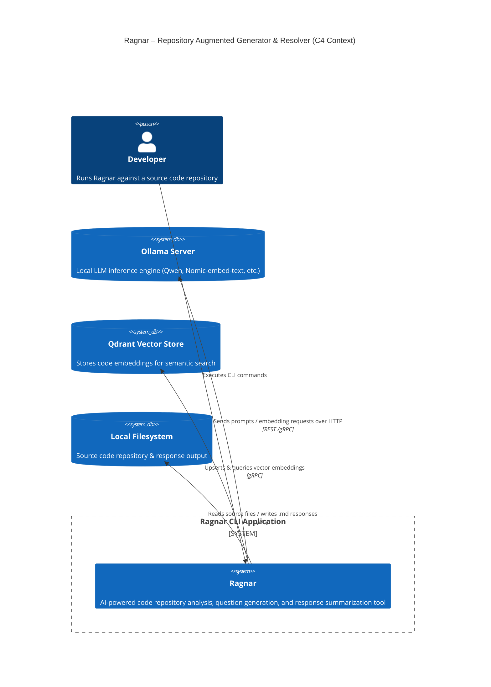

## 2. C4 Container Diagram (Level 2)

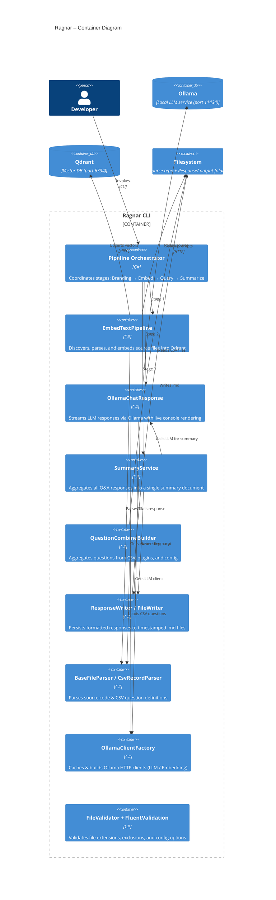

## 3. C4 Component Diagram (Level 3)

```mermaid
C4Component
    title Ragnar – Component Diagram (Core Query Flow)

    Container_Boundary(core, "Ragnar Core") {
        Component(stage_brand, "BrandingStage", "IPipelineStage", "Renders title, tagline, version")
        Component(stage_summ, "SummarizationStage", "IPipelineStage", "Triggers summary after all responses")
        Component(pipeline_orch, "Pipeline Orchestrator", "Service", "Sequences IPipelineStage execution")
        Component(emb_pipeline, "EmbedTextPipeline", "IEmbedTextPipeline", "Discover → Parse → Embed → Upsert")
        Component(chat_resp, "OllamaChatResponse", "IOllamaGenerationService", "Streams tokens, live panel render")
        Component(emb_svc, "OllamaEmbeddingService", "IEmbeddingService", "Generates float[] vectors")
        Component(client_fac, "OllamaClientFactory", "IOllamaClientFactory", "ConcurrentDictionary cache of clients")
        Component(q_builder, "QuestionCombineBuilder", "Builder", "Aggregates CSV + plugin + config questions")
        Component(csv_prov, "CsvFileQuestionProvider", "IQuestionProvider", "Loads Question[] from .csv")
        Component(csv_parse, "CsvRecordParser", "IRecordParser<QuestionRecord>", "CsvHelper deserialization")
        Component(resp_writer, "ResponseWriter", "IResponseWriter", "Formats & saves to Response/{category}/")
        Component(file_writer, "FileWriter", "IWriter", "File.WriteAllTextAsync")
        Component(path_res, "PathResolver", "IPathResolver", "Resolves Response/{Category}/ path")
        Component(summ_svc, "SummaryService", "ISummaryService", "Iterates folders, asks agent, saves summary")
        Component(agg, "ContentSummarizerAgent", "Agent", "Composes prompt + invokes LLM")
        Component(qdrant_repo, "VectorStoreRepository", "IVectorStoreRepository", "UpsertBatchAsync to Qdrant")
        Component(qdrant_build, "VectorStoreBuilder", "IVectorStoreBuilder", "Create/exists collection, payload index")
        Component(file_val, "FileValidator", "IFileValidator", "Extension + exclusion checks")
        Component(base_parser, "BaseFileParser", "IFileParser", "Abstract ReadFileAsync")
        Component(prompt_prov, "PromptTemplateProvider / SummarizePromptProvider", "IPromptProvider", "System + template strings")
    }

    ContainerDb(ollama, "Ollama", "LLM + Embedding models")
    ContainerDb(qdrant, "Qdrant", "Vector store")
    System(fs, "Filesystem", "Source + Response/")

    Rel(pipeline_orch, stage_brand, "1st")
    Rel(pipeline_orch, emb_pipeline, "2nd")
    Rel(pipeline_orch, chat_resp, "3rd")
    Rel(pipeline_orch, stage_summ, "4th")

    Rel(emb_pipeline, base_parser, "Parses")
    Rel(emb_pipeline, emb_svc, "Embeds")
    Rel(emb_pipeline, qdrant_repo, "Upserts")
    Rel(emb_svc, client_fac, "Get client")
    Rel(client_fac, ollama, "HTTP")
    Rel(qdrant_repo, qdrant, "gRPC")
    Rel(qdrant_repo, emb_svc, "Generate vector")
    Rel(base_parser, fs, "Reads")
    Rel(file_val, base_parser, "Filters")

    Rel(chat_resp, client_fac, "Get LLM client")
    Rel(chat_resp, ollama, "SSE stream")
    Rel(chat_resp, resp_writer, "Save")
    Rel(resp_writer, path_res, "Resolve dir")
    Rel(resp_writer, file_writer, "Write")
    Rel(file_writer, fs, ".md")
    Rel(q_builder, csv_prov, "CSV questions")
    Rel(csv_prov, csv_parse, "Parse")
    Rel(csv_parse, fs, "Read .csv")

    Rel(summ_svc, agg, "Ask agent")
    Rel(agg, chat_resp, "Generate")
    Rel(agg, prompt_prov, "Template")
    Rel(summ_svc, resp_writer, "Save summary")
    Rel(summ_svc, fs, "Read Response/")
```

## 4. Class Diagram

```mermaid
classDiagram
    direction TB

    %% ===== Interfaces =====
    class IPipelineStage {
        <<interface>>
        +ExecuteAsync(CancellationToken) Task
    }
    class IOllamaGenerationService {
        <<interface>>
        +GenerateResponse(GenerateRequest, CancellationToken) Task~string~
    }
    class IEmbeddingService {
        <<interface>>
        +GenerateAsync(string, CancellationToken) Task~ReadOnlyMemory~float~~
        +GenerateBatchAsync(IReadOnlyCollection~string~, CancellationToken) Task~GeneratedEmbeddings~
    }
    class IOllamaClientFactory {
        <<interface>>
        +FindClient(OllamaServiceType) OllamaApiClient
    }
    class IFileParser {
        <<interface>>
        +ParseFileAsync(string, CancellationToken) ValueTask~CodeDocument[]~
    }
    class IFileValidator {
        <<interface>>
        +IsValid(FileInfo, in FileLoadOptions) bool
    }
    class IQuestionProvider {
        <<interface>>
        +ProviderName string
        +LoadQuestionsAsync(string, CancellationToken) Task~IEnumerable~Question~~
    }
    class IRecordParser~T~ {
        <<interface>>
        +ParseAsync(string, CancellationToken) Task~IEnumerable~T~~
    }
    class IPromptProvider {
        <<interface>>
        +System string
        +GetTemplate(string, string) string
    }
    class IResponseWriter {
        <<interface>>
        +WriteResponseAsync(SaveDetails, CancellationToken) Task~string~
    }
    class IWriter {
        <<interface>>
        +WriteAsync(string, string, CancellationToken) Task
    }
    class IPathResolver {
        <<interface>>
        +ResolveResponseDirectory(QuestionCategory?) string
    }
    class IVectorStoreRepository {
        <<interface>>
        +UpsertBatchAsync(CodeDocument[], CancellationToken) Task~UpdateResult~
    }
    class IVectorStoreBuilder {
        <<interface>>
        +BuildAsync(CancellationToken) Task~bool~
        +ExistsAsync(CancellationToken) Task~IVectorStoreBuilder~
        +CreateAsync(CancellationToken) Task~IVectorStoreBuilder~
        +MakeIndexAsync(string, PayloadSchemaType, CancellationToken) Task~IVectorStoreBuilder~
    }
    class ISummaryService {
        <<interface>>
        +SummarizeAllResponsesAsync(CancellationToken) ValueTask
    }
    class IFilterStrategy {
        <<interface>>
        +SupportedCategory QuestionCategory
        +CreateFilter(int) Filter
    }
    class IApplicationHeader {
        <<interface>>
        +RenderBranding() void
    }
    class IEmbedTextPipeline {
        <<interface>>
        +RunAsync(CancellationToken) Task
    }
    class IOutputWriter {
        <<interface>>
        +Write(IRenderable) void
        +WriteLine() void
        +MarkupLine(string, Style) void
        +WriteRule() void
    }

    %% ===== Concrete Classes =====
    class OllamaChatResponse {
        -OllamaApiClient _ollamaClient
        +GenerateResponse(GenerateRequest, CancellationToken) Task~string~
    }
    class OllamaEmbeddingService {
        -IEmbeddingGenerator~string, Embedding~float~~ _generator
        +GenerateAsync(string, CancellationToken) Task~ReadOnlyMemory~float~~
        +GenerateBatchAsync(IReadOnlyCollection~string~, CancellationToken) Task~GeneratedEmbeddings~
        -CreateTimeoutCts(CancellationToken) CancellationTokenSource
    }
    class OllamaClientFactory {
        -ConcurrentDictionary~OllamaServiceType, OllamaApiClient~ _cache
        -RagnarConfig _config
        +FindClient(OllamaServiceType) OllamaApiClient
        -BuildLlmClient() OllamaApiClient
        -BuildEmbeddingClient() OllamaApiClient
        -CreateHttpClient(OllamaServiceType) HttpClient
    }
    class EmbedTextPipeline {
        -int BATCHSIZE = 1
        +RunAsync(CancellationToken) Task
        -DiscoverSourceFilesAsync(CancellationToken) Task~IReadOnlyList~string~~
        -ParseDocumentsAsync(IReadOnlyList~string~, CancellationToken) Task~IReadOnlyList~CodeDocument~~
        -UpsertInBatchesAsync(IReadOnlyList~CodeDocument~, CancellationToken) Task
    }
    class BaseFileParser {
        <<abstract>>
        #Serilog.ILogger logger
        +ParseFileAsync(string, CancellationToken)* ValueTask~CodeDocument[]~
        +ReadFileAsync(string, CancellationToken) ValueTask~string~
    }
    class FileValidator {
        +IsValid(FileInfo, in FileLoadOptions) bool
    }
    class QuestionCombineBuilder {
        -List~Question~ Questions
        +GetCategories() QuestionCombineBuilder
        +GetFileConfig() QuestionCombineBuilder
        +GetCsvFileAsync(string, CancellationToken) Task~QuestionCombineBuilder~
        +Build() IReadOnlyList~Question~
        +WithCategoryFilter(ApplicationOptions?) QuestionCombineBuilder
    }
    class CsvFileQuestionProvider {
        +ProviderName string
        +LoadQuestionsAsync(string, CancellationToken) Task~IEnumerable~Question~~
    }
    class CsvRecordParser {
        +ParseAsync(string, CancellationToken) Task~IEnumerable~QuestionRecord~~
    }
    class QuestionMap {
        +..ctor()
    }
    class QuestionRecord {
        +bool IsEnabled
        +string Text
        +string FileName
        +QuestionCategory Category
    }
    class Question {
        +bool IsEnabled
        +string Text
        +string FileName
        +QuestionCategory Category
    }
    class QuestionCategory {
        <<enum>>
        General
        Summary
        XML
        Performance
        Refactor
        Testing
        Diagram
        Other
    }
    class ResponseWriter {
        +WriteResponseAsync(SaveDetails, CancellationToken) Task~string~
    }
    class FileWriter {
        +WriteAsync(string, string, CancellationToken) Task
    }
    class PathResolver {
        +ResolveResponseDirectory(QuestionCategory?) string
    }
    class VectorStoreRepository {
        -ApplicationOptions _appOptions
        +UpsertBatchAsync(CodeDocument[], CancellationToken) Task~UpdateResult~
    }
    class VectorStoreBuilder {
        -bool IsExisting
        +string VectorStoreName
        +ulong Dimension
        +BuildAsync(CancellationToken) Task~bool~
        +ExistsAsync(CancellationToken) Task~IVectorStoreBuilder~
        +CreateAsync(CancellationToken) Task~IVectorStoreBuilder~
        +MakeIndexAsync(string, PayloadSchemaType, CancellationToken) Task~IVectorStoreBuilder~
    }
    class SummaryService {
        -ILogger _logger
        -IOutputWriter _writer
        -IOllamaAIClientBuilder _ollamaAIClient
        -IPromptProvider _summaryPrompt
        -IOllamaGenerationService _ollamaClientProvider
        -IOptions~RagnarConfig~ _configWrapper
        +SummarizeAllResponsesAsync(CancellationToken) ValueTask
        -LoadQuestions() List~Question~
        -AskAgentAsync(string, Question, CancellationToken) Task~string~
        -SaveResponseAsync(string, string, string, string, CancellationToken) Task
    }
    class ContentSummarizerAgent {
        +AskAgent(string, string, CancellationToken) Task~string~
    }
    class PromptTemplateProvider {
        +System string
    }
    class SummarizePromptProvider {
        +System string
        +GetTemplate(string, string) string
    }
    class ApplicationHeader {
        -string _versionNumber
        +RenderBranding() void
    }
    class BrandingStage {
        +ExecuteAsync(CancellationToken) Task
    }
    class SummarizationStage {
        +ExecuteAsync(CancellationToken) Task
    }
    class XmlCommentFilterStrategy {
        +SupportedCategory QuestionCategory
        +CreateFilter(int) Filter
    }
    class CodeDocument {
        +string ElementName
        +string Code
        +AsPoint() PointStruct
    }
    class SaveDetails {
        +Question Question
        +string Response
        +string ElapsedTime
    }
    class GenerateRequest {
        +string Model
        +string Prompt
        +string System
        +RequestOptions Options
    }
    class AppDefaults {
        <<const>>
        RESPONSE_DIRECTORYNAME
        UNCATEGORIZED_CATEGORY
        ORIGINAL_PROMPT_LABEL
        MARKDOWN_FENCEMARKER
    }
    class ApplicationConfigurationExtensions {
        <<static>>
        +RegisterEmbeddingServices(IServiceCollection) IServiceCollection
        +LoadQuestionPlugins(IServiceCollection) IServiceCollection
    }
    class RagnarConfig {
        +ApplicationOptions ApplicationOptions
        +FileLoadOptions FileLoadOptions
        +OllamaOptions OllamaOptions
        +EmbeddingOptions EmbeddingOptions
    }

    %% ===== Relationships =====
    OllamaChatResponse ..|> IOllamaGenerationService
    OllamaEmbeddingService ..|> IEmbeddingService
    OllamaClientFactory ..|> IOllamaClientFactory
    EmbedTextPipeline ..|> IEmbedTextPipeline
    BaseFileParser ..|> IFileParser
    FileValidator ..|> IFileValidator
    CsvFileQuestionProvider ..|> IQuestionProvider
    CsvRecordParser ..|> IRecordParser~QuestionRecord~
    PromptTemplateProvider ..|> IPromptProvider
    SummarizePromptProvider ..|> IPromptProvider
    ResponseWriter ..|> IResponseWriter
    FileWriter ..|> IWriter
    PathResolver ..|> IPathResolver
    VectorStoreRepository ..|> IVectorStoreRepository
    VectorStoreBuilder ..|> IVectorStoreBuilder
    SummaryService ..|> ISummaryService
    XmlCommentFilterStrategy ..|> IFilterStrategy
    ApplicationHeader ..|> IApplicationHeader
    BrandingStage ..|> IPipelineStage
    SummarizationStage ..|> IPipelineStage

    QuestionMap --> QuestionRecord : maps
    CsvRecordParser ..> IRecordParser~QuestionRecord~ : implements
    CsvFileQuestionProvider --> CsvRecordParser : uses
    QuestionCombineBuilder --> CsvFileQuestionProvider : uses
    QuestionCombineBuilder --> Question : aggregates

    OllamaChatResponse --> OllamaClientFactory : uses
    OllamaEmbeddingService --> OllamaClientFactory : uses
    OllamaChatResponse --> GenerateRequest : input
    EmbedTextPipeline --> BaseFileParser : uses
    EmbedTextPipeline --> OllamaEmbeddingService : uses
    EmbedTextPipeline --> VectorStoreRepository : uses
    EmbedTextPipeline --> FileValidator : uses
    VectorStoreRepository --> OllamaEmbeddingService : uses
    VectorStoreRepository --> VectorStoreBuilder : uses
    VectorStoreRepository --> CodeDocument : processes

    SummaryService --> ContentSummarizerAgent : uses
    SummaryService --> IOllamaGenerationService : uses
    SummaryService --> IPromptProvider : uses
    SummaryService --> IResponseWriter : uses

    ResponseWriter --> PathResolver : uses
    ResponseWriter --> FileWriter : uses
    ResponseWriter --> SaveDetails : input
    SaveDetails --> Question : contains

    BrandingStage --> ApplicationHeader : uses
    SummarizationStage --> ISummaryService : uses
    XmlCommentFilterStrategy --> QuestionCategory : references

    OllamaClientFactory --> OllamaApiClient : creates
    RagnarConfig *-- ApplicationOptions
    RagnarConfig *-- FileLoadOptions
    RagnarConfig *-- OllamaOptions
    RagnarConfig *-- EmbeddingOptions
```

## 5. Sequence Diagram – Full Application Lifecycle

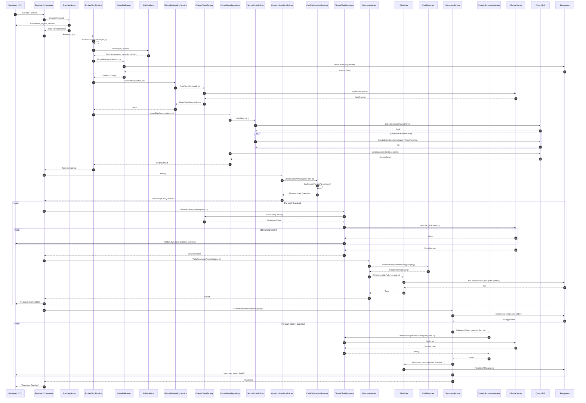

## 6. Application Flowchart – Embedding Pipeline

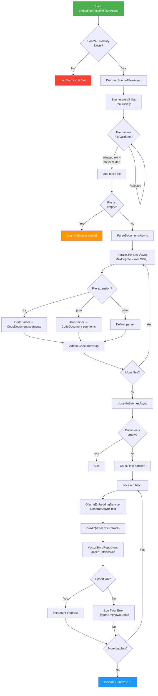

## 7. Application Flowchart – Query & Response Pipeline

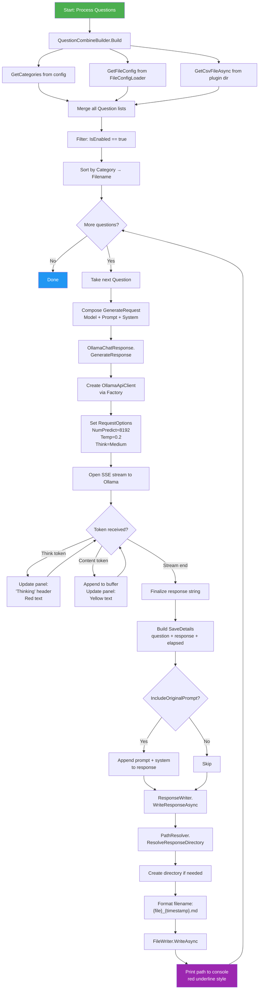

## 8. Application Flowchart – Summary Pipeline

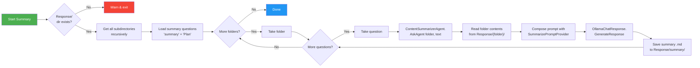

## 9. State Diagram – Ollama Stream Response

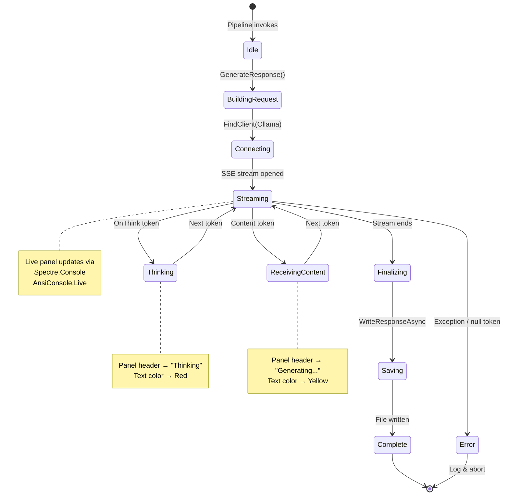

## 10. Component Interaction – DI & Factory Pattern

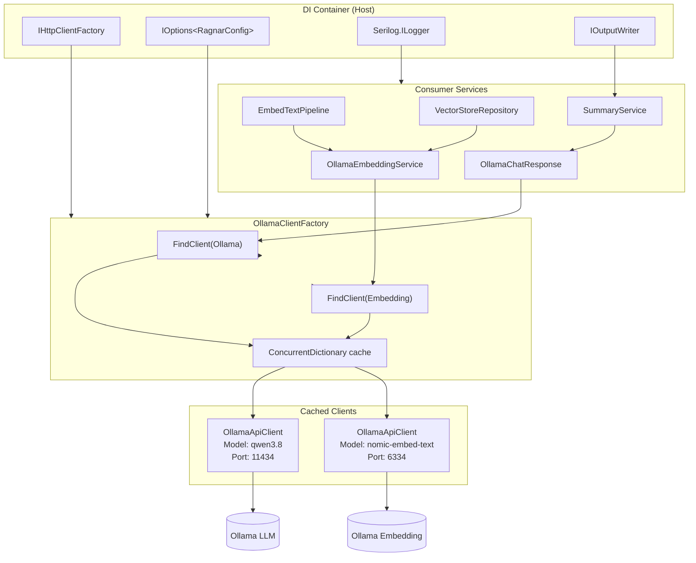

## 11. Data Flow – Question Loading Pipeline

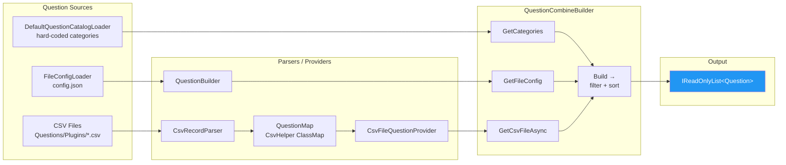

## 12. Configuration Hierarchy

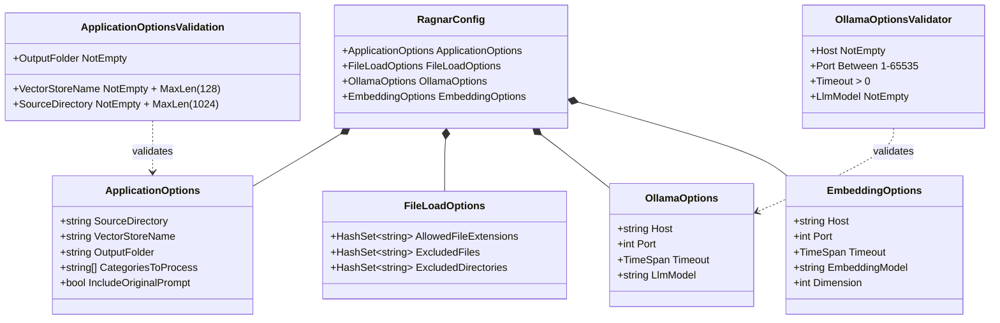

## 13. Module Dependency Map

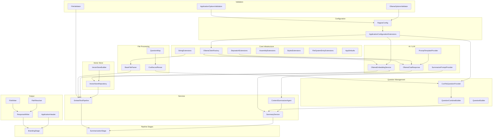

## 14. Error Handling Flow

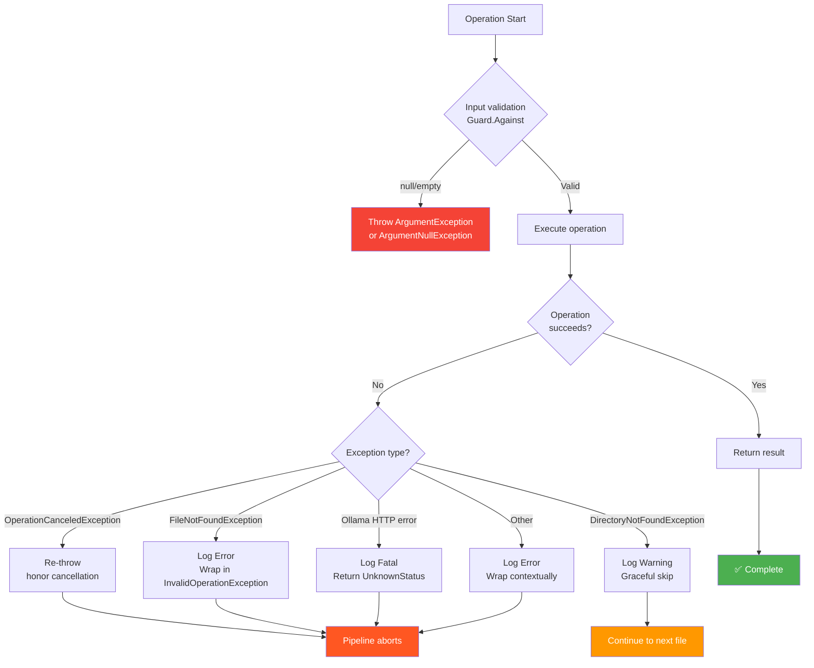

## 15. Plugin Loading Architecture

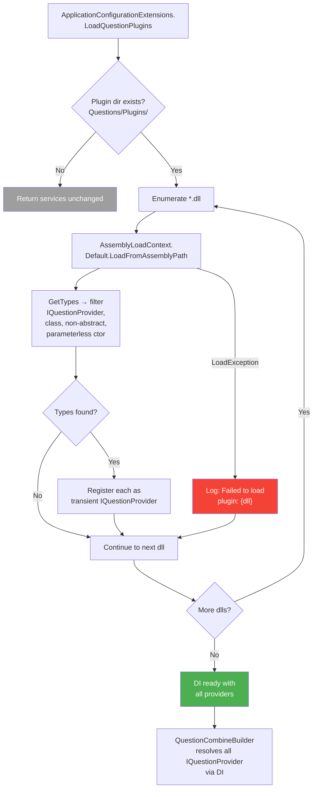

---

## Summary of Key Architectural Patterns

| Pattern | Where Used |
|---------|-----------|
| **Pipeline / Stages** | `IPipelineStage` → `BrandingStage`, `SummarizationStage`, `EmbedTextPipeline` |
| **Factory** | `OllamaClientFactory` (c
