### <span style="color:darkblue;">Diagram</span> Analyze the following C# code base. Generate the appropriate Mermaid diagrams, a sequence diagram, an application flowchart(s), and class diagrams based on the provided source code. Please also create valid mermaid C4 Diagrams If their are other Mermaid diagrams that would help to understand the provided code base.
> **Date Generated**: 9/17/2026 5:24:45 PM
> ## Question: 
> Analyze the following C# code base. Generate the appropriate Mermaid diagrams, a sequence diagram, an application flowchart(s), and class diagrams based on the provided source code. Please also create valid mermaid C4 Diagrams If their are other Mermaid diagrams that would help to understand the provided code base.
> **Method Call Duration**: 01:45:16
 ## Response: 
# Ragnar — Repository Augmented Generator & Resolver: Mermaid Diagrams

## 1. C4 Context Diagram

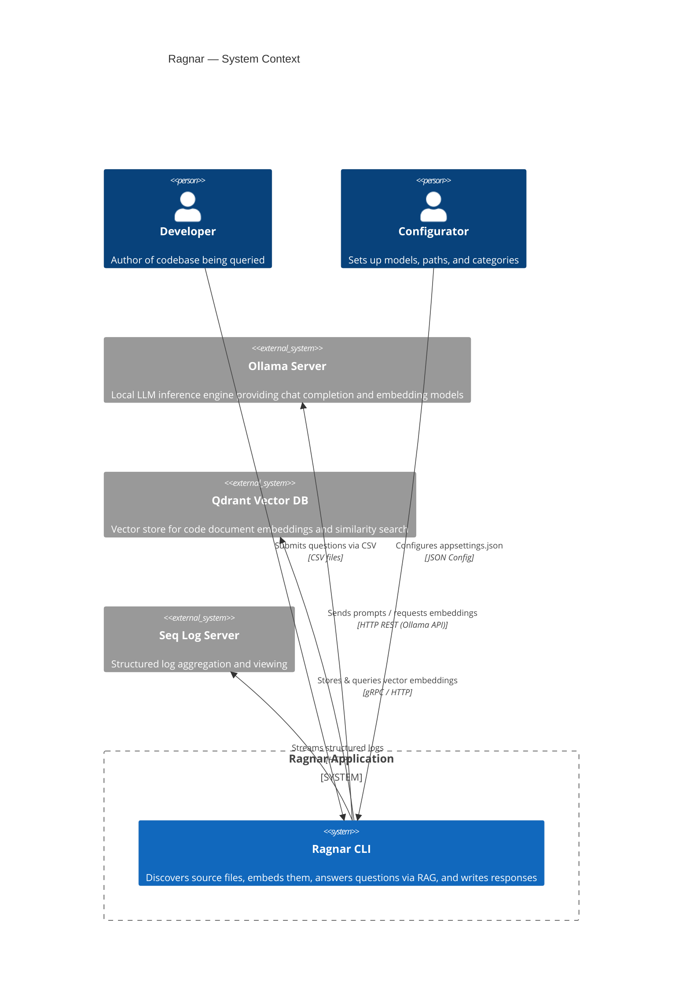

## 2. C4 Container Diagram

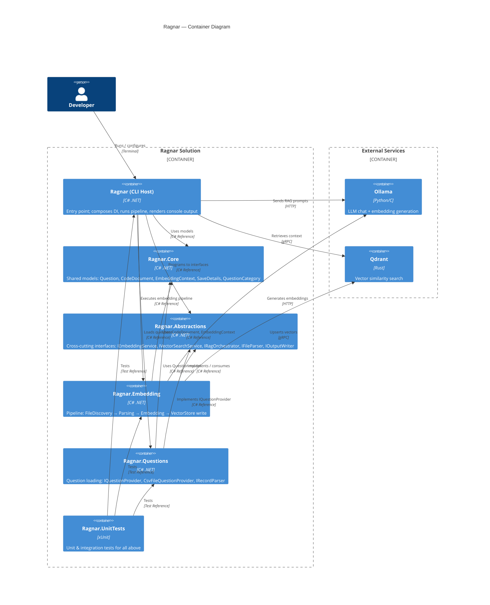

## 3. C4 Component Diagram (Main Application)

```mermaid
C4Component
    title Ragnar — Component Diagram (Main App)

    Component_Container(ragnar, "Ragnar CLI") {

        [PipelineRunner] as runner
        [ParsingStage] as parseStage
        [QuestionExecutionStage] as askStage
        [FileDiscoveryPipeline] as discovery
        [QuestionSourceBuilder] as qBuilder
        [CsvFileQuestionProvider] as csvProvider
        [CsvRecordParser] as csvParser
        [OllamaEmbeddingService] as embedSvc
        [OllamaClientFactory] as ollamaFactory
        [VectorStoreBuilder] as vsBuilder
        [RagOrchestrator] as ragOrch
        [SummarizePromptProvider] as promptProv
        [ResponseWriter] as respWriter
        [PathResolver] as pathRes
        [FileWriter] as fileWriter
        [OutputFormatter] as formatter
        [ApplicationHeader] as header
        [OllamaOptionsValidator] as validator
        [FileSystemEntryExtensions] as fsExt
        [StopwatchExtensions] as swExt

        Rel(header, runner, "Renders branding before pipeline")
        Rel(runner, parseStage, "Executes stage 1")
        Rel(parseStage, discovery, "Gets discovered files")
        Rel(parseStage, fsExt, "Filters by extension")
        Rel(runner, askStage, "Executes stage 2")
        Rel(askStage, qBuilder, "Builds question list")
        Rel(qBuilder, csvProvider, "Loads CSV questions")
        Rel(csvProvider, csvParser, "Parses CSV records")
        Rel(askStage, ragOrch, "Executes RAG per question")
        Rel(ragOrch, ollamaFactory, "Resolves Ollama client")
        Rel(ragOrch, promptProv, "Gets system + user prompt")
        Rel(embedSvc, ollamaFactory, "Resolves embedding client")
        Rel(vsBuilder, embedSvc, "Generates vectors")
        Rel(ragOrch, vsBuilder, "Retrieves context from Qdrant")
        Rel(askStage, respWriter, "Writes response file")
        Rel(respWriter, pathRes, "Resolves output directory")
        Rel(respWriter, formatter, "Formats markdown")
        Rel(respWriter, fileWriter, "Writes to disk")
        Rel(validator, ollamaFactory, "Validates Ollama config")
        Rel(runner, swExt, "Formats elapsed time")
    }

    UpdateLayoutConfig($c4ShapeInRow="4", $c4DepthInRow="3")
```

## 4. Sequence Diagram — Question Processing Flow

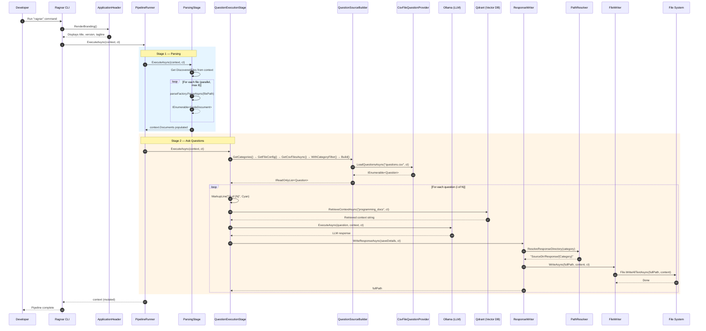

## 5. Application Flowchart

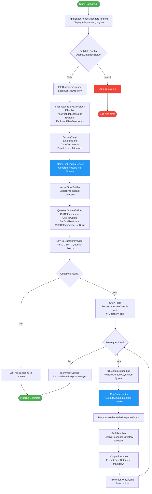

## 6. Embedding Pipeline Flowchart

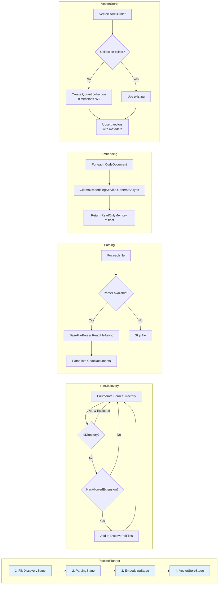

## 7. Class Diagram — Core Abstractions & Pipeline

```mermaid
classDiagram
    direction TB

    class IPipelineStage~T~ {
        <<interface>>
        +string Name
        +bool ShouldRun
        +Task ExecuteAsync(T context, CancellationToken ct)
    }

    class PipelineRunner {
        -List~IPipelineStage~_stages
        +PipelineRunner(IOutputWriter, ILogger)
        +AddStage(IPipelineStage) PipelineRunner
        +ExecuteAsync(EmbeddingContext, CancellationToken) Task~EmbeddingContext~
    }

    class ParsingStage {
        +string Name$ "Parsing files…"
        +bool ShouldRun$ true
        +ExecuteAsync(EmbeddingContext, CancellationToken) Task
    }

    class QuestionExecutionStage {
        +string Name$ "Ask Questions Stage"
        +bool ShouldRun
        +ExecuteAsync(EmbeddingContext, CancellationToken) Task
        -LoadQuestionsAsync(CancellationToken) Task~IReadOnlyList~Question~~
        -ShowTable(IReadOnlyList~Question~) void
    }

    class EmbeddingContext {
        +List~FileSystemEntry~ DiscoveredFiles
        +List~CodeDocument~ Documents
    }

    class Question {
        +bool IsActive
        +string Text
        +string FileName
        +QuestionCategory Category
    }

    class QuestionCategory {
        <<enumeration>>
        CSharp
        XML
        General
        Other
        Uncategorized
    }

    class CodeDocument {
        +string Content
        +string FileName
        +string Language
    }

    class SaveDetails {
        +Question Question
        +string Content
        +string ElapsedTime
    }

    class IFileParser {
        <<interface>>
        +ParseAsync(string, CancellationToken) Task~IEnumerable~CodeDocument~~
        +ReadFileAsync(string, CancellationToken) Task~string~
    }

    class BaseFileParser {
        <<abstract>>
        -ILogger logger
        +ParseAsync(string, CancellationToken)* Task~IEnumerable~CodeDocument~~
        +ReadFileAsync(string, CancellationToken) Task~string~
    }

    class IFileParseFactory {
        <<interface>>
        +ParseAsync(string, CancellationToken) Task~IEnumerable~CodeDocument~~
    }

    class IEmbeddingService {
        <<interface>>
        +GenerateAsync(string, CancellationToken) Task~ReadOnlyMemory~float~~
        +GenerateBatchAsync(IReadOnlyCollection~string~, CancellationToken) Task~GeneratedEmbeddings~
    }

    class OllamaEmbeddingService {
        -IEmbeddingGenerator~string, Embedding~float~~ _generator
        +GenerateAsync(string, CancellationToken) Task~ReadOnlyMemory~float~~
        +GenerateBatchAsync(IReadOnlyCollection~string~, CancellationToken) Task~GeneratedEmbeddings~
        -CreateTimeoutCts(CancellationToken) CancellationTokenSource
    }

    class IVectorSearchService {
        <<interface>>
        +RetrieveContextAsync(string, ReadOnlyMemory~float~, Filter?, CancellationToken) Task~string~
    }

    class IQuestionEmbedding {
        <<interface>>
        +RetrieveContextAsync(string, CancellationToken, Filter?) Task~string~
    }

    class IRagOrchestrator {
        <<interface>>
        +ExecuteAsync(Question, string, CancellationToken) Task
    }

    class IChatPromptProvider {
        <<interface>>
        +string System
        +GetTemplate(string, string) string
    }

    class SummarizePromptProvider {
        +string System$
        +GetTemplate(string, string) string
    }

    class IQuestionProvider {
        <<interface>>
        +string ProviderName
        +LoadQuestionsAsync(string, CancellationToken) Task~IEnumerable~Question~~
    }

    class CsvFileQuestionProvider {
        -IRecordParser~QuestionRecord~ csvParser
        +string ProviderName$ "CSV File"
        +LoadQuestionsAsync(string, CancellationToken) Task~IEnumerable~Question~~
    }

    class IRecordParser~T~ {
        <<interface>>
        +ParseAsync(string, CancellationToken) Task~IEnumerable~T~~
    }

    class CsvRecordParser {
        +ParseAsync(string, CancellationToken) Task~IEnumerable~QuestionRecord~~
    }

    class IQuestionSourceBuilder {
        <<interface>>
        +GetCategories() IQuestionSourceBuilder
        +GetFileConfig() IQuestionSourceBuilder
        +GetCsvFilesAsync(string, CancellationToken) Task~IQuestionSourceBuilder~
        +WithCategoryFilter() IQuestionSourceBuilder
        +Build() IReadOnlyList~Question~
    }

    class IOllamaClientFactory {
        <<interface>>
        +ResolveClient(OllamaServiceType) OllamaApiClient
    }

    class OllamaClientFactory {
        +ResolveClient(OllamaServiceType) OllamaApiClient
    }

    class OllamaServiceType {
        <<enumeration>>
        Ollama
        Embedding
    }

    class IResponseWriter {
        <<interface>>
        +WriteResponseAsync(SaveDetails, CancellationToken) Task~string~
    }

    class ResponseWriter {
        +WriteResponseAsync(SaveDetails, CancellationToken) Task~string~
    }

    class IPathResolver {
        <<interface>>
        +ResolveResponseDirectory(QuestionCategory?) string
    }

    class PathResolver {
        +ResolveResponseDirectory(QuestionCategory?) string
    }

    class IWriter {
        <<interface>>
        +WriteAsync(string, string, CancellationToken) Task
    }

    class FileWriter {
        +WriteAsync(string, string, CancellationToken) Task
    }

    class IOutputFormatter {
        <<interface>>
        +string FileExtension
        +Format(SaveDetails) string
    }

    class ISummaryService {
        <<interface>>
        +SummarizeAllResponsesAsync(CancellationToken) Task
    }

    class IApplicationHeader {
        <<interface>>
        +RenderBranding() void
    }

    class ApplicationHeader {
        +RenderBranding() void
    }

    class RagnarConfig {
        +ApplicationOptions ApplicationOptions
        +EmbeddingOptions EmbeddingOptions
        +OllamaOptions OllamaOptions
        +FileLoadOptions FileLoadOptions
    }

    class ApplicationOptions {
        +string OutputFolder
        +string SourceDirectory
        +string VectorStoreName
        +List~QuestionCategory~ CategoriesToProcess
        +bool IncludeOriginalPrompt
    }

    class EmbeddingOptions {
        +int BatchSize
        +int Dimension
        +string EmbeddingModel
        +string Host
        +int Port
        +TimeSpan Timeout
    }

    class OllamaOptions {
        +string Host
        +int Port
        +string LlmModel
        +TimeSpan Timeout
    }

    class FileLoadOptions {
        +List~string~ AllowedFileExtensions
        +List~string~ ExcludedFiles
        +List~string~ ExcludedDirectories
    }

    class IFilterStrategy {
        <<interface>>
        +QuestionCategory SupportedCategory
        +CreateFilter(int) Filter
    }

    class XmlCommentFilterStrategy {
        +QuestionCategory SupportedCategory$ XML
        +CreateFilter(int) Filter
    }

    class VectorStoreBuilder {
        +string VectorStoreName
        +ulong Dimension
        +ExistsAsync(CancellationToken) Task~VectorStoreBuilder~
    }

    class OllamaOptionsValidator {
        +OllamaOptionsValidator()
    }

    %% Inheritance & Implementation
    IPipelineStage~T~ <|.. ParsingStage
    IPipelineStage~T~ <|.. QuestionExecutionStage
    IFileParser <|.. BaseFileParser
    IEmbeddingService <|.. OllamaEmbeddingService
    IChatPromptProvider <|.. SummarizePromptProvider
    IQuestionProvider <|.. CsvFileQuestionProvider
    IRecordParser~T~ <|.. CsvRecordParser
    IOllamaClientFactory <|.. OllamaClientFactory
    IResponseWriter <|.. ResponseWriter
    IPathResolver <|.. PathResolver
    IWriter <|.. FileWriter
    ISummaryService <|.. ISummaryService
    IApplicationHeader <|.. ApplicationHeader
    IFilterStrategy <|.. XmlCommentFilterStrategy
    AbstractValidator~OllamaOptions~ <|-- OllamaOptionsValidator

    %% Dependencies
    PipelineRunner --> IPipelineStage~EmbeddingContext~ : executes
    QuestionExecutionStage --> IQuestionSourceBuilder : builds questions
    QuestionExecutionStage --> IRagOrchestrator : executes RAG
    QuestionExecutionStage --> IQuestionEmbedding : retrieves context
    QuestionExecutionStage --> IOutputWriter : writes progress
    ParsingStage --> IFileParseFactory : parses files
    OllamaEmbeddingService --> IOllamaClientFactory : resolves client
    RagOrchestrator --> IChatPromptProvider : gets prompts
    RagOrchestrator --> IOllamaClientFactory : resolves client
    CsvFileQuestionProvider --> IRecordParser~QuestionRecord~ : parses CSV
    ResponseWriter --> IPathResolver : resolves path
    ResponseWriter --> IOutputFormatter : formats output
    ResponseWriter --> IWriter : writes file
    Question --> QuestionCategory
    SaveDetails --> Question
    RagnarConfig *-- ApplicationOptions
    RagnarConfig *-- EmbeddingOptions
    RagnarConfig *-- OllamaOptions
    RagnarConfig *-- FileLoadOptions
```

## 8. State Diagram — Pipeline Execution

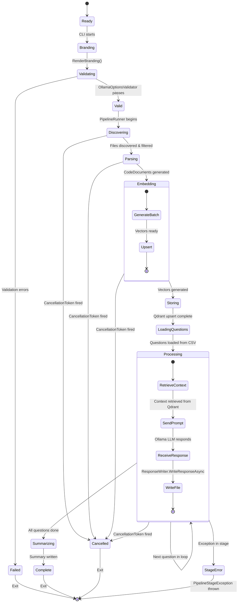

## 9. Deployment / Infrastructure Diagram

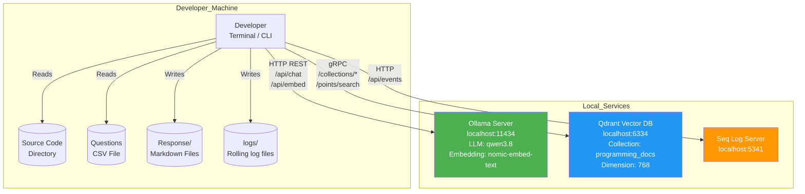

## 10. Class Diagram — Question Loading Subsystem

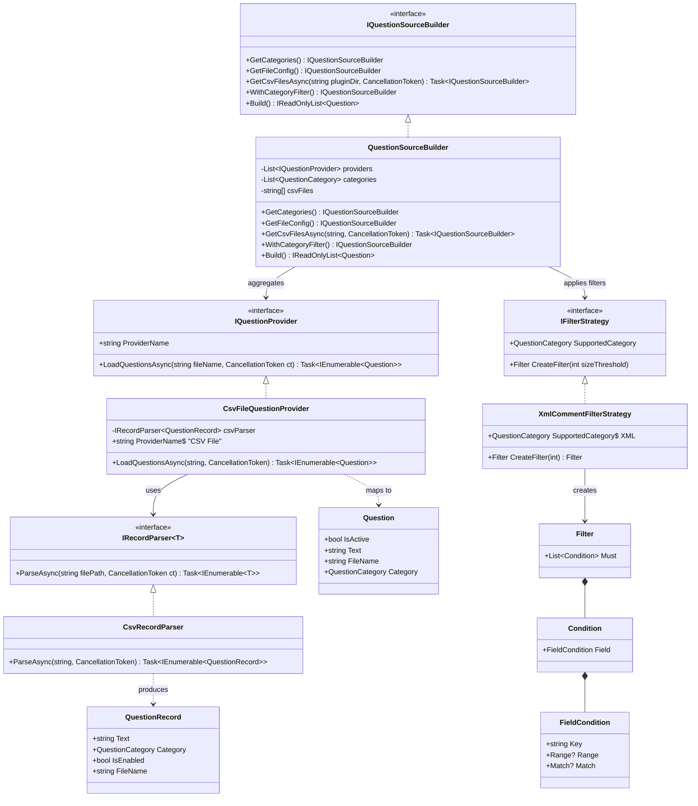

## 11. Class Diagram — Output & Response Subsystem

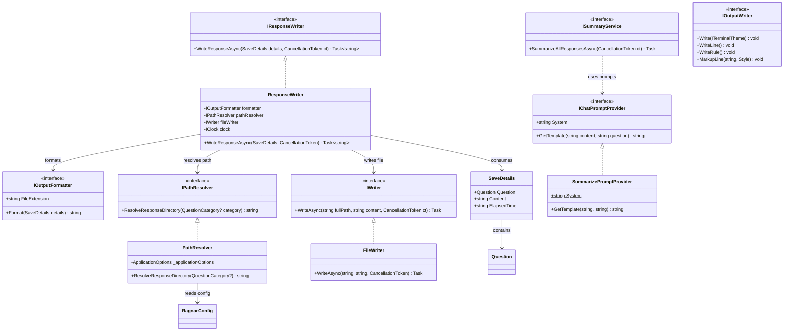

## 12. Sequence Diagram — Embedding Pipeline

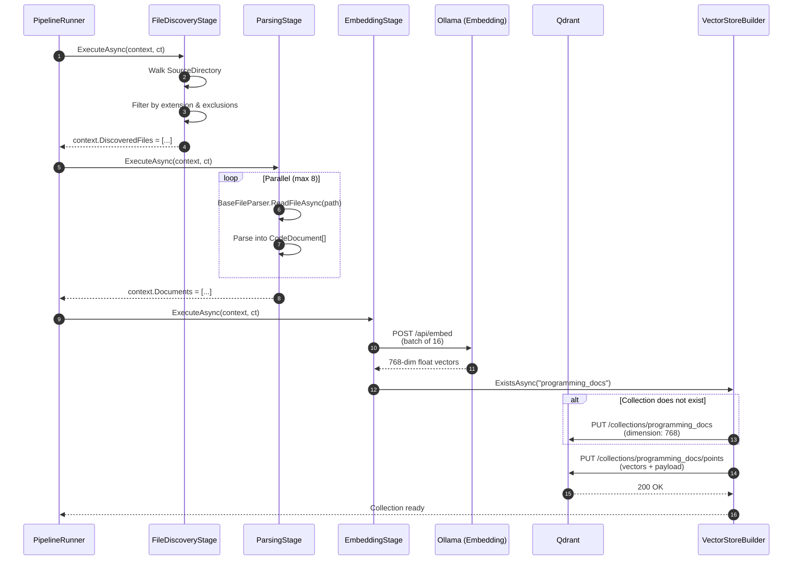

## 13. Diagram — Configuration Hierarchy

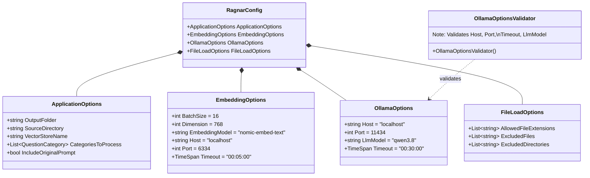

## 14. ERD — Data Model Relationships

```mermaid
erDiagram
    QUESTION {
        bool IsActive PK
        string Text
        string FileName
        QuestionCategory Category
    }

    CODE_DOCUMENT {
        string Content
        string FileName
        string Language
        int CommentLength
    }

    EMBEDDING_CONTEXT {
        list DiscoveredFiles
        list Documents
    }

    SAVE_DETAILS {
        question_id Question FK
        string Content
        string ElapsedTime
    }
'''    
