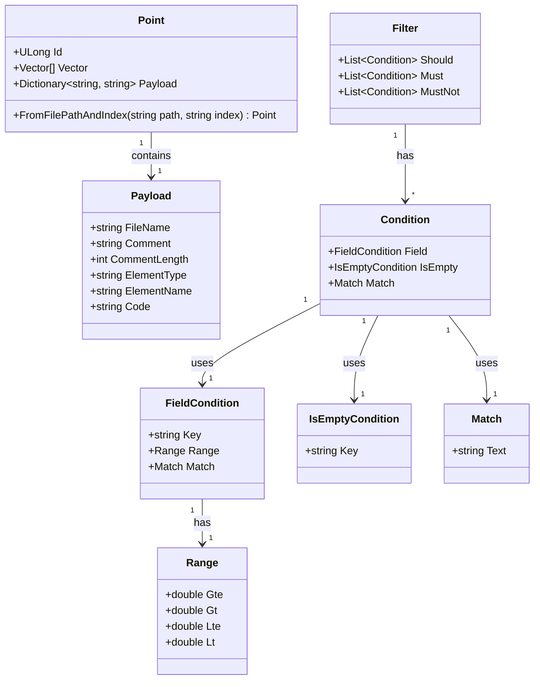
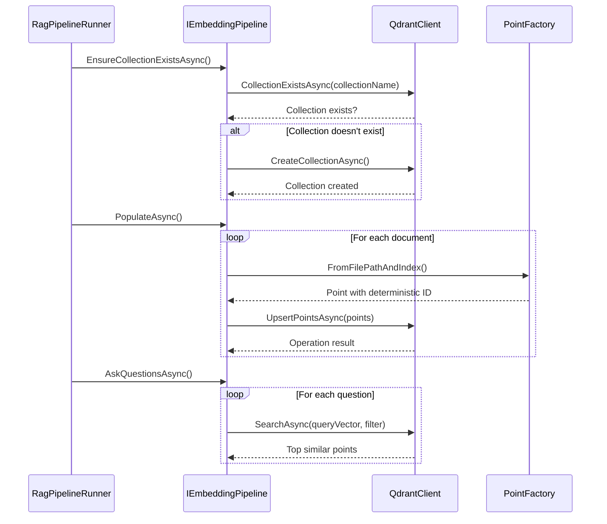
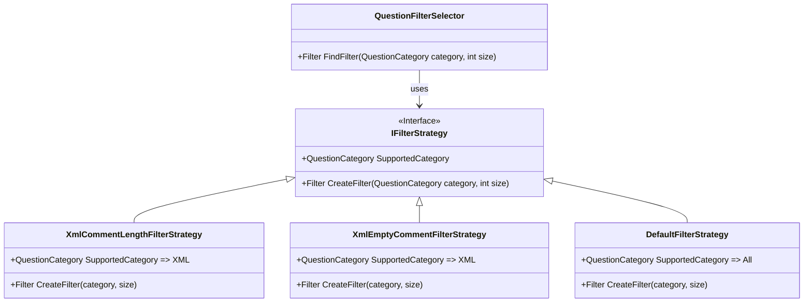
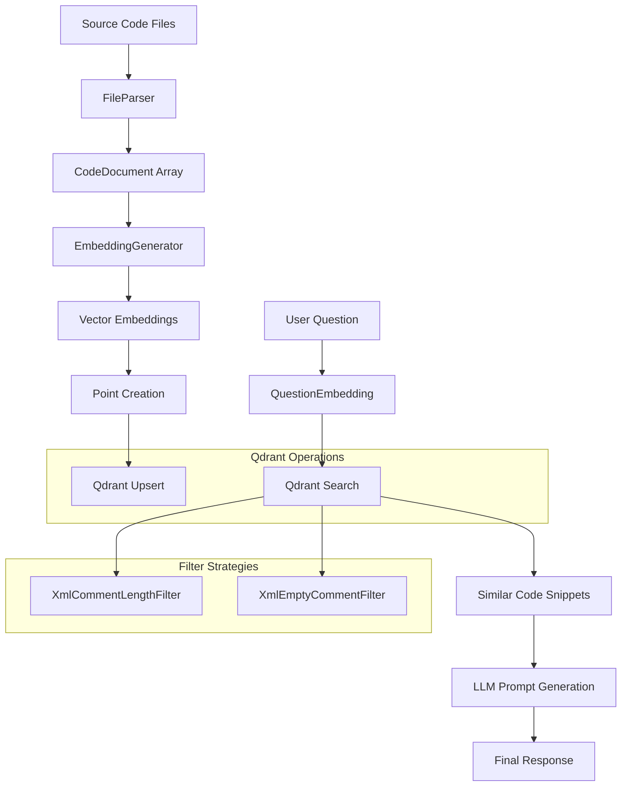
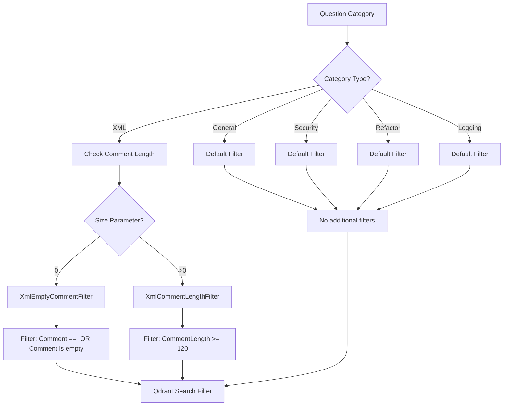

### [Diagram] Analyze the C# code base. Generate the appropriate Mermaid diagrams for the Qdrant database.
> **Date Generated**: 8/6/2026 12:09:12 AM
> ## Question: 
> Analyze the C# code base. Generate the appropriate Mermaid diagrams for the Qdrant database.
> **Method Call Duration**: 13:54
 ## Response: 
Based on the provided codebase, here are the key Mermaid diagrams for the Qdrant database integration:

### 1. Qdrant Point Structure (Data Model)

### 2. Qdrant Collection Operations Flow

### 3. Filter Strategy Pattern

### 4. Qdrant Data Flow for RAG Pipeline

### 5. Question Categorization and Filtering

### Key Qdrant Integration Points:

1. **Point Creation**: Uses deterministic IDs from file paths and indices
2. **Payload Structure**: Contains code elements with metadata (FileName, Comment, CommentLength, etc.)
3. **Filtering System**: 
   - XML-specific filters (empty comments, comment length)
   - Default filters for other categories
4. **Resilience**: Uses HttpClient with retry policies and circuit breakers
5. **Collection Management**: Automatic collection existence check and creation

These diagrams capture the essential Qdrant database interactions in the Ragnar RAG system, showing how code documentation is stored, filtered, and retrieved for the LLM processing pipeline.
