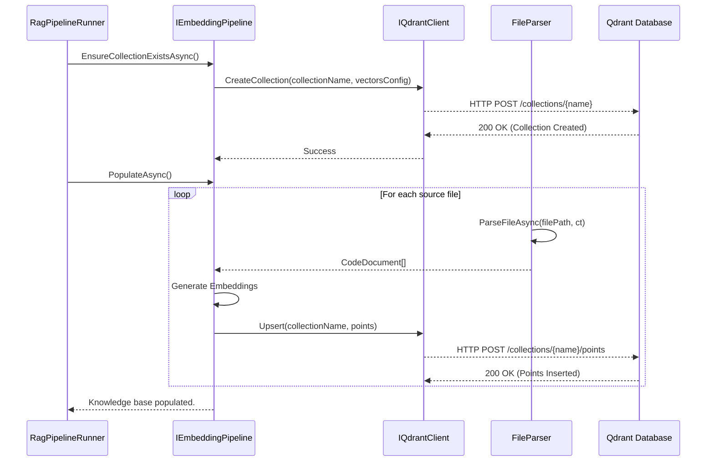
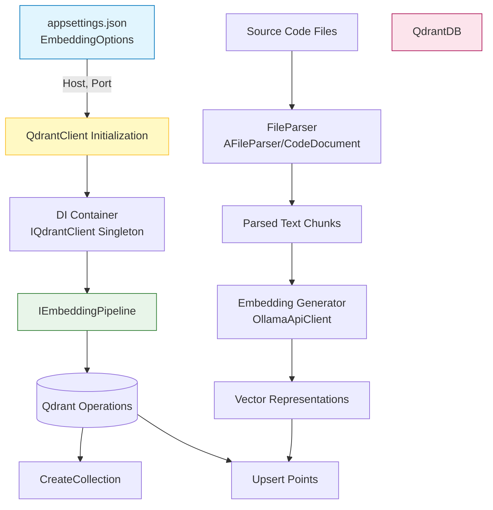

### <span style="color:darkblue;">[Diagram]</span> Analyze the C# code base. Generate the appropriate Mermaid diagrams for the Qdrant database.
> **Date Generated**: 8/16/2026 5:29:59 PM
> ## Question: 
> Analyze the C# code base. Generate the appropriate Mermaid diagrams for the Qdrant database.
> **Method Call Duration**: 23:09
 ## Response: 
Based on the provided C# codebase, here are three targeted Mermaid diagrams that model how Qdrant is integrated, configured, and utilized within your RAG pipeline. Each diagram maps directly to the extracted source files.

### 1. Dependency Injection & Service Registration Architecture
Shows how `QdrantClient` is wired into the DI container via `RagPipelineHostBuilder`, alongside related services.

```mermaid
classDiagram
    direction TB
    class RagPipelineHostBuilder {
        +CreateDefaultBuilder(args) IServiceCollection
    }
    class EmbeddingOptions {
        +string Host
        +int Port
    }
    class IQdrantClient
    class QdrantClient
    class IEmbeddingPipeline
    class FileParser
    class CodeDocument

    RagPipelineHostBuilder --> EmbeddingOptions : "Reads from config section"
    RagPipelineHostBuilder --> IQdrantClient : "Registers Singleton"
    IQdrantClient <|.. QdrantClient : "Implements"
    IEmbeddingPipeline ..> IQdrantClient : "Uses for DB operations"
    IEmbeddingPipeline ..> FileParser : "Consumes parsed chunks"
    FileParser --> CodeDocument : "Produces segments"

    note right of RagPipelineHostBuilder
        From: RagPipelineHostBuilder.cs
        services.AddSingleton<IQdrantClient, QdrantClient>(... => 
            new QdrantClient(options.Host, options.Port, https: false));
    end note
```

### 2. Runtime Initialization & Population Sequence
Models the exact startup flow in `RagPipelineRunner.StartAsync()` where Qdrant is prepared and populated with embedded code documents.



### 3. Configuration & Data Ingestion Flowchart
Visualizes how application configuration drives the client, and how raw source files are transformed into vector points before hitting Qdrant.



### 🔍 Key Code Mappings & Observations
| Diagram | Source File | Relevant Snippet |
|---------|-------------|------------------|
| **DI Architecture** | `RagPipelineHostBuilder.cs` | `services.AddSingleton<IQdrantClient, QdrantClient>(serviceProvider => { var options = ...; return new QdrantClient(options.Host, options.Port, https: false); });` |
| **Runtime Sequence** | `RagPipelineRunner.cs` | `await embeddingPipeline.EnsureCollectionExistsAsync(cancellationToken);`<br>`await embeddingPipeline.PopulateAsync(cancellationToken);` |
| **Data Flow** | `FileParser.cs` & `AFileParser.cs` | `ParseFileAsync` → `SplitMarkdown` → `CodeDocument[]` → (inferred) Embedding generation → Qdrant Upsert |

### 💡 Implementation Notes for Your Codebase
1. **Client Lifetime**: `QdrantClient` is registered as a singleton in DI, which aligns with best practices since the underlying HTTP client handles connection pooling.
2. **HTTPS Flag**: The code explicitly passes `https: false`. Ensure your Qdrant instance is either running locally without TLS or behind a reverse proxy that terminates SSL before reaching the app.
3. **Pipeline Abstraction**: `IEmbeddingPipeline` abstracts Qdrant-specific calls (`CreateCollection`, `Upsert`). This makes it easy to swap vector backends later if needed (e.g., Chroma, Weaviate).
4. **Error Handling**: Consider adding retry logic or circuit breakers around the `IQdrantClient` HTTP calls, especially during `PopulateAsync()`, since network timeouts can occur when indexing large codebases.

Let me know if you'd like a diagram focusing on the vector schema, query/retrieval flow, or plugin loading architecture!
