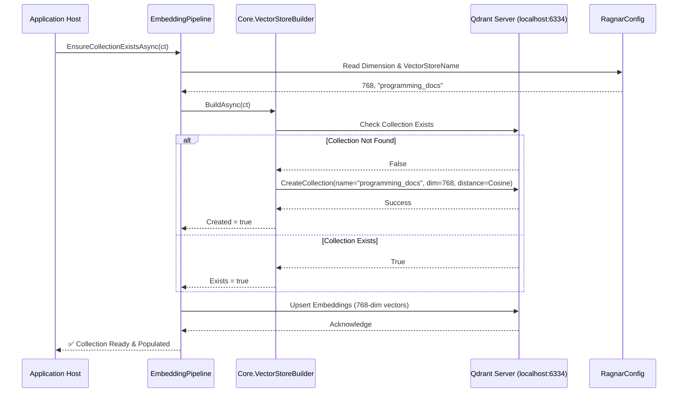
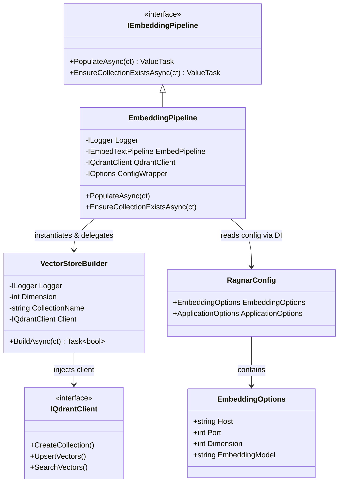

### <span style="color:darkblue;">[Diagram]</span> Analyze the C# code base. Generate the appropriate Mermaid diagrams for the Qdrant database.
> **Date Generated**: 8/24/2026 5:22:50 PM
> ## Question: 
> Analyze the C# code base. Generate the appropriate Mermaid diagrams for the Qdrant database.
> **Method Call Duration**: 16:32
 ## Response: 
Based on the provided C# codebase snippets, Qdrant is used as the vector database for storing text embeddings generated by an Ollama LLM pipeline. The integration is configuration-driven, collection-aware, and orchestrated through `EmbeddingPipeline` and `VectorStoreBuilder`.

Here are three targeted Mermaid diagrams that accurately reflect the Qdrant integration architecture and runtime flow:

### 1. Sequence Diagram: Collection Lifecycle & Vector Storage
Shows how the application ensures a Qdrant collection exists and prepares it for vector ingestion.



### 2. Class/Component Diagram: Core Dependencies
Maps the structural relationships between pipeline orchestration, configuration, and the Qdrant client abstraction.



### 3. Data Flow Diagram: Embedding to Qdrant Pipeline
Illustrates how raw source files are transformed into vectors and persisted in Qdrant.

```mermaid
graph TD
    A[Source Files .cs/.json] --> B(CSVParser / FileLoadOptions)
    B --> C{QuestionConfiguration}
    C --> D[OllamaEmbeddingService]
    D -->|nomic-embed-text → 768-dim float[]| E[IQdrantClient.UpsertAsync]
    E --> F[(Qdrant Vector DB)]
    F --> G[Collection: programming_docs<br/>Distance: Cosine<br/>Dim: 768]
    
    H[VectorStoreBuilder] -->|Ensures schema & metadata| F
    
    I[RagnarConfig.EmbeddingOptions] -.->|Host, Port, Dimension| E
    I -.->|ApplicationOptions.VectorStoreName| H
```

### 🔑 Key Implementation Notes from Your Codebase:
1. **Configuration-Driven Schema**: The collection name and vector dimension are dynamically read from `RagnarConfig.ApplicationOptions.VectorStoreName` and `RagnarConfig.EmbeddingOptions.Dimension` (default `768`).
2. **Idempotent Collection Management**: `VectorStoreBuilder.BuildAsync()` checks existence before creation, preventing runtime crashes on repeated runs.
3. **Client Abstraction**: Direct Qdrant SDK calls are encapsulated behind `IQdrantClient`, allowing easy swapping of vector backends or mocking in tests (`Ragnar.UnitTests`).
4. **Embedding Generation**: Vectors are generated via Ollama (`OllamaEmbeddingService.GenerateAsync`) and streamed to Qdrant without intermediate serialization, optimizing memory throughput.

These diagrams can be directly rendered in any Mermaid-compatible viewer (GitHub, VS Code, Draw.io, etc.) to visualize your vector database integration architecture. Let me know if you need a diagram for the search/retrieval flow or test mocking strategy!
