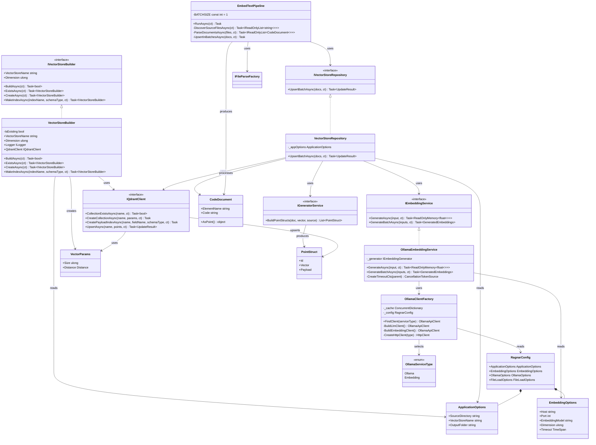
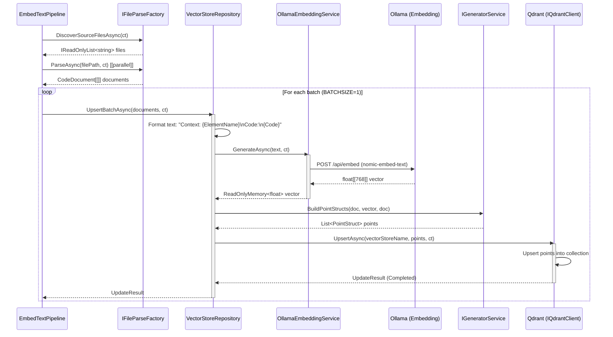
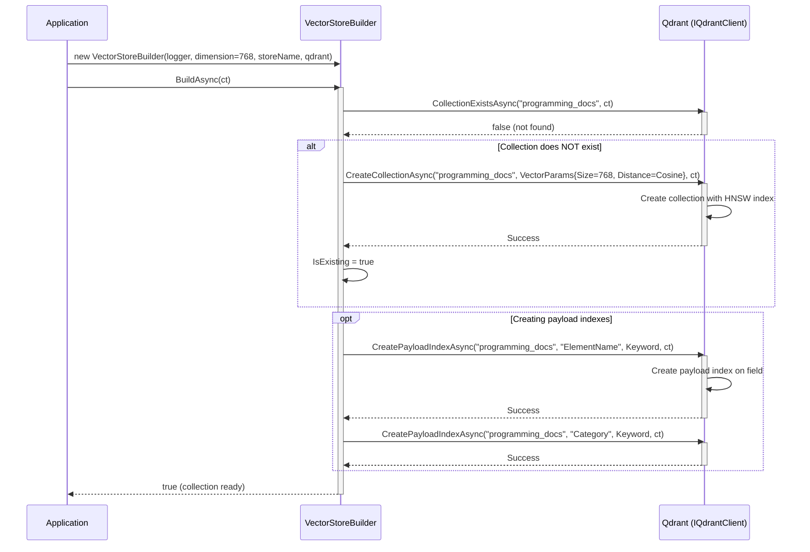
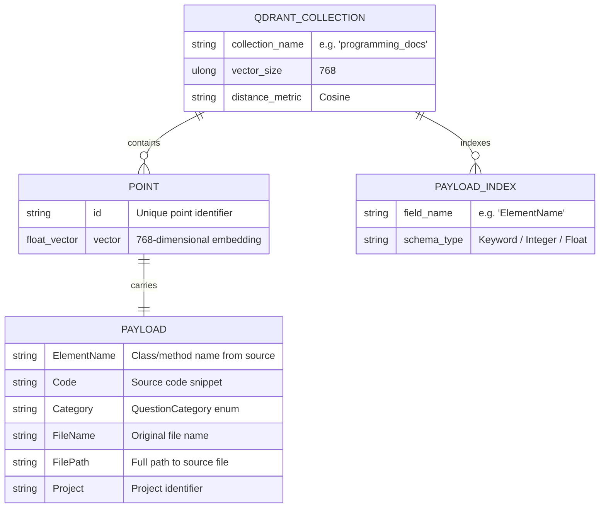
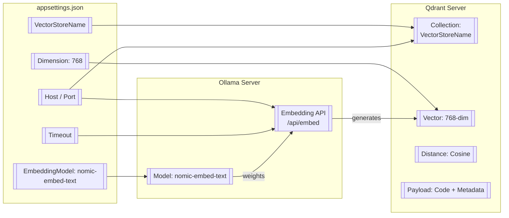

### <span style="color:darkblue;">[Diagram]</span> Analyze the C# code base. Generate the appropriate Mermaid diagrams for the Qdrant database.
> **Date Generated**: 9/2/2026 1:55:51 PM
> ## Question: 
> Analyze the C# code base. Generate the appropriate Mermaid diagrams for the Qdrant database.
> **Method Call Duration**: 01:08
 ## Response: 
# Mermaid Diagrams for Qdrant Database Architecture

## 1. Class Diagram – Qdrant-Related Components



## 2. Sequence Diagram – Embedding & Upsert Flow



## 3. Sequence Diagram – Vector Store Initialization



## 4. Flowchart – Qdrant Pipeline (End-to-End)

```mermaid
flowchart TD
    A[[Application Starts]] --> B[[Load RagnarConfig]]
    B --> C{SourceDirectory exists?}
    C -->|No| D[[Log Warning & Exit]]
    C -->|Yes| E[[Discover Source Files]]
    E --> F[[Filter by Allowed Extensions<br/>.cs, .json, .editorconfig]]
    F --> G[[Exclude by<br/>ExcludedFiles / ExcludedDirectories]]
    G --> H{Any files found?}
    H -->|No| I[[Log 'Nothing to embed' & Exit]]
    H -->|Yes| J[[Parse Files in Parallel<br/>max 8 threads]]
    J --> K[[Produce CodeDocument[[]]<br/>ElementName + Code + Metadata]]
    K --> L{VectorStore exists in Qdrant?}
    L -->|No| M[[VectorStoreBuilder.CreateAsync<br/>VectorParams: Size=768, Cosine]]
    M --> N[[Create Payload Indexes<br/>ElementName, Category]]
    N --> O
    L -->|Yes| O[[Upsert in Batches<br/>BATCHSIZE = 1]]
    O --> P[[Format: 'Context: {Name}\nCode: {Code}']]
    P --> Q[[OllamaEmbeddingService<br/>nomic-embed-text → float 768-dim]]
    Q --> R[[IGeneratorService.BuildPointStructs]]
    R --> S[[Qdrant.UpsertAsync<br/>collection: VectorStoreName]]
    S --> T{More batches?}
    T -->|Yes| O
    T -->|No| U[[Log: Embedding Complete]]

    style M fill:#4a90d9,color:#fff
    style Q fill:#27ae60,color:#fff
    style S fill:#e74c3c,color:#fff
```

## 5. Qdrant Collection Schema (Payload Structure)



## 6. Configuration Mapping to Qdrant



## Key Observations

| Aspect | Detail |
|--------|--------|
| **Vector Model** | `nomic-embed-text` (768 dimensions) |
| **Distance Metric** | Cosine similarity |
| **Batch Size** | 1 (sequential upserts) |
| **Payload Schema** | ElementName, Code, Category, FileName |
| **Client** | `IQdrantClient` (abstracted; likely Qdrant official .NET SDK) |
| **Config Driven** | Multiple `appsettings*.json` files target different repos (Obituary.Aspire, Ragnar, WebPToPng) with distinct collection names |
| **Indexing** | Payload indexes on `ElementName` (Keyword) for filtered retrieval |
