### [General] Can you suggest how to better organize based on features the code into visual studio projects and namespaces? Please generate an updated mermaid UML Diagram of the updated code. 
> **Date Generated**: 8/22/2026 3:35:37 AM
> ## Question: 
> Can you suggest how to better organize based on features the code into visual studio projects and namespaces? Please generate an updated mermaid UML Diagram of the updated code. 
> **Method Call Duration**: 33:19
 ## Response: 
Based on the code snippets provided, your current structure mixes domain models, external integrations (Qdrant/Ollama), orchestration logic, UI rendering, and tests in a flat or loosely grouped manner. To improve maintainability, testability, and scalability, I recommend adopting a **Clean Architecture / Feature-Based Layered** approach tailored for a CLI/Agent application.

### 📦 Proposed Visual Studio Solution Structure & Namespace Mapping

| Project | Namespace | Responsibility | Key Classes from Your Code |
|:---|:---|:---|:---|
| `Ragnar.Core` | `Models` | Domain entities, DTOs, configuration contracts | `Question`, `SaveDetails`, `RagnarConfig`, `OllamaOptions`, `ApplicationOptions`, `EmbeddingOptions`, `FileLoadOptions`, `QuestionCategory` |
| `Ragnar.Core` | `Interfaces` | Abstractions for external dependencies & services | `IOutputWriter`, `IQdrantClient`, `IEmbeddingService`, `IVectorSearchService`, `ISystemPromptProvider`, `IOllamaResponse`, `IQuestionFactory`, `IFilterStrategy`, `IApplicationHeader` |
| `Ragnar.Core` | `Extensions` | Pure utility & extension methods | `StopwatchExtensions`, `AssemblyExtensions`, `Utils.ExpandDirectory`, `SavePathExtensions`, `StylesExtensions` |
| `Ragnar.Core` | `Validation` | Configuration & domain validation rules | `OllamaOptionsValidator` (FluentValidation) |
| `Ragnar.Infrastructure` | `VectorStore` | Qdrant client wrappers, vector builders, search logic | `QdrantSearchService`, `VectorStoreBuilder` |
| `Ragnar.Infrastructure` | `LLM.Ollama` | Ollama HTTP clients, embedding generators, prompt templates | `OllamaEmbeddingService`, `SystemPromptProvider` |
| `Ragnar.Infrastructure` | `Parsing` | File I/O strategies, XML/comment filtering logic | `FileParseFactory`, `XmlCommentFilterStrategy`, `XmlEmptyCommentFilter` |
| `Ragnar.Application` | `Pipelines` | Multi-step workflows & orchestration | `EmbeddingPipeline` |
| `Ragnar.Application` | `Agents` | AI agent orchestration & prompt routing | `SummaryAgent` |
| `Ragnar.Application` | `Writers` | Response formatting, markdown generation, persistence | `ResponseWriter` |
| `Ragnar.Presentation` | `Console` | CLI rendering, Spectre.Console adapters, branding | `ApplicationHeader`, `SpectreConsoleOutputWriter` (implied) |
| `Ragnar.Tests` | `Unit` | Isolated unit tests for core & infrastructure | `DefaultQuestionFactoryTests`, `StringExtensionsTests`, `SavePathExtensionsTests`, `FileParseFactoryTests`, `ResponseWriterTests` |

---

### 📐 Updated Mermaid UML Diagram

```mermaid
classDiagram
    %% Core Domain & Contracts
    package RagnarCore 
        class Models { <<domain>> }
        class Interfaces { <<contracts>> }
        class Extensions { <<utilities>> }
        class Validation { <<rules>> }
        end

    %% External Integrations
    package RagnarInfrastructure
        class VectorStore { <<qdrant>> }
        class LLM_Ollama { <<ollama>> }
        class Parsing { <<file-io>> }
    end

    %% Business Logic & Orchestration
    package RagnarApplication
        class Pipelines { <<orchestration>> }
        class Agents { <<ai-agents>> }
        class Writers { <<output>> }
    end

    %% User Interface
    package RagnarPresentation
        class ConsoleUI { <<cli-spectre>> }
    end

    %% Testing
    package RagnarTests
        class UnitTests { <<xunit>> }
    end

    %% Mapped Classes (abbreviated for diagram clarity)
    Models : Question, SaveDetails, RagnarConfig, OllamaOptions...
    Interfaces : IOutputWriter, IQdrantClient, IEmbeddingService, IVectorSearchService...
    Extensions : StopwatchExtensions, AssemblyExtensions, Utils, SavePathExtensions, StylesExtensions
    Validation : OllamaOptionsValidator

    VectorStore : QdrantSearchService, VectorStoreBuilder
    LLM_Ollama : OllamaEmbeddingService, SystemPromptProvider
    Parsing : FileParseFactory, XmlCommentFilterStrategy, XmlEmptyCommentFilter

    Pipelines : EmbeddingPipeline
    Agents : SummaryAgent
    Writers : ResponseWriter

    ConsoleUI : ApplicationHeader

    UnitTests : DefaultQuestionFactoryTests, StringExtensionsTests, SavePathExtensionsTests, FileParseFactoryTests, ResponseWriterTests

    %% Dependencies & Relationships
    Infrastructure.VectorStore ..|> Interfaces : implements IVectorSearchService
    Infrastructure.LLM_Ollama ..|> Interfaces : implements IEmbeddingService, IOllamaResponse
    Application.Pipelines --> Interfaces : orchestrates pipelines
    Application.Writers --> Models : persists SaveDetails
    Presentation.ConsoleUI --> Extensions : renders UI with Spectre helpers
    Tests.UnitTests --> Models : validates domain logic
    Tests.UnitTests --> Parsing : tests file parsing strategies
```

---

### 🔑 Key Architectural Benefits & Migration Tips

1. **Dependency Rule (Clean Architecture)**: `Core` knows nothing about `Infrastructure`, `Application`, or `Presentation`. All external dependencies (Qdrant, Ollama, File System) are abstracted via `Interfaces` in Core and implemented in Infrastructure.
2. **Feature-Based Namespaces**: Grouping by capability (`VectorStore`, `LLM.Ollama`, `Parsing`) prevents namespace pollution and makes it easy to locate or replace specific integrations without touching unrelated code.
3. **Testability**: `Ragnar.Tests` only depends on `Core` and `Infrastructure`. You can mock `IQdrantClient`, `IOllamaClientFactory`, and `IOutputWriter` easily since they live in Core contracts.
4. **Configuration Handling**: Move `RagnarConfig` JSON structure to a strongly-typed POCO in `Ragnar.Core.Configuration`. Use `IOptions<RagnarConfig>` injection at the composition root (Program.cs).
5. **Visual Studio Setup**:
   - Create each project as a separate `.csproj`.
   - Set `Ragnar.Application` as the startup project if it contains your CLI entry point, or keep `Ragnar.Presentation` as the entry point and reference Application/Infrastructure via DI.
   - Use `[FromKeyedServices]` and interface registration in a central `DependencyInjection` extension method inside `Ragnar.Core`.

This structure scales cleanly as you add more LLM providers, vector databases, or UI layers (e.g., Web API, Desktop) without refactoring core business logic. Let me know if you need the exact `Program.cs` DI wiring or project file templates!

***
