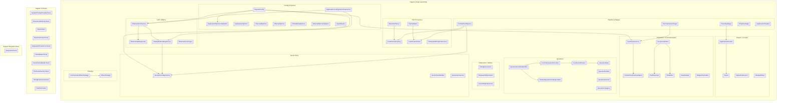
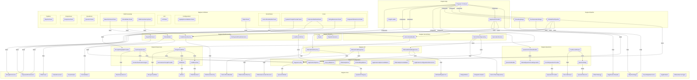
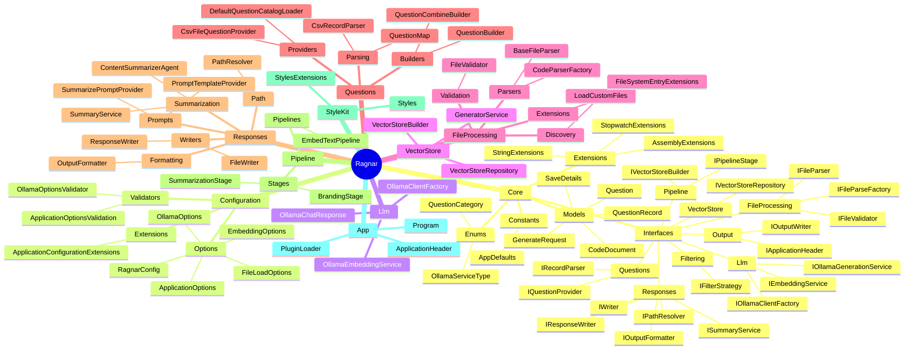

### <span style="color:darkblue;">[General]</span> Can you suggest how to better organize based on features the code into visual studio projects and namespaces? Please generate an updated mermaid Diagrams of the updated code compared to the current implementation. Please provide a step by step guide on migrating each file over to the organization.
> **Date Generated**: 9/1/2026 1:47:34 PM
> ## Question: 
> Can you suggest how to better organize based on features the code into visual studio projects and namespaces? Please generate an updated mermaid Diagrams of the updated code compared to the current implementation. Please provide a step by step guide on migrating each file over to the organization.
> **Method Call Duration**: 01:01
 ## Response: 
# Ragnar Codebase: Feature-Based Project & Namespace Restructuring

## 1. Current State Analysis

The codebase currently appears to live in a small number of assemblies (likely `Ragnar` + `Ragnar.UnitTests` + `Ragnar.IntegrationTests`), with all concerns—LLM clients, vector store, file parsing, question management, response writing, pipeline orchestration, configuration, and console output—mixed together. Below is a diagram of that flat topology.

---

## 2. Proposed Solution Layout

```
Ragnar.sln
│
├── src/
│   ├── Ragnar.Core/                  ← abstractions, models, enums, shared extensions
│   ├── Ragnar.Configuration/         ← option classes, FluentValidation rules, DI extensions
│   ├── Ragnar.Llm/                   ← Ollama client factory, chat generation, embeddings
│   ├── Ragnar.VectorStore/           ← Qdrant builder, repository, point generation
│   ├── Ragnar.FileProcessing/        ← file discovery, parsers, validators
│   ├── Ragnar.Questions/             ← question builders, CSV providers, plugin loading
│   ├── Ragnar.Responses/             ← response writing, formatting, summarization
│   ├── Ragnar.Pipeline/              ← IPipelineStage, stage implementations, orchestration
│   └── Ragnar.App/                   ← Program.cs, branding, DI composition root
│
├── tests/
│   ├── Ragnar.UnitTests/
│   │   ├── Core/
│   │   ├── Configuration/
│   │   ├── Llm/
│   │   ├── VectorStore/
│   │   ├── FileProcessing/
│   │   ├── Questions/
│   │   ├── Responses/
│   │   └── Pipeline/
│   └── Ragnar.IntegrationTests/
│
└── shared/
    └── Ragnar.StyleKit/              ← Spectre.Console styles, extensions (reusable)
```

### Dependency Graph (compile-time)

```
Ragnar.App
 ├── Ragnar.Pipeline
 │    ├── Ragnar.Responses
 │    │    ├── Ragnar.Core
 │    │    └── Ragnar.Configuration
 │    ├── Ragnar.VectorStore
 │    │    ├── Ragnar.Core
 │    │    ├── Ragnar.Llm
 │    │    └── Ragnar.Configuration
 │    ├── Ragnar.Questions
 │    │    ├── Ragnar.Core
 │    │    └── Ragnar.Configuration
 │    └── Ragnar.FileProcessing
 │         ├── Ragnar.Core
 │         └── Ragnar.Configuration
 ├── Ragnar.Configuration
 │    └── Ragnar.Core
 ├── Ragnar.StyleKit
 └── Ragnar.Core
```

---

## 3. Mermaid Diagrams

### 3a. Current (flat / monolithic) implementation



### 3b. Proposed (feature-based) implementation



### 3c. Namespace tree (proposed)



---

## 4. Step-by-Step Migration Guide

> **Principle:** Work bottom-up (Core → leaves → App). At every step the solution must still build. Use *new* project files and *move* (not copy) existing files. Update `using` directives as you go.

### Phase 0 – Preparation (≈ 30 min)

| # | Action |
|---|--------|
| 0.1 | Create a feature branch: `git checkout -b refactor/project-split` |
| 0.2 | Verify the solution builds and all tests pass **before** any change. |
| 0.3 | Add a `Directory.Build.props` at the solution root for shared `LangVersion`, `Nullable`, `TreatWarningsAsErrors`, and common package versions (`Serilog`, `Spectre.Console`, `CsvHelper`, `FluentValidation`, `Qdrant.Client`, `Guard.NET`, `Microsoft.Extensions.*`). |
| 0.4 | Add a `Directory.Packages.props` (Central Package Management) so every new project references packages by version centrally. |
| 0.5 | Add solution folders in the .sln: `src/`, `tests/`, `shared/`. |

---

### Phase 1 – Create **Ragnar.Core** (no external deps beyond Guard.NET)

| # | File / Element | Source Namespace | Target Project | Target Namespace | Notes |
|---|----------------|-----------------|----------------|-----------------|-------|
| 1.1 | `Question` (record/class) | `Ragnar.Core.Model` | **Ragnar.Core** | `Ragnar.Core.Models` | |
| 1.2 | `QuestionRecord` | `Ragnar.Core.Model` | **Ragnar.Core** | `Ragnar.Core.Models` | |
| 1.3 | `QuestionCategory` enum | `Ragnar.Core.Model` | **Ragnar.Core** | `Ragnar.Core.Enums` | |
| 1.4 | `CodeDocument` | (existing) | **Ragnar.Core** | `Ragnar.Core.Models` | |
| 1.5 | `SaveDetails` | (existing) | **Ragnar.Core** | `Ragnar.Core.Models` | |
| 1.6 | `GenerateRequest` | (existing) | **Ragnar.Core** | `Ragnar.Core.Models` | |
| 1.7 | `OllamaServiceType` enum | (existing) | **Ragnar.Core** | `Ragnar.Core.Enums` | |
| 1.8 | `IOllamaClientFactory` | (existing) | **Ragnar.Core** | `Ragnar.Core.Interfaces.Llm` | |
| 1.9 | `IOllamaGenerationService` | (existing) | **Ragnar.Core** | `Ragnar.Core.Interfaces.Llm` | |
| 1.10 | `IEmbeddingService` | (existing) | **Ragnar.Core** | `Ragnar.Core.Interfaces.Llm` | |
| 1.11 | `IVectorStoreBuilder` | (existing) | **Ragnar.Core** | `Ragnar.Core.Interfaces.VectorStore` | |
| 1.12 | `IVectorStoreRepository` | (existing) | **Ragnar.Core** | `Ragnar.Core.Interfaces.VectorStore` | |
| 1.13 | `IFileParser` | (existing) | **Ragnar.Core** | `Ragnar.Core.Interfaces.FileProcessing` | |
| 1.14 | `IFileParseFactory` | (existing) | **Ragnar.Core** | `Ragnar.Core.Interfaces.FileProcessing` | |
| 1.15 | `IFileValidator` | (existing) | **Ragnar.Core** | `Ragnar.Core.Interfaces.FileProcessing` | |
| 1.16 | `IQuestionProvider` | (existing) | **Ragnar.Core** | `Ragnar.Core.Interfaces.Questions` | |
| 1.17 | `IRecordParser<T>` | (existing) | **Ragnar.Core** | `Ragnar.Core.Interfaces.Questions` | |
| 1.18 | `IResponseWriter` | (existing) | **Ragnar.Core** | `Ragnar.Core.Interfaces.Responses` | |
| 1.19 | `IWriter` | (existing) | **Ragnar.Core** | `Ragnar.Core.Interfaces.Responses` | |
| 1.20 | `IOutputFormatter` | (existing) | **Ragnar.Core** | `Ragnar.Core.Interfaces.Responses` | |
| 1.21 | `IPathResolver` | (existing) | **Ragnar.Core** | `Ragnar.Core.Interfaces.Responses` | |
| 1.22 | `ISummaryService` | (existing) | **Ragnar.Core** | `Ragnar.Core.Interfaces.Responses` | |
| 1.23 | `IPipelineStage` | (existing) | **Ragnar.Core** | `Ragnar.Core.Interfaces.Pipeline` | |
| 1.24 | `IApplicationHeader` | (existing) | **Ragnar.Core** | `Ragnar.Core.Interfaces.Output` | |
| 1.25 | `IOutputWriter` | (existing) | **Ragnar.Core** | `Ragnar.Core.Interfaces.Output` | |
| 1.26 | `IFilterStrategy` | (existing) | **Ragnar.Core** | `Ragnar.Core.Interfaces.Filtering` | |
| 1.27 | `StringExtensions` | (existing) | **Ragnar.Core** | `Ragnar.Core.Extensions` | |
| 1.28 | `StopwatchExtensions` | (existing) | **Ragnar.Core** | `Ragnar.Core.Extensions` | |
| 1.29 | `AssemblyExtensions` | (existing) | **Ragnar.Core** | `Ragnar.Core.Extensions` | |
| 1.30 | `AppDefaults` | (existing) | **Ragnar.Core** | `Ragnar.Core.Constants` | |
| 1.31 | `Filter`, `Condition`, `FieldCondition`, `Range` | (existing) | **Ragnar.Core** | `Ragnar.Core.Models.Filtering` | Supporting types for `IFilterStrategy` |
| 1.32 | `QuestionMap` *(interface contract only – see Phase 5)* | `Ragnar.UnitTests`? | **Ragnar.Core** | `Ragnar.Core.Models.Questions` | CsvHelper `ClassMap<T>` needs CsvHelper ref – add **CsvHelper** to Core. |

**Project file skeleton (`Ragnar.Core.csproj`):**
```xml
<Project Sdk="Microsoft.NET.Sdk">
  <PropertyGroup>
    <TargetFramework>net10.0</TargetFramework>
  </PropertyGroup>
  <ItemGroup>
    <PackageReference Include="Guard.NET" />
    <PackageReference Include="CsvHelper" />
  </ItemGroup>
</Project>
```

**After Phase 1:** `Ragnar.Core` builds. All other projects (not yet created) still reference the old assembly. Delete the moved files from the old project and add a `ProjectReference` to `Ragnar.Core`. Build + test.

---

### Phase 2 – Create **Ragnar.StyleKit** (shared, zero-domain)

| # | File | Target Namespace |
|---|------|-----------------|
| 2.1 | `Styles` (static class with `GreenBlink`, `Yellow`, `Blue`, `BoldSteelBlue`, etc.) | `Ragnar.StyleKit` |
| 2.2 | `StylesExtensions` (`EnsureValidStyle`) | `Ragnar.StyleKit.Extensions` |

```xml
<PackageReference Include="Spectre.Console" />
```

Move `StylesTests` → `Ragnar.UnitTests/StyleKit/StylesTests.cs`.

---

### Phase 3 – Create **Ragnar.Configuration**

| # | File | Target Namespace | Notes |
|---|------|-----------------|-------|
| 3.1 | `RagnarConfig` | `Ragnar.Configuration.Options` | Aggregate root for options |
| 3.2 | `ApplicationOptions` | `Ragnar.Configuration.Options` | |
| 3.3 | `FileLoadOptions` | `Ragnar.Configuration.Options` | |
| 3.4 | `OllamaOptions` | `Ragnar.Configuration.Options` | |
| 3.5 | `EmbeddingOptions` | `Ragnar.Configuration.Options` | |
| 3.6 | `ApplicationOptionsValidation` | `Ragnar.Configuration.Validators` | FluentValidation |
| 3.7 | `OllamaOptionsValidator` | `Ragnar.Configuration.Validators` | |
| 3.8 | `ApplicationConfigurationExtensions` (`RegisterEmbeddingServices`, `LoadQuestionPlugins`) | `Ragnar.Configuration.Extensions` | **Note:** `LoadQuestionPlugins` moves here; it references `IQuestionProvider` (from Core) and `AssemblyLoadContext`. |

**Package references:** `Ragnar.Core`, `FluentValidation`, `Microsoft.Extensions.Options`, `Microsoft.Extensions.DependencyInjection.Abstractions`, `Serilog`.

Move `appsettings.json` (or the relevant sections) into a `Ragnar.Configuration` shared resource, or keep per-assembly `appsettings.Development.json` in `Ragnar.App`.

---

### Phase 4 – Create **Ragnar.Llm**

| # | File | Target Namespace |
|---|------|-----------------|
| 4.1 | `OllamaClientFactory` | `Ragnar.Llm` |
| 4.2 | `OllamaChatResponse` | `Ragnar.Llm.Generation` |
| 4.3 | `OllamaEmbeddingService` | `Ragnar.Llm.Embeddings` |
| 4.4 | `OllamaApiClient` *(if it's a thin wrapper over HttpClient)* | `Ragnar.Llm.Clients` |

**References:** `Ragnar.Core`, `Ragnar.Configuration`, `Microsoft.Extensions.Http`, `Spectre.Console` (for the live panel in `OllamaChatResponse`), `Serilog`.

> **Key change:** `OllamaChatResponse` currently uses `AnsiConsole.Live` inline. Consider extracting the rendering loop into a `ConsoleProgressRenderer` in `Ragnar.StyleKit` or `Ragnar.App` to keep the LLM project free of Spectre dependencies. If you keep it here, add `Spectre.Console` to the csproj.

---

### Phase 5 – Create **Ragnar.VectorStore**

| # | File | Target Namespace |
|---|------|-----------------|
| 5.1 | `VectorStoreBuilder` | `Ragnar.VectorStore` |
| 5.2 | `VectorStoreRepository` | `Ragnar.VectorStore` |
| 5.3 | `GeneratorService` / `IGeneratorService` | `Ragnar.VectorStore` |
| 5.4 | `XmlCommentFilterStrategy` | `Ragnar.VectorStore.Filtering` | *(or keep in `Ragnar.FileProcessing` if it's purely about parsing XML comments – decide based on who calls it. If the Qdrant filter uses it, keep here.)* |

**References:** `Ragnar.Core`, `Ragnar.Configuration`, `Ragnar.Llm` (for `IEmbeddingService`), `Qdrant.Client`.

Move `VectorStoreBuilderTests` → `Ragnar.UnitTests/VectorStore/`.

---

### Phase 6 – Create **Ragnar.FileProcessing**

| # | File | Target Namespace |
|---|------|-----------------|
| 6.1 | `BaseFileParser` | `Ragnar.FileProcessing.Parsers` |
| 6.2 | `CodeParserFactory` (aka `FileParseFactory`) | `Ragnar.FileProcessing.Parsers` |
| 6.3 | `FileValidator` | `Ragnar.FileProcessing.Validation` |
| 6.4 | `FileSystemEntryExtensions` | `Ragnar.FileProcessing.Extensions` |
| 6.5 | `LoadCustomFiles` (the file-discovery service) | `Ragnar.FileProcessing.Discovery` |

**References:** `Ragnar.Core`, `Ragnar.Configuration` (for `FileLoadOptions`), `Serilog`, `Guard.NET`.

Move `BaseFileParserTests`, `FileValidatorTests`, `FileParseFactoryTests`, `TestFileParser` → `Ragnar.UnitTests/FileProcessing/`.

---

### Phase 7 – Create **Ragnar.Questions**

| # | File | Target Namespace |
|---|------|-----------------|
| 7.1 | `QuestionCombineBuilder` | `Ragnar.Questions.Builders` |
| 7.2 | `QuestionBuilder` | `Ragnar.Questions.Builders` |
| 7.3 | `CsvRecordParser` | `Ragnar.Questions.Parsing` |
| 7.4 | `CsvFileQuestionProvider` | `Ragnar.Questions.Providers` |
| 7.5 | `DefaultQuestionCatalogLoader` | `Ragnar.Questions.Providers` |
| 7.6 | `QuestionMap` | `Ragnar.Questions.Parsing` | *(already moved to Core in Phase 1 – keep here if you prefer CsvHelper mapping in the same project that uses it; either works. The key is that `IRecordParser<QuestionRecord>` is in Core.)* |

**References:** `Ragnar.Core`, `Ragnar.Configuration`, `CsvHelper`, `Microsoft.Extensions.Options`.

> `ApplicationConfigurationExtensions.LoadQuestionPlugins()` (Phase 3) calls `AssemblyLoadContext.Default.LoadFromAssemblyPath` and registers `IQuestionProvider` types. Because it depends on `IQuestionProvider` (Core) but is a **DI extension**, keep it in `Ragnar.Configuration`. The plugin DLLs themselves live in `Ragnar.App/bin/Questions/Plugins/` at runtime.

---

### Phase 8 – Create **Ragnar.Responses**

| # | File | Target Namespace |
|---|------|-----------------|
| 8.1 | `ResponseWriter` | `Ragnar.Responses.Writers` |
| 8.2 | `FileWriter` | `Ragnar.Responses.Writers` |
| 8.3 | `PathResolver` | `Ragnar.Responses.Path` |
| 8.4 | `OutputFormatter` / `IOutputFormatter` impl | `Ragnar.Responses.Formatting` |
| 8.5 | `SummaryService` | `Ragnar.Responses.Summarization` |
| 8.6 | `ContentSummarizerAgent` | `Ragnar.Responses.Summarization.Agents` |
| 8.7 | `SummarizePromptProvider` | `Ragnar.Responses.Prompts` |
| 8.8 | `PromptTemplateProvider` | `Ragnar.Responses.Prompts` |

**References:** `Ragnar.Core`, `Ragnar.Configuration`, `Ragnar.Llm` (for `IOllamaGenerationService` used by `SummaryService`), `Spectre.Console` (for `IOutputWriter.MarkupLine`).

Move `SystemPromptProviderTests` → `Ragnar.UnitTests/Responses/`.

---

### Phase 9 – Create **Ragnar.Pipeline**

| # | File | Target Namespace |
|---|------|-----------------|
| 9.1 | `BrandingStage` | `Ragnar.Pipeline.Stages` |
| 9.2 | `SummarizationStage` | `Ragnar.Pipeline.Stages` |
| 9.3 | `EmbedTextPipeline` | `Ragnar.Pipeline.Pipelines` |

**References:** `Ragnar.Core`, `Ragnar.Configuration`, `Ragnar.VectorStore`, `Ragnar.FileProcessing`, `Ragnar.Responses`, `Spectre.Console`, `Serilog`.

This is the "orchestrator" project – it depends on most others, which is expected for a composition/orchestration layer.

---

### Phase 10 – Create **Ragnar.App** (the executable)

| # | File | Target Namespace |
|---|------|-----------------|
| 10.1 | `Program.cs` / `Startup.cs` | `Ragnar.App` |
| 10.2 | `ApplicationHeader` | `Ragnar.App.Branding` |
| 10.3 | Plugin-loading glue (if you extracted it from `ApplicationConfigurationExtensions`) | `Ragnar.App.Plugins` |
| 10.4 | `appsettings.json` | `Ragnar.App` (Content) |

**References:** Everything. `OutputType = Exe`.

This is where `ServiceCollection` is built, Serilog is configured, and the pipeline stages are composed and executed.

---

### Phase 11 – Reorganize **Ragnar.UnitTests**

Create sub-folders mirroring the feature projects:

```
Ragnar.UnitTests/
├── Core/
│   ├── Extensions/
│   │   ├── StringExtensionsTests.cs
│   │   ├── StopwatchExtensionsTests.cs
│   │   └── AssemblyExtensionsTests.cs
│   └── Models/
│       └── ...
├── Configuration/
│   └── ApplicationOptionsValidationTests.cs
├── Llm/
│   ├── OllamaClientFactoryTests.cs
│   └── OllamaChatResponseTests.cs
├── VectorStore/
│   ├── VectorStoreBuilderTests.cs
│   └── VectorStoreRepositoryTests.cs
├── FileProcessing/
│   ├── BaseFileParserTests.cs
│   ├── FileValidatorTests.cs
│   └── FileParseFactoryTests.cs
├── Questions/
│   ├── QuestionCombineBuilderTests.cs
│   └── CsvRecordParserTests.cs
├── Responses/
│   ├── ResponseWriterTests.cs
│   ├── SystemPromptProviderTests.cs
│   └── SummaryServiceTests.cs
├── Pipeline/
│   ├── BrandingStageTests.cs
│   └
