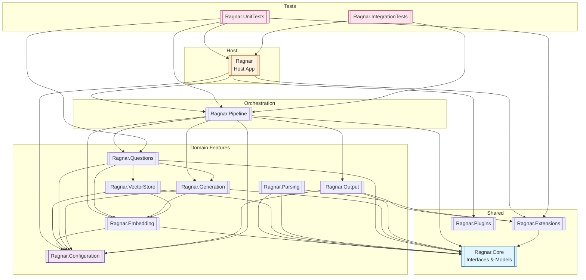
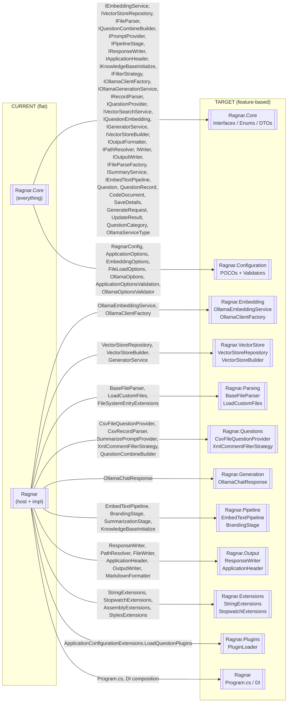
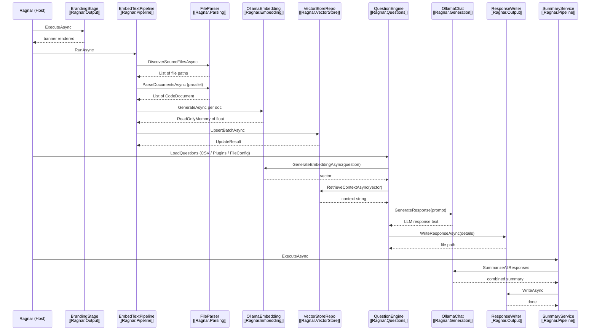
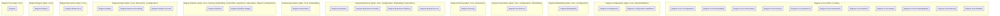

### <span style="color:darkblue;">[General]</span> Can you suggest how to better organize based on features the code into visual studio projects and namespaces? Please generate an updated mermaid Diagrams of the updated code compared to the current implementation. Please provide a step by step guide on migrating each file over to the updated structure.
> **Date Generated**: 9/11/2026 3:46:26 AM
> ## Question: 
> Can you suggest how to better organize based on features the code into visual studio projects and namespaces? Please generate an updated mermaid Diagrams of the updated code compared to the current implementation. Please provide a step by step guide on migrating each file over to the updated structure.
> **Method Call Duration**: 44:33
 ## Response: 
# Feature-Based Project & Namespace Restructuring for Ragnar

## Proposed Solution Architecture

The current codebase has a flat, layered structure where everything lives in a handful of projects. The restructure below groups code by **business capability (feature)**, making each project independently testable, deployable as a NuGet package if needed, and easier to reason about.

---

## Updated Project & Namespace Layout

```
Ragnar.sln
│
├── src/
│   ├── Ragnar.Core/                  ← Abstractions ONLY (no implementation, no external deps)
│   │   ├── Configuration/
│   │   ├── Embedding/
│   │   ├── VectorStore/
│   │   ├── Parsing/
│   │   ├── Questions/
│   │   ├── Generation/
│   │   ├── Pipeline/
│   │   ├── Output/
│   │   ├── KnowledgeBase/
│   │   ├── Filtering/
│   │   └── Models/
│   │
│   ├── Ragnar.Configuration/         ← Concrete config POCOs + FluentValidation
│   │
│   ├── Ragnar.Embedding/             ← Ollama client factory + embedding service
│   │
│   ├── Ragnar.VectorStore/           ← Qdrant repo, builder, point generator
│   │
│   ├── Ragnar.Parsing/               ← File parsers, discovery, FS extensions
│   │
│   ├── Ragnar.Questions/             ← Question providers, CSV, filters, prompts
│   │
│   ├── Ragnar.Generation/            ← LLM chat response streaming
│   │
│   ├── Ragnar.Pipeline/              ← Pipeline stages + orchestration
│   │
│   ├── Ragnar.Output/                ← Writers, formatters, path resolvers, console UI
│   │
│   ├── Ragnar.Extensions/            ← Shared utility extension methods
│   │
│   ├── Ragnar.Plugins/               ← Plugin DLL discovery & loading
│   │
│   └── Ragnar/                       ← Host app (Program.cs, DI composition root)
│
├── tests/
│   ├── Ragnar.UnitTests/
│   └── Ragnar.IntegrationTests/
│
└── docs/
    └── appsettings.examples/
```

---

## Mermaid Diagrams

### 1. Project Dependency Graph (Target State)



### 2. Feature-to-Namespace Mapping (Current → Target)



### 3. Pipeline Execution Flow (Unchanged, just relocated)



### 4. Namespace Tree per Project



---

## File-by-File Migration Guide

### Phase 1 — Create the Project Skeleton

| Step | Action |
|------|--------|
| 1.1 | `dotnet new sln -n Ragnar` in the repo root. |
| 1.2 | Create solution folders: `src`, `tests`, `docs`. |
| 1.3 | Create each class library project (net8.0): `Ragnar.Core`, `Ragnar.Configuration`, `Ragnar.Embedding`, `Ragnar.VectorStore`, `Ragnar.Parsing`, `Ragnar.Questions`, `Ragnar.Generation`, `Ragnar.Pipeline`, `Ragnar.Output`, `Ragnar.Extensions`, `Ragnar.Plugins`. |
| 1.4 | Create the host project `Ragnar` (console app, net8.0). |
| 1.5 | Add NuGet packages **only where needed** (see table below). |
| 1.6 | Add all projects to the solution; set up the dependency references shown in the diagram. |

**NuGet package placement (target state):**

| Package | Project(s) |
|---------|-----------|
| `Microsoft.Extensions.Options` | Core, Configuration, Embedding, VectorStore, Parsing, Questions, Generation, Pipeline, Output, Host |
| `FluentValidation` | Configuration |
| `Qdrant.Client` | Core (for types), VectorStore |
| `CsvHelper` | Questions |
| `Spectre.Console` | Output, Pipeline, Parsing, Generation |
| `Serilog` | Core (ILogger), Output, Pipeline, Parsing, Generation, VectorStore |
| `Guard.Net` | Core, Parsing, Questions, Generation |
| `OllamaSharp` / `Microsoft.SemanticKernel` (or your Ollama lib) | Embedding, Generation |
| `Microsoft.Extensions.DependencyInjection.Abstractions` | Core, Host |
| `System.Text.Json` | Configuration |

---

### Phase 2 — Migrate `Ragnar.Core` (Interfaces & Models)

Move **every** interface, enum, model, DTO, and record here. No implementation classes.

| File (current) | New namespace | New folder |
|---|---|---|
| `IEmbeddingService` | `Ragnar.Core.Embedding` | `src/Ragnar.Core/Embedding/` |
| `IVectorStoreRepository` | `Ragnar.Core.VectorStore` | `src/Ragnar.Core/VectorStore/` |
| `IVectorStoreBuilder` | `Ragnar.Core.VectorStore` | `src/Ragnar.Core/VectorStore/` |
| `IGeneratorService` | `Ragnar.Core.VectorStore` | `src/Ragnar.Core/VectorStore/` |
| `IFileParser` | `Ragnar.Core.Parsing` | `src/Ragnar.Core/Parsing/` |
| `IFileParseFactory` | `Ragnar.Core.Parsing` | `src/Ragnar.Core/Parsing/` |
| `IQuestionCombineBuilder` | `Ragnar.Core.Questions` | `src/Ragnar.Core/Questions/` |
| `IQuestionProvider` | `Ragnar.Core.Questions` | `src/Ragnar.Core/Questions/` |
| `IRecordParser<T>` | `Ragnar.Core.Questions` | `src/Ragnar.Core/Questions/` |
| `IPromptProvider` | `Ragnar.Core.Questions` | `src/Ragnar.Core/Questions/` |
| `IOllamaGenerationService` | `Ragnar.Core.Generation` | `src/Ragnar.Core/Generation/` |
| `IOllamaClientFactory` | `Ragnar.Core.Generation` | `src/Ragnar.Core/Generation/` |
| `IPipelineStage` | `Ragnar.Core.Pipeline` | `src/Ragnar.Core/Pipeline/` |
| `IEmbedTextPipeline` | `src/Ragnar.Core/Pipeline/` | |
| `ISummaryService` | `Ragnar.Core.Pipeline` | `src/Ragnar.Core/Pipeline/` |
| `IKnowledgeBaseInitialize` | `Ragnar.Core.KnowledgeBase` | `src/Ragnar.Core/KnowledgeBase/` |
| `IQuestionEmbedding` | `Ragnar.Core.KnowledgeBase` | `src/Ragnar.Core/KnowledgeBase/` |
| `IVectorSearchService` | `src/Ragnar.Core/KnowledgeBase/` | |
| `IResponseWriter` | `Ragnar.Core.Output` | `src/Ragnar.Core/Output/` |
| `IOutputFormatter` | `Ragnar.Core.Output` | `src/Ragnar.Core/Output/` |
| `IPathResolver` | `Ragnar.Core.Output` | `src/Ragnar.Core/Output/` |
| `IWriter` | `Ragnar.Core.Output` | `src/Ragnar.Core/Output/` |
| `IOutputWriter` | `Ragnar.Core.Output` | `src/Ragnar.Core/Output/` |
| `IApplicationHeader` | `Ragnar.Core.Output` | `src/Ragnar.Core/Output/` |
| `IFilterStrategy` | `Ragnar.Core.Filtering` | `src/Ragnar.Core/Filtering/` |
| `Question` (model) | `Ragnar.Core.Models` | `src/Ragnar.Core/Models/` |
| `QuestionRecord` | `Ragnar.Core.Models` | `src/Ragnar.Core/Models/` |
| `QuestionCategory` (enum) | `Ragnar.Core.Models` | `src/Ragnar.Core/Models/` |
| `CodeDocument` | `Ragnar.Core.Models` | `src/Ragnar.Core/Models/` |
| `SaveDetails` | `Ragnar.Core.Models` | `src/Ragnar.Core/Models/` |
| `GenerateRequest` | `Ragnar.Core.Models` | `src/Ragnar.Core/Models/` |
| `UpdateResult`, `UpdateStatus` | `Ragnar.Core.Models` | `src/Ragnar.Core/Models/` |
| `OllamaServiceType` (enum) | `Ragnar.Core.Generation` | `src/Ragnar.Core/Generation/` |
| `Filter`, `Condition`, `FieldCondition`, `Range`, `Match`, `RepeatedStrings` | `Ragnar.Core.Filtering` | `src/Ragnar.Core/Filtering/` |

> **Rule:** `Ragnar.Core` has **zero** NuGet dependencies beyond `Microsoft.Extensions.Options.Abstractions` and `Serilog` (for `ILogger` in a couple of interface defaults). No `Spectre.Console`, no `Qdrant.Client`, no `CsvHelper`.

---

### Phase 3 — Migrate `Ragnar.Configuration`

| File (current) | New namespace |
|---|---|
| `RagnarConfig` (root config class) | `Ragnar.Configuration` |
| `ApplicationOptions` | `Ragnar.Configuration` |
| `EmbeddingOptions` | `Ragnar.Configuration` |
| `FileLoadOptions` | `Ragnar.Configuration` |
| `OllamaOptions` | `Ragnar.Configuration` |
| `ApplicationOptionsValidation` | `Ragnar.Configuration.Validation` |
| `OllamaOptionsValidator` | `Ragnar.Configuration.Validation` |
| `appsettings.json` (all variants) | Move to `docs/appsettings.examples/`; keep one in `Ragnar/` (host) |

**References:** → `Ragnar.Core`, `FluentValidation`, `Microsoft.Extensions.Options`.

---

### Phase 4 — Migrate `Ragnar.Embedding`

| File (current) | New namespace |
|---|---|
| `OllamaEmbeddingService` | `Ragnar.Embedding` |
| `OllamaClientFactory` | `Ragnar.Embedding` |
| (any `AsEmbeddingGenerator` extension on `OllamaApiClient`) | `Ragnar.Embedding` |

**References:** → `Ragnar.Core`, `Ragnar.Configuration`, `Serilog`, `OllamaSharp`/your Ollama lib.

---

### Phase 5 — Migrate `Ragnar.VectorStore`

| File (current) | New namespace |
|---|---|
| `VectorStoreRepository` | `Ragnar.VectorStore` |
| `VectorStoreBuilder` | `Ragnar.VectorStore` |
| `GeneratorService` (impl of `IGeneratorService`) | `Ragnar.VectorStore` |

**References:** → `Ragnar.Core`, `Ragnar.Configuration`, `Ragnar.Embedding`, `Qdrant.Client`, `Serilog`.

---

### Phase 6 — Migrate `Ragnar.Parsing`

| File (current) | New namespace |
|---|---|
| `BaseFileParser` | `Ragnar.Parsing` |
| `CSharpFileParser` / any concrete parser | `Ragnar.Parsing` |
| `FileParseFactory` (impl of `IFileParseFactory`) | `Ragnar.Parsing` |
| `LoadCustomFiles` (directory walker) | `Ragnar.Parsing` |
| `FileSystemEntryExtensions` | `Ragnar.Parsing` |
| `XmlCommentFilterStrategy` → move to **Ragnar.Questions** (it's question-domain) | `Ragnar.Questions.Filtering` |

**References:** → `Ragnar.Core`, `Ragnar.Extensions`, `Serilog`, `Guard.Net`.

---

### Phase 7 — Migrate `Ragnar.Questions`

| File (current) | New namespace |
|---|---|
| `CsvFileQuestionProvider` | `Ragnar.Questions` |
| `CsvRecordParser` | `Ragnar.Questions.Csv` |
| `QuestionMap` (CsvHelper class map) | `Ragnar.Questions.Csv` |
| `QuestionCombineBuilder` (impl of `IQuestionCombineBuilder`) | `Ragnar.Questions` |
| `SummarizePromptProvider` | `Ragnar.Questions.Prompts` |
| `XmlCommentFilterStrategy` | `Ragnar.Questions.Filtering` |
| `QuestionRecord` → stays in Core (it's a model) | `Ragnar.Core.Models` |

**References:** → `Ragnar.Core`, `Ragnar.Configuration`, `Ragnar.Embedding`, `Ragnar.VectorStore`, `CsvHelper`, `Serilog`.

---

### Phase 8 — Migrate `Ragnar.Generation`

| File (current) | New namespace |
|---|---|
| `OllamaChatResponse` | `Ragnar.Generation` |

**References:** → `Ragnar.Core`, `Ragnar.Embedding`, `Serilog`, `Spectre.Console`.

---

### Phase 9 — Migrate `Ragnar.Pipeline`

| File (current) | New namespace |
|---|---|
| `EmbedTextPipeline` | `Ragnar.Pipeline` |
| `BrandingStage` | `Ragnar.Pipeline.Stages` |
| `SummarizationStage` | `Ragnar.Pipeline.Stages` |
| `KnowledgeBaseInitialize` (impl of `IKnowledgeBaseInitialize`) | `Ragnar.Pipeline` |
| `SummaryService` (impl of `ISummaryService`) | `Ragnar.Pipeline` |

**References:** → `Ragnar.Core`, `Ragnar.Configuration`, `Ragnar.Embedding`, `Ragnar.VectorStore`, `Ragnar.Parsing`, `Ragnar.Questions`, `Ragnar.Generation`, `Ragnar.Output`, `Serilog`, `Spectre.Console`.

---

### Phase 10 — Migrate `Ragnar.Output`

| File (current) | New namespace |
|---|---|
| `ResponseWriter` | `Ragnar.Output` |
| `PathResolver` | `Ragnar.Output` |
| `FileWriter` | `Ragnar.Output` |
| `MarkdownFormatter` (impl of `IOutputFormatter`) | `Ragnar.Output.Formatting` |
| `ApplicationHeader` | `Ragnar.Output.Console` |
| `OutputWriter` (impl of `IOutputWriter`) | `Ragnar.Output.Console` |
| `StylesExtensions` | `Ragnar.Output.Console` |

**References:** → `Ragnar.Core`, `Ragnar.Configuration`, `Ragnar.Extensions`, `Spectre.Console`, `Serilog`.

---

### Phase 11 — Migrate `Ragnar.Extensions`

| File (current) | New namespace |
|---|---|
| `StringExtensions` | `Ragnar.Extensions` |
| `StopwatchExtensions` | `Ragnar.Extensions` |
| `AssemblyExtensions` | `Ragnar.Extensions` |

**References:** → `Ragnar.Core` (only for types the extensions operate on).

---

### Phase 12 — Migrate `Ragnar.Plugins`

| File (current) | New namespace |
|---|---|
| The plugin-discovery logic currently in `ApplicationConfigurationExtensions.LoadQuestionPlugins()` | `Ragnar.Plugins` → extract into a `PluginLoader` class |
| `ApplicationConfigurationExtensions.RegisterEmbeddingServices()` → extract into `EmbeddingServiceRegistrar` | `Ragnar.Plugins` |

**References:** → `Ragnar.Core`, `Microsoft.Extensions.DependencyInjection.Abstractions`.

---

### Phase 13 — Migrate `Ragnar` (Host App)

| File (current) | New namespace |
|---|---|
| `Program.cs` | `Ragnar` |
| `ApplicationConfigurationExtensions` (DI wiring) | `Ragnar` → or move registration methods into each feature project's own `IServiceCollection` extension (e.g., `Ragnar.Embedding/EmbeddingServiceCollectionExtensions.cs`) |
| `appsettings.json` | `Ragnar` (root), with `docs/appsettings.examples/` for reference copies |

**References:** → **All** other projects.

---

### Phase 14 — Migrate Tests

| File (current) | New location |
|---|---|
| `StringExtensionsTests` | `tests/Ragnar.UnitTests/Ragnar.Extensions/StringExtensionsTests.cs` |
| All other unit tests | Group under the matching feature namespace |
| Integration tests | `tests/Ragnar.IntegrationTests/` |

---

## Step-by-Step Migration Checklist

Work in this order to keep the solution compiling at every step:

```
Step 1  ──  Create Ragnar.sln + all projects (empty). Set up references.
           ✓ Solution builds (all projects are empty).

Step 2  ──  Move ALL interfaces, enums, models, DTOs into Ragnar.Core.
           Update namespaces. Delete old files from the monolith.
           ✓ Solution builds.

Step 3  ──  Move config POCOs + validators into Ragnar.Configuration.
           Move appsettings.json variants to docs/ + keep one in Host.
           ✓ Solution builds.

Step 4  ──  Move OllamaEmbeddingService + OllamaClientFactory
           into Ragnar.Embedding.
           ✓ Solution builds.

Step 5  ──  Move VectorStoreRepository + VectorStoreBuilder +
           GeneratorService into Ragnar.VectorStore.
           ✓ Solution builds.

Step 6  ──  Move BaseFileParser, concrete parsers, LoadCustomFiles,
           FileSystemEntryExtensions into Ragnar.Parsing.
           ✓ Solution builds.

Step 7  ──  Move CsvFileQuestionProvider, CsvRecordParser, QuestionMap,
           QuestionCombineBuilder, SummarizePromptProvider,
           XmlCommentFilterStrategy into Ragnar.Questions.
           ✓ Solution builds.

Step 8  ──  Move OllamaChatResponse into Ragnar.Generation.
           ✓ Solution builds.

Step 9  ──  Move EmbedTextPipeline, BrandingStage, SummarizationStage,
           KnowledgeBaseInitialize, SummaryService into Ragnar.Pipeline.
           ✓ Solution builds.

Step 10 ──  Move ResponseWriter, PathResolver, FileWriter,
           MarkdownFormatter, ApplicationHeader, OutputWriter,
           StylesExtensions into Ragnar.Output.
           ✓ Solution builds.

Step 11 ──  Move StringExtensions, StopwatchExtensions,
           AssemblyExtensions into Ragnar.Extensions.
           ✓ Solution builds.

Step 12 ──  Extract plugin loading + DI registration helpers into
           Ragnar.Plugins.
           ✓ Solution builds.

Step 13 ──  Move Program.cs + remaining DI wiring into Ragnar (host).
           Add appsettings.json. Verify end-to-end run.
           ✓ Application runs correctly.

Step 14 ──  Move all test files into Ragnar.UnitTests /
           Ragnar.IntegrationTests, updating using statements.
           ✓ All tests pass.

Step 15 ──  Add .editorconfig, Directory.Build.props (shared TFMs,
           analyzers), .gitignore updates, README with architecture
           diagram. Clean up any orphaned files.
           ✓ Final state.
```

---

## Key Design Rules for the New Structure

| Rule | Rationale |
|------|-----------|
| **`Ragnar.Core` depends on nothing** (except BCL + `Options.Abstractions`) | It is the single source of truth for contracts; every other project references it. |
| **Feature projects depend on `Core` + `Configuration` + at most 2 sibling features** | Prevents circular references; keeps the DAG shallow. |
| **No feature project references another feature project's *implementation* types** — only `Core` interfaces | Enables swapping implementations (e.g., replace `OllamaEmbeddingService` with a different provider) without touching consumers. |
| **DI registration lives in the host project (or `Ragnar.Plugins`)** | Feature projects expose `IServiceCollection` extension methods; the host composes them. No feature project knows about `Program.cs`. |
| **`Ragnar.Extensions` is the only "horizontal" utility project** | It contains pure, stateless extension methods. No DI, no Serilog. Everything else lives in a vertical feature slice. |
| **`Spectre.Console` appears only in `Ragnar.Output`, `Ragnar.Pipeline`, `Ragnar.Generation`, `Ragnar.Parsing`** | Console rendering is a cross-cutting *presentation* concern, confined to the projects that actually render. |
| **One `appsettings.json` per environment lives in `Ragnar/` (host)** | Configuration is loaded at the composition root; feature projects receive resolved `IOptions<T>` via DI. |

This structure keeps the **dependency graph a strict DAG**, makes each feature independently unit-testable, and gives you clear ownership boundaries when multiple developers work on different capabilities simultaneously.
