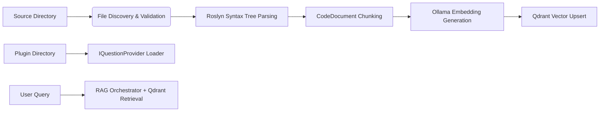

### <span style="color:darkblue;">[General]</span> Can you create a Readme.md file designed to be used with GitHub?
> **Date Generated**: 8/16/2026 4:51:25 PM
> ## Question: 
> Can you create a Readme.md file designed to be used with GitHub?
> **Method Call Duration**: 13:27
 ## Response: 
# 🚀 RAG Code Embedding & Query Pipeline

A high-performance .NET pipeline for parsing, chunking, and embedding C# source code into vector stores using local LLMs (Ollama) and Qdrant. Designed for AI-assisted code analysis, refactoring suggestions, and intelligent querying with a rich console UI and plugin architecture.

---

## ✨ Key Features
- 🔍 **Roslyn-Powered Parsing**: Automatically extracts classes, methods, and documentation comments from C# syntax trees.
- 🧠 **Local Embedding Generation**: Integrates seamlessly with Ollama for fast, privacy-friendly vector embeddings.
- 🔎 **Vector Storage & Retrieval**: Upserts code chunks into Qdrant with payload metadata (filename, category, element type).
- ⚡ **Batch Processing & Progress Tracking**: Real-time console progress bars via Spectre.Console with resilient HTTP clients.
- 🔌 **Plugin Architecture**: Dynamically loads custom `IQuestionProvider` plugins from a designated directory.
- ✅ **Configuration Validation**: Strongly-typed options binding with DataAnnotations validation on startup.
- 🧪 **Comprehensive Testing**: xUnit test coverage for extensions, parsers, utilities, and DI setup.

---

## 🏗️ Architecture Overview


---

## 📋 Prerequisites
- [.NET 8+ SDK](https://dotnet.microsoft.com/download)
- [Ollama](https://ollama.ai/) (running locally or accessible remotely)
- [Qdrant](https://qdrant.tech/) (vector database service)
- Git

---

## ⚙️ Setup & Configuration

### 1. Clone & Restore
```bash
git clone <repository-url>
cd <project-directory>
dotnet restore
```

### 2. Configure `appsettings.json`
The pipeline expects the following configuration structure:
```json
{
  "ApplicationOptions": {
    "SourceDirectory": "./src"
  },
  "EmbeddingOptions": {
    "EmbeddingModel": "nomic-embed-text"
  },
  "OllamaOptions": {
    "Host": "http://localhost",
    "Port": 11434,
    "Timeout": "00:20:00"
  },
  "FileLoadOptions": {
    // File extension filters & exclusion patterns
  }
}
```

### 3. Dependency Injection Setup
All services are registered via `RagPipelineHostBuilder` and `EmbeddingSetupExtension`:
- `IGeneratorService`, `IEmbeddingPipeline`, `IVectorStoreRepository`
- `OllamaApiClient` with resilience handlers (retry, circuit breaker)
- `QdrantClient` bound to configuration
- Plugin loader for custom question providers

---

## ▶️ Usage

### Run the Pipeline
```bash
dotnet run
```
The application will:
1. Discover files in `SourceDirectory`
2. Parse C# syntax trees into `CodeDocument` chunks
3. Generate embeddings via Ollama
4. Upsert vectors to Qdrant with progress tracking
5. Load and register question plugins

### Console UI
Rich output is handled by `AnsiConsoleOutputWriter` and custom `Styles`:
- Progress bars for file processing & embedding
- Styled markup for warnings, errors, and status updates
- Automatic cleanup on completion

---

# 🔌 Plugin Development

Custom questions can be loaded dynamically at runtime. Place compiled DLLs in:
```
<app-base-dir>/Questions/Plugins/*.dll
```

Each plugin must expose a public, parameterless class implementing `IQuestionProvider`:
```csharp
public class MyCustomQuestionProvider : IQuestionProvider
{
    // Implement required interface members
}
```

The pipeline automatically discovers and registers these via reflection during startup.

---

## 🧪 Testing

Run the full test suite:
```bash
dotnet test
```

Covers:
- `ChunkBySyntaxTree` parsing & category inference
- String/Path extensions (`CharacterCount`, `IsExcluded`)
- Question factory validation & filtering
- Configuration binding & directory expansion
- Console style definitions

---

## 🤝 Contributing

1. Fork the repository
2. Create a feature branch (`git checkout -b feature/amazing-feature`)
3. Commit changes (`git commit -m 'feat: add amazing feature'`)
4. Push to the branch (`git push origin feature/amazing-feature`)
5. Open a Pull Request

Please ensure all tests pass and follow existing coding conventions (async/await, pattern matching, extension methods).

---

## 📄 License

This project is licensed under the [MIT License](LICENSE). See `LICENSE` for details.

---

> 💡 **Tip**: Ensure Ollama has your chosen embedding model pulled (`ollama pull nomic-embed-text`) before running the pipeline to avoid timeout exceptions.
