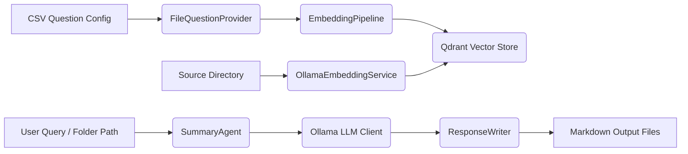

### <span style="color:darkblue;">[General]</span> Can you create a Readme.md file designed to be used with GitHub?
> **Date Generated**: 8/24/2026 2:33:36 PM
> ## Question: 
> Can you create a Readme.md file designed to be used with GitHub?
> **Method Call Duration**: 17:57
 ## Response: 
# 🛡️ Ragnar: Repository Augmented Generator & Resolver
> Smart, recursive code reasoning — from query to solution.

[](https://dotnet.microsoft.com/)
[](https://learn.microsoft.com/en-us/dotnet/csharp/whats-new/csharp-14)
[](LICENSE)
[](https://xunit.net/)

---

## 📖 Overview
**Ragnar** is a modern, AI-driven code analysis and reasoning engine built for **.NET 10 & C# 14**. It leverages vector embeddings, local LLM inference (Ollama), and advanced source-code parsing to ingest repositories, answer contextual queries, and generate structured markdown responses. Designed for developers who want recursive, context-aware code intelligence without cloud dependencies.

---

## ✨ Key Features
- 🔍 **Vector-Based Code Indexing**: Embeds & stores source code in a local Qdrant vector database for semantic retrieval.
- 🤖 **Local LLM Integration**: Fully compatible with Ollama; supports custom embedding models (`nomic-embed-text`) and LLM inference (`qwen3.6`/`qwen3.8:27b`).
- 📄 **CSV-Driven Question Engine**: Loads & maps test/query configurations from CSV files using `CsvHelper`.
- 🧹 **XML Comment Filtering**: Intelligent strategies to isolate, filter, and process XML documentation comments.
- 📝 **Structured Markdown Output**: Generates timestamped, category-tagged response files with metadata headers.
- 🎨 **Rich Console UI**: Branded terminal output & progress indicators via `Spectre.Console`.
- 📊 **Production Logging**: Serilog pipeline with rolling file & Seq sink support.
- 🧪 **Comprehensive Testing**: xUnit v3, FluentAssertions, and Moq coverage across factories, parsers, and writers.

---

## 🏗️ Architecture & Workflow


1. **Ingestion**: Source files are filtered, parsed, and embedded via `OllamaEmbeddingService`.
2. **Storage**: Vectors are persisted in Qdrant using `VectorStoreBuilder`.
3. **Querying**: `SummaryAgent` retrieves context, invokes LLM functions, and applies retry policies (`Polly`).
4. **Output**: `ResponseWriter` formats results into timestamped markdown files categorized by question type.

---

## ⚙️ Prerequisites
- [.NET 10 SDK](https://dotnet.microsoft.com/download/dotnet/10.0) or later
- [Ollama](https://ollama.ai/) (running locally or accessible via network)
- [Qdrant Vector Database](https://qdrant.tech/) (local instance recommended)
- Visual Studio 2026+ (recommended for C# 14 features: extension members, type extensions, lambda modifiers)

---

## 🚀 Installation & Setup
```bash
# Clone the repository
git clone https://github.com/JonPahl/RAGNAR.git
cd RAGNAR

# Restore dependencies
dotnet restore

# Build the solution
dotnet build --configuration Release

# Run the application
dotnet run --project Ragnar.Core
```

---

## 🔧 Configuration
Ragnar uses a `RagnarConfig.json` file for runtime settings. Key sections include:

```json
{
  "RagnarConfig": {
    "ApplicationOptions": {
      "SourceDirectory": "%USERPROFILE%\\source\\Ragnar\\",
      "VectorStoreName": "programming_docs"
    },
    "EmbeddingOptions": {
      "Timeout": "00:05:00",
      "Host": "localhost",
      "Port": 6334,
      "EmbeddingModel": "nomic-embed-text",
      "Dimension": 768
    },
    "OllamaOptions": {
      "Timeout": "00:20:00",
      "LlmModel": "qwen3.6",
      "Port": 11434,
      "Host": "localhost"
    },
    "FileLoadOptions": {
      "AllowedFileExtensions": [ ".editorconfig", ".cs", ".json" ],
      "ExcludedFiles": [ "docker-compose.yml" ]
    }
  },
  "Serilog": {
    "Using": ["Serilog.Sinks.File", "Serilog.Sinks.Seq"],
    "MinimumLevel": { "Default": "Information" },
    "WriteTo": [
      { "Name": "Seq", "Args": { "serverUrl": "http://localhost:5341" } },
      { "Name": "File", "Args": { "path": "logs/log-.txt", "rollingInterval": "Day" } }
    ]
  }
}
```

---

## 💻 Usage Examples
### Generate Embeddings & Populate Vector Store
```csharp
var pipeline = new EmbeddingPipeline(logger, embedPipeline, writer, configWrapper, qdrantClient);
await pipeline.EnsureCollectionExistsAsync(ct);
await pipeline.PopulateAsync(ct);
```

### Query Directory with AI Agent
```csharp
var agent = new SummaryAgent(clientFactory, ollamaProvider, summaryPrompt);
string summary = await agent.SummarizeContent("/path/to/source", "What are the main architectural patterns?", ct);
```

### Write Structured Response
```csharp
var writer = new ResponseWriter(configWrapper);
SaveDetails details = new(question, responseText, duration);
string outputPath = await writer.WriteResponseAsync(details, ct);
```

---

## 🧪 Testing
Run the full test suite using xUnit v3:
```bash
dotnet test --filter "FullyQualifiedName~Ragnar.UnitTests"
```
- **Factories**: `DefaultQuestionFactoryTests` validates active/inactive question creation & edge cases.
- **Extensions**: `StaticExtensionsTests`, `StringExtensionsTests`, `SavePathExtensionsTests` verify utility methods.
- **Parsers/Writers**: `FileParseFactoryTests` & `ResponseWriterTests` ensure file routing & markdown formatting.

---

## 📦 Core Dependencies
| Package | Purpose |
|---------|---------|
| `Microsoft.Extensions.AI` + `Ollama` | LLM client abstraction & local inference |
| `Qdrant.Client` | Vector database storage & retrieval |
| `CsvHelper` | CSV question/configuration mapping |
| `Serilog` + `Serilog.Sinks.Seq/File` | Structured logging pipeline |
| `Spectre.Console` | Terminal UI & progress rendering |
| `Polly` | Resilience & retry policies for LLM calls |
| `FluentAssertions` + `Moq` | Unit testing framework & mocking |

---

## 📜 License
This project is licensed under the [MIT License](LICENSE). See the license file for details.

---

## 🤝 Contributing
Contributions are welcome! Please ensure:
- Code follows C# 14 conventions (extension members, pattern matching, etc.)
- New features include xUnit v3 test coverage
- Configuration changes are documented in `RagnarConfig.json` schema

---

> 💡 *Built for developers who want local, recursive code intelligence without vendor lock-in.*  
> 🐙 [View Repository](https://github.com/JonPahl/RAGNAR) | 📖 [Documentation](docs/) | 🐛 [Issues](https://github.com/JonPahl/RAGNAR/issues)
