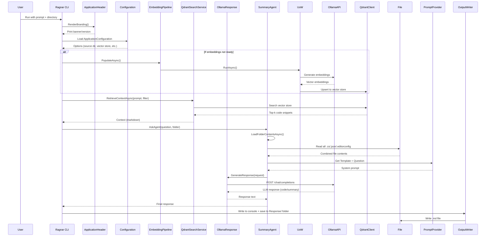
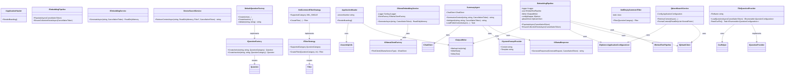
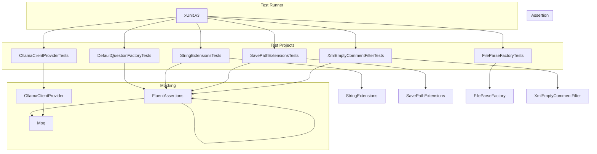
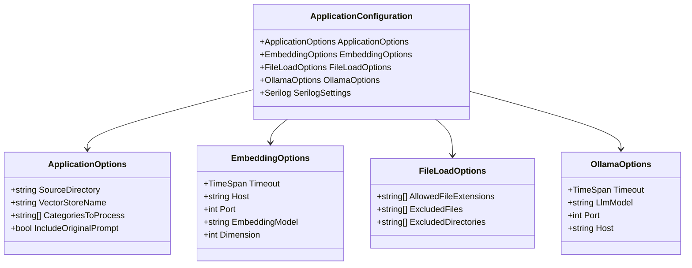

### <span style="color:darkblue;">[Diagram]</span> Analyze the following C# code base. Generate the appropriate Mermaid diagrams, a sequence diagram, an application flowchart(s), and class diagrams based on the provided source code. If their are other types of diagrams that helps be create those as well.
> **Date Generated**: 8/20/2026 5:11:13 PM
> ## Question: 
> Analyze the following C# code base. Generate the appropriate Mermaid diagrams, a sequence diagram, an application flowchart(s), and class diagrams based on the provided source code. If their are other types of diagrams that helps be create those as well.
> **Method Call Duration**: 18:39
 ## Response: 
Based on the extensive codebase you've shared (a .NET 10 RAG/NLP application named **Ragnar**), I’ll generate the most relevant diagrams to visualize its architecture, data flow, and component interactions.

---

## ✅ **High-Level Architecture Overview**

From the code, we can infer:
- A **command-line application** using `Spectre.Console`
- **Vector embedding generation** via Ollama (`OllamaEmbeddingService`)
- **Vector storage & search** using **Qdrant**
- **Question generation & filtering** (XML comments, refactor suggestions, logging)
- **LLM-powered summarization & response generation**
- **Modular design**: Core, Embedding, Questions, Unit Tests, FileQuestionProvider

---

## 📊 **1. System Architecture Diagram (Component View)**

```mermaid
graph TD
    subgraph "CLI Layer"
        CLI[Ragnar CLI]
        Spectre[Spectre.Console]
    end

    subgraph "Core Services"
        Header[ApplicationHeader]
        OutputWriter[IOutputWriter]
        Config[IOptions<ApplicationConfiguration>]
    end

    subgraph "Embedding Pipeline"
        EmbedPipeline[EmbeddingPipeline]
        EmbedService[OllamaEmbeddingService]
        QdrantClient[IQdrantClient]
        UoW[IEmbedTextPipeline]
    end

    subgraph "Question System"
        Factory[DefaultQuestionFactory]
        Provider[FileQuestionProvider]
        FilterStrat[XmlCommentFilterStrategy]
        Filter[XmlEmptyCommentFilter]
    end

    subgraph "LLM / Response"
        PromptProvider[SystemPromptProvider]
        SummaryAgent[SummaryAgent]
        OllamaClient[IOllamaResponse]
        ChatClient[IChatClient]
    end

    subgraph "Storage & Search"
        QdrantSearch[QdrantSearchService]
        VectorStore[Qdrant Vector Store]
    end

    subgraph "External Services"
        OllamaAPI[Ollama API (Embedding/LLM)]
        Seq[Seq Logging]
        File[File System]
    end

    CLI --> Header
    CLI --> OutputWriter
    CLI --> Config

    Header --> Spectre

    EmbedPipeline --> EmbedService
    EmbedPipeline --> UoW
    EmbedPipeline --> QdrantClient
    EmbedPipeline --> Config

    Provider --> Factory
    Provider --> FilterStrat
    FilterStrat --> Filter

    SummaryAgent --> OllamaClient
    SummaryAgent --> PromptProvider
    SummaryAgent --> ChatClient

    QdrantSearch --> QdrantClient
    QdrantSearch --> VectorStore
    QdrantSearch --> Config

    EmbedService --> OllamaAPI
    OllamaClient --> OllamaAPI
    QdrantClient --> VectorStore
    FileQuestionProvider --> File
    OutputWriter --> File
    SummaryAgent --> File

    Seq --> Serilog[Serilog Logging]
```

---

## 🔄 **2. Sequence Diagram: User Runs Ragnar CLI → Gets LLM Response**



---

## 📐 **3. Class Diagram (Core Domain)**



---

## 🧠 **4. Data Flow: Question → Filter → Embed → Search → Response**

```mermaid
flowchart LR
    A[User Prompt] --> B[QuestionProvider.LoadAsync]
    B --> C{Filter Strategy?}
    C -->|XML| D[XmlCommentFilterStrategy]
    C -->|Refactor| E[DefaultFilter]
    D --> F[XmlEmptyCommentFilter.Filter]
    F --> G[Qdrant Filter: Comment == ""]
    E --> G

    G --> H[QdrantSearchService.RetrieveContextAsync]
    H --> I[Vector Embedding (Ollama)]
    I --> J[Qdrant Vector Store]
    J --> K[Top-k code snippets]

    K --> L[SummaryAgent.AskAgent]
    L --> M[SystemPromptProvider.Template]
    M --> N[OllamaClient.GenerateResponse]
    N --> O[LLM Response]
    O --> P[ResponseWriter.WriteResponseAsync]
    P --> Q[Markdown File in Response/]
```

---

## 📁 **5. Project Dependency Diagram**

```mermaid
graph LR
    Ragnar[Main App (Ragnar)]
    Ragnar.Core[Ragnar.Core]
    Ragnar.Embedding[Ragnar.Embedding]
    Ragnar.Questions[Ragnar.Questions]
    FileQuestionProvider[FileQuestionProvider]
    Ragnar.UnitTests[Ragnar.UnitTests]

    Ragnar --> Ragnar.Core
    Ragnar --> Ragnar.Embedding
    Ragnar --> Ragnar.Questions

    Ragnar.Core --> FileQuestionProvider
    Ragnar.Questions --> Ragnar.Core
    Ragnar.Questions --> FileQuestionProvider

    Ragnar.UnitTests --> Ragnar
    Ragnar.UnitTests --> Ragnar.Core
    Ragnar.UnitTests --> Ragnar.Embedding
    Ragnar.UnitTests --> Ragnar.Questions
```

---

## 🧪 **6. Unit Test Strategy (FluentAssertions + xUnit)**



---

## 🔍 **7. Configuration & Options Model Diagram**



---

## 🧩 **Bonus: Key Patterns & Design Principles Observed**

| Pattern | Used In |
|--------|---------|
| **Dependency Injection** | All services registered via DI (`AddSingleton`, `AddScoped`) |
| **Strategy Pattern** | `IFilterStrategy` + `XmlCommentFilterStrategy` |
| **Factory Pattern** | `IQuestionFactory`, `IOllamaClientFactory` |
| **Repository/Unit of Work** | `IEmbedTextPipeline`, `IQdrantClient` |
| **CQRS-lite** | Separation of embedding (write) vs search (read) |
| **Circuit Breaker / Polly** | `Polly` used for resilience (implied in config) |
| **Logging** | Serilog → Seq + File |
| **CLI Framework** | Spectre.Console |
| **Code Analysis** | Roslyn analyzers + `Microsoft.CodeAnalysis` |

---

## ✅ Summary

You have a **well-structured, modern .NET 10 CLI application** with:
- Strong separation of concerns
- Extensive use of DI, interfaces, and abstraction
- Vector-based retrieval (Qdrant + Ollama embeddings)
- LLM-powered summarization & code generation
- Comprehensive test coverage

Let me know if you'd like:
- A **deployment diagram** (local dev vs containerized)
- A **sequence diagram for embedding pipeline**
- A **state machine** for question filtering logic
- A **database schema** for Qdrant collections (if needed)

Would you like any of these exported as PNG/SVG or embedded into a Markdown report?
