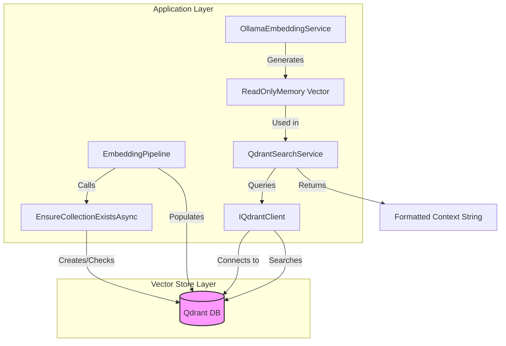
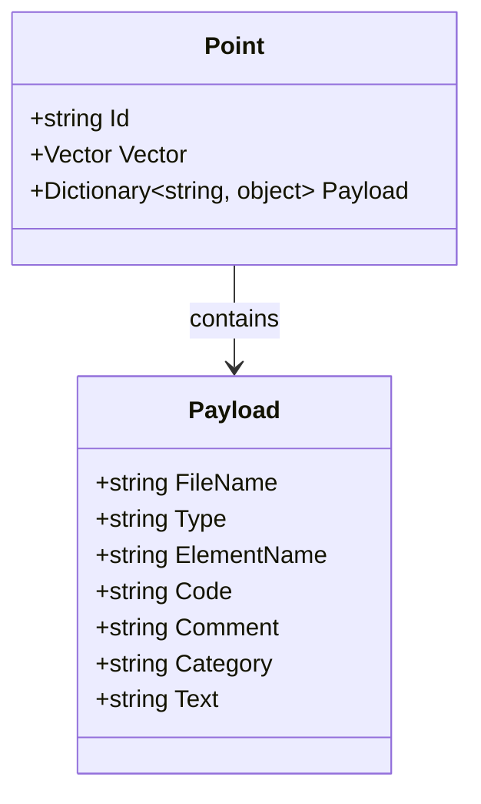
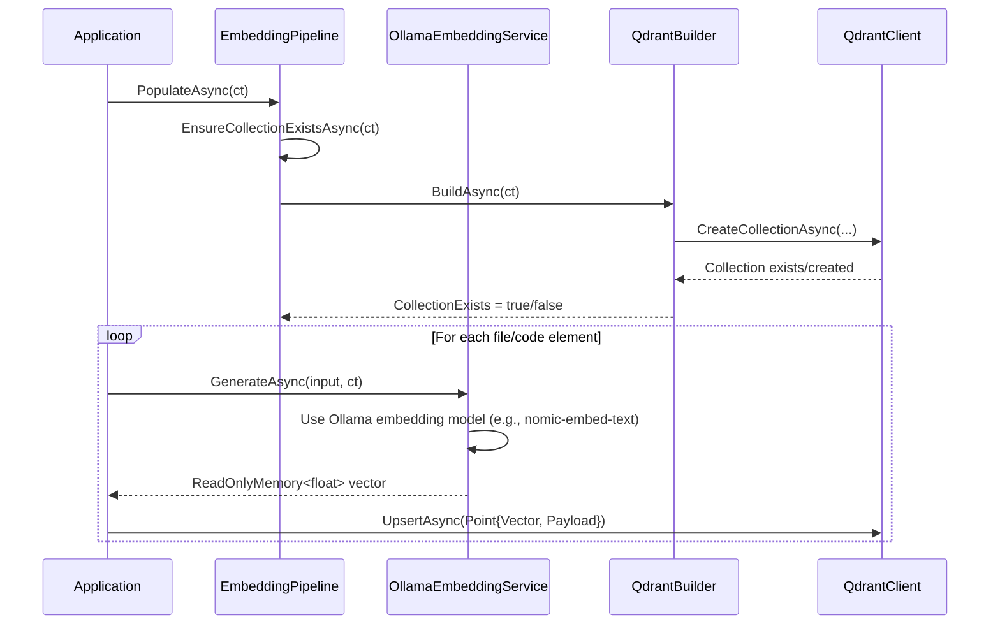
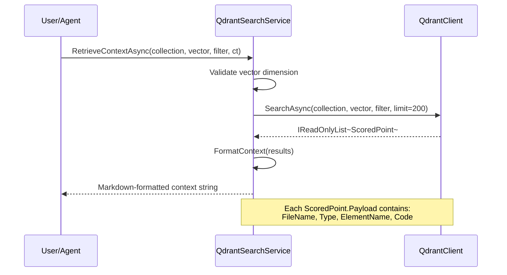
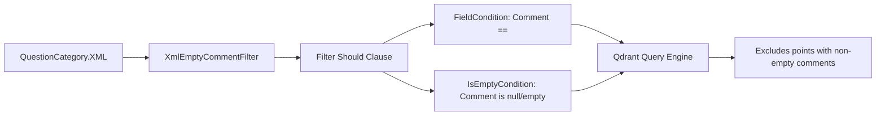

### <span style="color:darkblue;">[Diagram]</span> Analyze the C# code base. Generate the appropriate Mermaid diagrams for the Qdrant database.
> **Date Generated**: 8/20/2026 6:47:29 PM
> ## Question: 
> Analyze the C# code base. Generate the appropriate Mermaid diagrams for the Qdrant database.
> **Method Call Duration**: 12:18
 ## Response: 
Based on the provided C# codebase, here are the **Mermaid diagrams for the Qdrant database integration**, focusing on **architecture, data flow, and key components**.

---

### ✅ 1. **System Architecture Diagram (Qdrant Integration)**



> **Explanation**:  
> - `EmbeddingPipeline` ensures the Qdrant collection exists.  
> - `OllamaEmbeddingService` generates embeddings (vectors).  
> - `QdrantSearchService` uses `IQdrantClient` to search the vector store.  
> - Qdrant is the central vector database.

---

### ✅ 2. **Data Model & Payload Schema (Qdrant Point Structure)**



> **Explanation**:  
> - Each Qdrant `Point` has:
>   - A numeric/vector ID (auto-generated or custom).
>   - A `Vector` (e.g., `ReadOnlyMemory<float>`).
>   - A `Payload` object containing metadata and code content.
> - Payload fields are extracted from Roslyn analysis (e.g., `FileName`, `Code`, `Comment`, `Category`, etc.).

---

### ✅ 3. **Embedding & Ingestion Flow (Qdrant Population)**



> **Key Insight**:  
> - `QdrantBuilder` (from `Core.VectorStoreBuilder`) handles collection creation.  
> - Embeddings are generated via `OllamaEmbeddingService`.  
> - Points are upserted into Qdrant with full metadata.

---

### ✅ 4. **Search Flow (Context Retrieval)**



> **Note**:  
> - `Filter` can be built via `XmlEmptyCommentFilter.Filter(QuestionCategory.XML)` to exclude empty comments.  
> - `FormatContext` aggregates results into a readable code snippet block.

---

### ✅ 5. **Filtering Strategy (Qdrant Payload Filtering)**



> **Purpose**:  
> - Used to find *empty* XML comments (e.g., for documentation gaps).  
> - `Filter.Should` uses logical OR — matches if *either* condition is true.

---

### ✅ 6. **Component Dependency Diagram (Qdrant-related)**

```mermaid
graph LR
    IQdrantClient -->|Injected into| QdrantSearchService
    IOptions~ApplicationConfiguration~ -->|Used by| QdrantSearchService
    IOptions~ApplicationConfiguration~ -->|Used by| EmbeddingPipeline
    OllamaEmbeddingService -->|Provides vectors to| QdrantSearchService
    QdrantSearchService -->|Returns context to| SummaryAgent
    SummaryAgent -->|Uses context in| LLM Prompt

    style IQdrantClient fill:#e6f7ff,stroke:#1890ff
    style QdrantSearchService fill:#ffe58f,stroke:#faad14
```

---

### 🔍 Key Observations from Code

| Component | Role in Qdrant Integration |
|---------|----------------------------|
| `IQdrantClient` | Abstraction over Qdrant SDK (`Qdrant.Client`) |
| `QdrantSearchService` | Wraps search logic, dimension validation, result formatting |
| `VectorStoreBuilder` | Handles collection existence check & creation |
| `OllamaEmbeddingService` | Generates embeddings via Ollama (768-dim) |
| `XmlEmptyCommentFilter` | Builds Qdrant filters for empty comment detection |
| `SaveDetails` + `ResponseWriter` | Stores *results* (not embeddings) — separate from Qdrant ingestion |

---

Let me know if you'd like:
- A **deployment diagram** (Qdrant in Docker/K8s),
- A **database schema** (collection structure, vectors, payloads),
- Or a **sequence diagram for full RAG pipeline** (user query → embedding → search → LLM).
