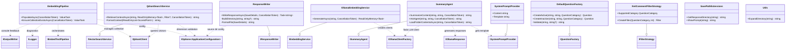
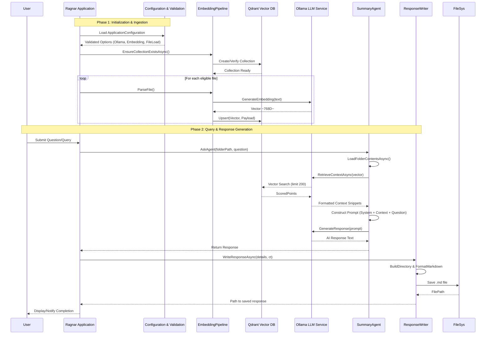
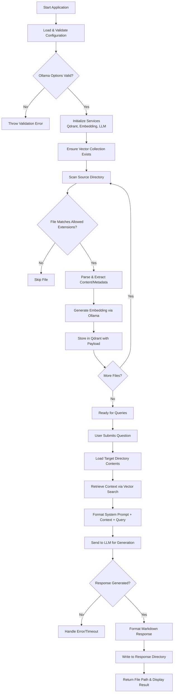
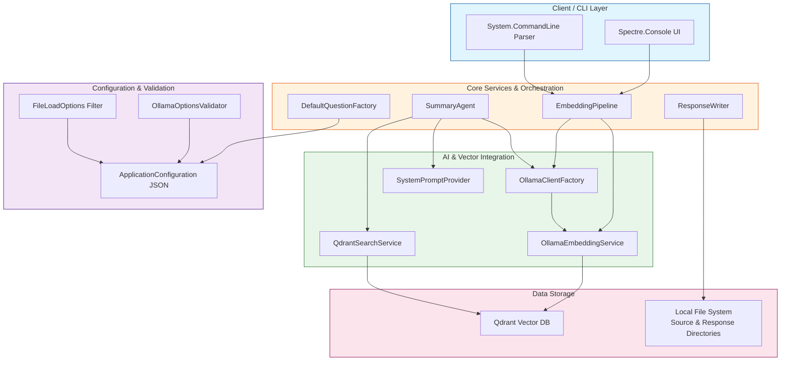

### [Diagram] Analyze the following C# code base. Generate the appropriate Mermaid diagrams, a sequence diagram, an application flowchart(s), and class diagrams based on the provided source code. If their are other types of diagrams that helps be create those as well.
> **Date Generated**: 8/20/2026 9:53:55 AM
> ## Question: 
> Analyze the following C# code base. Generate the appropriate Mermaid diagrams, a sequence diagram, an application flowchart(s), and class diagrams based on the provided source code. If their are other types of diagrams that helps be create those as well.
> **Method Call Duration**: 25:57
 ## Response: 
Based on the provided C# source code, configuration files, and dependency metadata for the **Ragnar** project (a .NET 10 RAG pipeline targeting Ollama & Qdrant), here are the requested diagrams. Each is written in valid Mermaid syntax and can be rendered in GitHub, Obsidian, VS Code, or [Mermaid Live Editor](https://mermaid.live).

---
### 📐 1. Class Diagram
Captures core domain classes, interfaces, and dependency relationships derived from constructors and inheritance.

---
### 🔗 2. Sequence Diagram
Illustrates the runtime lifecycle: **Initialization & Ingestion** → **Query & Response Generation**.

---
### 🔄 3. Application Flowchart
High-level process flow covering configuration, vector ingestion, and query handling.

---
### 🏗️ 4. Architecture / Component Diagram
Shows layer separation, dependency injection boundaries, and data flow paths.

---
### 📌 How to Use These Diagrams
1. **Render Locally**: Paste any code block into [Mermaid Live Editor](https://mermaid.live), VS Code with the `Markdown Preview Mermaid Support` extension, or Obsidian (`![[diagram.mmd]]`).
2. **Key Insights from Analysis**:
   - The app follows a **pipeline architecture** heavily reliant on constructor injection and interface segregation.
   - Vector ingestion is decoupled from query handling via `OllamaEmbeddingService` → `QdrantSearchService`.
   - Configuration is strongly typed (`ApplicationConfiguration`, `OllamaOptions`) with runtime validation (`FluentValidation`).
   - File I/O and path resolution are abstracted into extension methods (`SavePathExtensions`, `Utils`) for testability.
3. **Testing Coverage**: The codebase includes xUnit tests (`DefaultQuestionFactoryTests`, `SavePathExtensionsTests`, `OllamaClientProviderTests`) that validate factory logic, path resolution, and client instantiation boundaries.

Let me know if you need a C4 model, dependency graph for NuGet packages, or state diagrams for specific agents!
