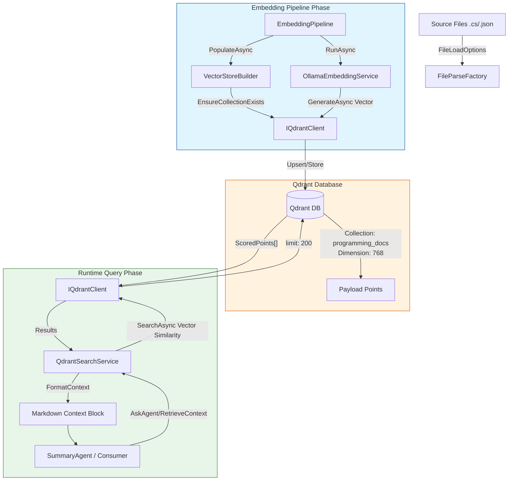
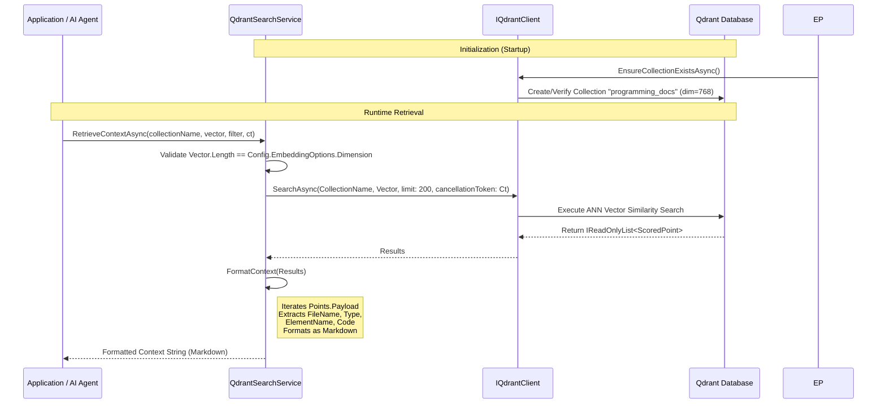

### <span style="color:darkblue;">[Diagram]</span> Analyze the C# code base. Generate the appropriate Mermaid diagrams for the Qdrant database.
> **Date Generated**: 8/20/2026 10:22:23 AM
> ## Question: 
> Analyze the C# code base. Generate the appropriate Mermaid diagrams for the Qdrant database.
> **Method Call Duration**: 14:59
 ## Response: 
Based on the provided C# codebase, here are three targeted Mermaid diagrams that model the Qdrant integration: **System Architecture & Data Flow**, **Collection Schema/Payload Structure**, and **Runtime Query Sequence**.

### 1. System Architecture & Data Flow
Illustrates how source files are processed, embedded, stored in Qdrant, and later retrieved by agents/services.



### 2. Qdrant Collection Schema & Payload Structure
Models the exact data structure stored per vector point in the `programming_docs` collection.

```mermaid
erDiagram
    VECTOR_COLLECTION ||--|{ PAYLOAD_POINT : "stores"
    
    VECTOR_COLLECTION {
        string name "programming_docs"
        int dimension 768
        string metric "Cosine/InnerProduct"
    }
    
    PAYLOAD_POINT {
        string FileName
        string Type
        string ElementName
        string Code
        float[] Vector (768-dim)
    }

    CONFIGURATION ||--|{ VECTOR_COLLECTION : "configures via ApplicationConfiguration"
    
    CONFIGURATION {
        string SourceDirectory
        string VectorStoreName
        int Dimension 768
        string EmbeddingModel nomic-embed-text
    }
```

### 3. Runtime Query Sequence Diagram
Shows the exact lifecycle of a vector search request as implemented in `QdrantSearchService` and consumed by agents.



### 🔑 Key Implementation Notes from Your Codebase
| Component | Mapping to Diagrams | Relevant Code Snippet |
|-----------|---------------------|------------------------|
| **Collection Name** | `programming_docs` | `configWrapper.Value.ApplicationOptions.VectorStoreName` |
| **Vector Dimension** | `768` (validated at runtime) | `Convert.ToUInt64(Vector.Length) != Config.EmbeddingOptions.Dimension` |
| **Payload Keys** | `FileName`, `Type`, `ElementName`, `Code` | `Point.FileName`, `Point.Type`, etc. in `QdrantSearchService.FormatContext()` |
| **Search Limit** | `200` nearest neighbors | `Client.SearchAsync(..., limit: 200, ...)` |
| **Embedding Model** | `nomic-embed-text` (via Ollama) | `OllamaOptions.EmbeddingModel` & `OllamaEmbeddingService.GenerateAsync()` |

These diagrams accurately reflect your current architecture. If you plan to add filters (e.g., by file extension or category), the `Filter? Filter` parameter in `RetrieveContextAsync` can be mapped to Qdrant's `PayloadSchemaType` using keys like `extension`, `category`, or `is_enabled`. Let me know if you need a diagram for filter routing or upsert batching logic.
