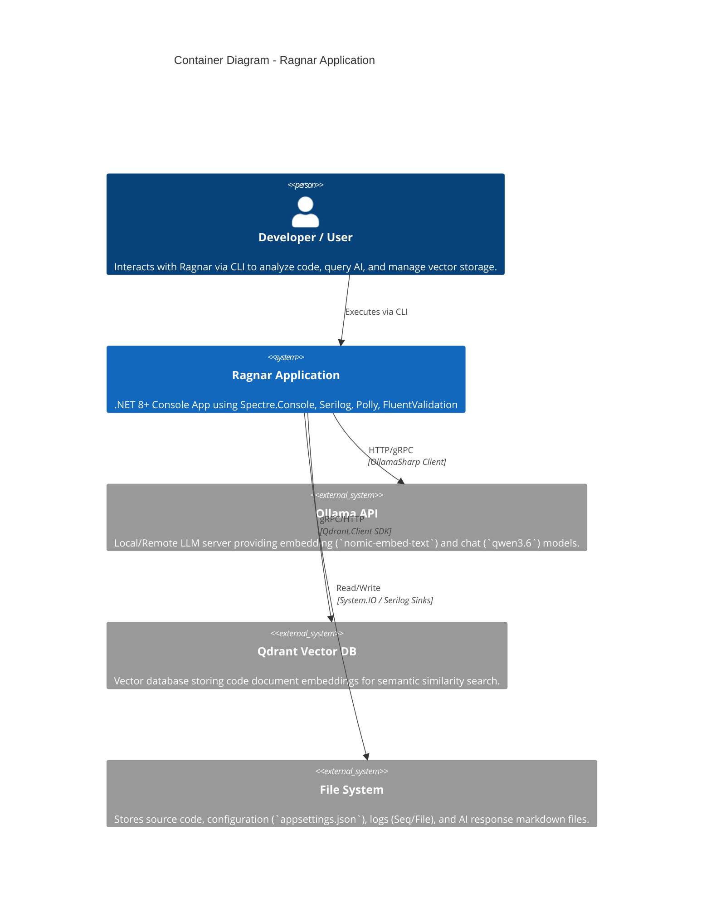
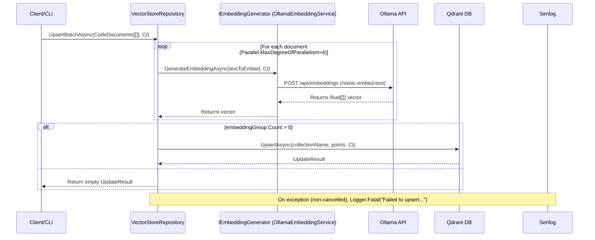
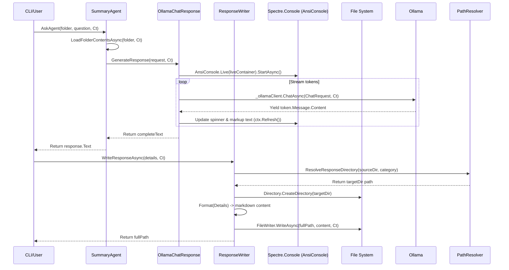
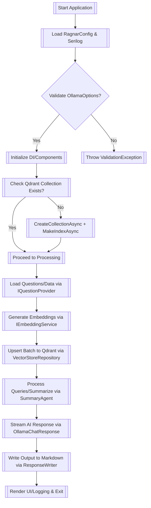

### <span style="color:darkblue;">[Diagram]</span> Analyze the following C# code base. Generate the appropriate Mermaid diagrams, a sequence diagram, an application flowchart(s), and class diagrams based on the provided source code. Please also create valid mermaid C4 Diagrams If their are other Mermaid diagrams that would help to understand the provided code base.
> **Date Generated**: 8/30/2026 1:42:54 AM
> ## Question: 
> Analyze the following C# code base. Generate the appropriate Mermaid diagrams, a sequence diagram, an application flowchart(s), and class diagrams based on the provided source code. Please also create valid mermaid C4 Diagrams If their are other Mermaid diagrams that would help to understand the provided code base.
> **Method Call Duration**: 14:14
 ## Response: 
Based on the provided C# source code, here is a comprehensive set of Mermaid diagrams and architectural analysis to visualize the **Ragnar** application. The code reveals a modern .NET CLI tool focused on vectorizing codebases, querying local LLMs (Ollama), and persisting AI responses.

### 📊 1. C4 Container Diagram
Shows how Ragnar interacts with external systems and internal boundaries.



---

### 🏗️ 2. Class Diagram
Maps interfaces, implementations, and core dependencies extracted from the snippets.

```mermaid
classDiagram
  %% Interfaces
  interface IQuestionProvider { +LoadQuestionsAsync(string, CancellationToken) IEnumerable~Question~ }
  interface IEmbeddingService { +GenerateAsync(string, CancellationToken) ReadOnlyMemory~float~ }
  interface IPromptProvider { +string Template {get} +string Content {get set} }
  interface IOutputWriter { +Write(Text) +WriteLine() +WriteRule() }
  interface IResponseWriter { +WriteResponseAsync(SaveDetails, CancellationToken) Task~string~ }
  interface IPathResolver { +ResolveResponseDirectory(string, QuestionCategory?) string }
  interface IWriter { +WriteAsync(string, string, CancellationToken) Task }
  interface IFilterStrategy { +QuestionCategory SupportedCategory {get} +Filter CreateFilter(int) Filter }
  interface IOllamaResponse { +GenerateResponse(GenerateRequest, CancellationToken) Task~string~ }

  %% Implementations
  class CsvFileQuestionProvider { +string ProviderName {get} }
  class OllamaEmbeddingService { }
  class SummarizePromptProvider { }
  class ApplicationHeader { +void RenderBranding() }
  class ResponseWriter { }
  class PathResolver { }
  class FileWriter { }
  class XmlCommentFilterStrategy { }
  class OllamaChatResponse { +async Task~string~ GenerateResponse(...) }

  %% Core Services
  class VectorStoreRepository { -IEmbeddingGenerator generator, -IQdrantClient qdrantClient, -ILogger logger }
  class SummaryAgent { -IChatClient agent, -IOllamaResponse ollamaProvider, -IPromptProvider summaryPrompt }
  class VectorStoreBuilder { +BuildAsync() +ExistsAsync() +CreateAsync() +MakeIndexAsync() }

  %% Config & Utils
  class RagnarConfig { ApplicationOptions, EmbeddingOptions, FileLoadOptions, OllamaOptions }
  class OllamaOptionsValidator { +OllamaOptionsValidator() }
  class Utils { +static string ExpandDirectory(this string) }
  class StopwatchExtensions { +static string ElapsedTimeString(this Stopwatch) }
  class AssemblyExtensions { +static string? InformationalVersion(this Assembly) }
  class StylesExtensions { +static Style EnsureValidStyle(this Style?) }

  %% Relationships
  IQuestionProvider <|-- CsvFileQuestionProvider
  IEmbeddingService <|-- OllamaEmbeddingService
  IPromptProvider <|-- SummarizePromptProvider
  IOutputWriter <|-- ApplicationHeader
  IResponseWriter <|-- ResponseWriter
  IPathResolver <|-- PathResolver
  IWriter <|-- FileWriter
  IFilterStrategy <|-- XmlCommentFilterStrategy
  IOllamaResponse <|-- OllamaChatResponse

  VectorStoreRepository --> IEmbeddingGenerator : uses
  VectorStoreRepository --> IQdrantClient : uses
  SummaryAgent --> IOllamaResponse : uses
  SummaryAgent --> IPromptProvider : uses
  ResponseWriter --> IOptions~RagnarConfig~ : reads
  ResponseWriter --> IOutputFormatter : uses
  ResponseWriter --> IPathResolver : uses
  ResponseWriter --> IWriter : uses
  VectorStoreBuilder --> IQdrantClient : manages
```

---

### 🔁 3. Sequence Diagrams

#### A. Code Document Upsert & Embedding Flow
Illustrates how code is processed, embedded via Ollama, and persisted to Qdrant.



#### B. AI Query & Response Generation Flow
Shows `SummaryAgent` orchestrating folder reading, LLM streaming, and file persistence.



---

### 🗺️ 4. Application Flowchart
Startup and core processing pipeline.



---

### 🧩 5. Component / Dependency Diagram
Visualizes architectural layers and cross-cutting concerns.

```mermaid
componentDiagram
  [[CLI / UI Layer]]:::layer1
    [[ApplicationHeader]]
    [[StylesExtensions]]
    [[TextWriterWindow]]
  [[Core Orchestration]]:::layer2
    [[SummaryAgent]]
    [[VectorStoreRepository]]
    [[VectorStoreBuilder]]
  [[Service Implementations]]:::layer3
    [[OllamaChatResponse]]
    [[OllamaEmbeddingService]]
    [[CsvFileQuestionProvider]]
    [[SummarizePromptProvider]]
    [[XmlCommentFilterStrategy]]
  [[Infrastructure & Utilities]]:::layer4
    [[ResponseWriter]]
    [[PathResolver]]
    [[FileWriter]]
    [[Utils]]
    [[StopwatchExtensions]]
    [[AssemblyExtensions]]
  [[Configuration & Validation]]:::layer5
    [[RagnarConfig]]
    [[OllamaOptionsValidator]]

  style layer1 fill:#e1f5fe,stroke:#01579b
  style layer2 fill:#fff3e0,stroke:#e65100
  style layer3 fill:#e8f5e9,stroke:#2e7d32
  style layer4 fill:#f3e5f5,stroke:#7b1fa2
  style layer5 fill:#fce4ec,stroke:#c2185b
```

---

### 🔍 Architectural Observations & Recommendations

| Area | Observation | Recommendation |
|------|-------------|----------------|
| **Dependency Injection** | Heavy reliance on factory patterns (`IOllamaClientFactory`) and `IOptions<T>` config binding. | Ensure DI container is properly configured in `Program.cs`. Consider using `Microsoft.Extensions.Hosting` for robust lifecycle management. |
| **Concurrency** | `Parallel.ForEachAsync` with `MaxDegreeOfParallelism = 4` in `UpsertBatchAsync`. | Good practice for I/O bound tasks. Monitor Ollama/Qdrant connection pool limits to avoid `SocketException` or rate limiting under heavy load. |
| **Streaming UI** | `OllamaChatResponse` uses `AnsiConsole.Live` with token-by-token updates. | Excellent UX. Ensure terminal supports ANSI escape codes. Consider adding a fallback for non-interactive/pipe environments (`!AnsiConsole.Console.IsInteractive`). |
| **Error Handling** | Polly retry policy in `SummaryAgent.SummarizeContent`. | Effective for transient HTTP failures. Add circuit breaker pattern if Ollama becomes unresponsive to prevent cascade failures. |
| **Storage Abstraction** | `IWriter`, `IPathResolver`, `ResponseWriter` decouple file I/O from business logic. | Highly maintainable. Consider adding an `IDirectoryExistsValidator` abstraction to `Utils.ExpandDirectory()` for testability. |
| **Vector Store Lifecycle** | `VectorStoreBuilder` handles existence checks & index creation. | Ensure idempotency. Qdrant's `CreateCollectionAsync` will throw if collection exists; the builder correctly guards against this. |

These diagrams and analysis provide a clear blueprint of Ragnar's data flow, component boundaries, and operational pipeline. Let me know if you need deep dives into specific modules (e.g., DI configuration, OllamaSharp integration details, or Qdrant payload schema mapping).
