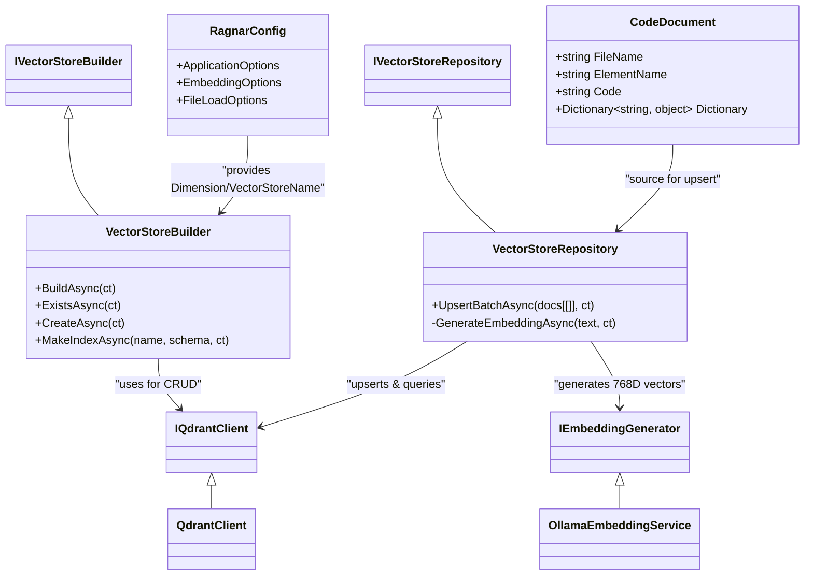

### <span style="color:darkblue;">[Diagram]</span> Analyze the C# code base. Generate the appropriate Mermaid diagrams for the Qdrant database.
> **Date Generated**: 8/29/2026 11:46:30 PM
> ## Question: 
> Analyze the C# code base. Generate the appropriate Mermaid diagrams for the Qdrant database.
> **Method Call Duration**: 07:15
 ## Response: 
Based on the provided C# codebase, here are three targeted Mermaid diagrams that model the Qdrant integration: **Architecture**, **Data Flow**, and **Collection Schema**. Each diagram is derived directly from your class definitions, configuration, and upsert logic.

### 1. Qdrant Integration Architecture
Shows how the application layers interact with the Qdrant client, builder, and repository.



### 2. Data Ingestion & Upsert Flow
Illustrates how source code is transformed into Qdrant points, including parallel embedding generation and payload mapping.

```mermaid
flowchart LR
    A[[Source Files]] --> B(FileLoadOptions & Parser)
    B --> C{CodeDocument[[]]}
    
    C --> D{VectorStoreRepository}
    
    subgraph Embedding Pipeline
        D -->|Parallel Batch| E[[OllamaEmbeddingService]]
        E -->|nomic-embed-text| F[[float[[]] Vector 768D]]
    end
    
    C --> G[[Payload Mapping]]
    G --> H{Payload Dictionary}
    H --> I[["FileName, ElementName, Code, etc."]]
    
    F & I --> J[[UpsertBatchAsync]]
    J --> K[[(Qdrant Collection)]]
    
    style K fill:#e6f3ff,stroke:#0055a4,stroke-width:2px
    style D fill:#fff3cd,stroke:#856404,stroke-width:1.5px
    style E fill:#d4edda,stroke:#155724,stroke-width:1.5px
```

### 3. Qdrant Collection Structure & Indexing Strategy
Models the logical schema of stored points, vector parameters, payload fields, and index creation strategy.

```mermaid
erDiagram
    COLLECTION ||--|{ POINT : contains
    POINT o--|| PAYLOAD : has
    POINT o--|| PAYLOAD_INDEX : indexed_by
    
    COLLECTION {
        string name "VectorStoreName" e.g. "programming_docs"
        int dimension 768
        string distance "Cosine"
        float[[]] vector_schema "Normalized float array"
    }
    
    POINT {
        string id "doc.AsPoint()"
        float[[]] vectors "Embedding vector"
        object payload "Dynamic key-value metadata"
    }
    
    PAYLOAD {
        string FileName "Original file path"
        string ElementName "Code element/method name"
        string Code "Raw source text"
        string Category "Question category"
    }
    
    PAYLOAD_INDEX {
        string index_name "e.g., 'FileName'"
        string schema_type "Keyword | Text | Integer"
        bool is_main_index "true/false"
    }
```

### 🔑 Key Mapping to Your Codebase:
| Diagram Aspect | Code Reference |
|----------------|----------------|
| **Vector Params** | `new VectorParams { Size = Dimension, Distance = Distance.Cosine }` in `CreateAsync()` |
| **Dimension** | `768` from `RagnarConfig.EmbeddingOptions.Dimension` |
| **Payload Structure** | `task.Result.doc.Dictionary` in `UpsertBatchAsync()` |
| **Indexing** | `MakeIndexAsync(string IndexName, PayloadSchemaType SchemaType, ...)` creates payload indexes for faster filtering |
| **Id Generation** | `Id = task.Result.doc.AsPoint()` assigns custom identifiers to points |
| **Parallel Upsert** | `Parallel.ForEachAsync(..., MaxDegreeOfParallelism = 4)` handles batch embedding & insertion |

These diagrams can be rendered in any Mermaid-supported editor (VS Code, Obsidian, GitHub, Draw.io, etc.). Let me know if you need a sequence diagram for query/retrieval flow or a configuration bootstrap diagram!
