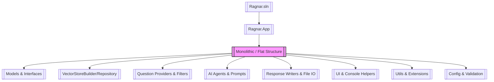
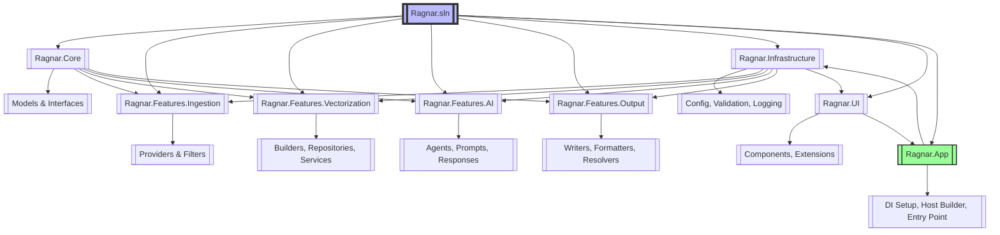

### <span style="color:darkblue;">[General]</span> Can you suggest how to better organize based on features the code into visual studio projects and namespaces? Please generate an updated mermaid Diagrams of the updated code compared to the current implementation. Please provide a step by step guide on migrating each file over to the organization.
> **Date Generated**: 8/30/2026 12:34:39 AM
> ## Question: 
> Can you suggest how to better organize based on features the code into visual studio projects and namespaces? Please generate an updated mermaid Diagrams of the updated code compared to the current implementation. Please provide a step by step guide on migrating each file over to the organization.
> **Method Call Duration**: 10:16
 ## Response: 
Based on the code snippets provided, your application follows a clear domain: **code ingestion → vectorization → AI reasoning → output formatting**. The current structure appears flat or loosely grouped by type, which leads to tight coupling and navigation friction as the codebase grows.

Below is a **Feature-Driven Clean Architecture** layout optimized for Visual Studio, complete with Mermaid diagrams and a step-by-step migration guide.

---
### 📦 Recommended Solution Structure

```
Ragnar.sln
├── Ragnar.Core                  (Domain models, business rules, shared interfaces)
├── Ragnar.Features.Ingestion    (File parsing, CSV/XML strategies, question loading)
├── Ragnar.Features.Vectorization(Embedding generation, Qdrant builders/repositories)
├── Ragnar.Features.AI           (Agents, prompt providers, LLM orchestration)
├── Ragnar.Features.Output       (Response writers, formatters, path resolvers)
├── Ragnar.Infrastructure        (Config validation, Serilog setup, external client adapters)
├── Ragnar.UI                    (Spectre.Console components, branding, live output)
└── Ragnar.App                   (DI registration, Host builder, Program.cs, entry point)
```

**Namespace Convention:** `Ragnar.<Area>.<Subarea>`  
*(e.g., `Ragnar.Features.Vectorization.Repositories`, `Ragnar.UI.Components`)*

---
### 📊 Mermaid Diagrams: Current vs. Proposed

#### 🔹 Current (Flat/Loosely Coupled)


#### 🔹 Proposed (Feature-Driven + Clean Architecture)


---
### 🛠️ Step-by-Step Migration Guide

#### ✅ Phase 1: Pre-Migration Cleanup
Before moving files, fix syntactic/structural issues in the provided snippets:
1. Replace invalid `extension(...)` syntax with proper static class declarations:
   ```csharp
   public static class AssemblyExtensions { ... }
   public static class StylesExtensions { ... }
   ```
2. Ensure all interfaces (`IQuestionProvider`, `IFilterStrategy`, `IEmbeddingService`, `IResponseWriter`, `IPromptProvider`, `IPathResolver`, `IOutputFormatter`) are moved to `Ragnar.Core` first.
3. Move domain models (`Question`, `CodeDocument`, `SaveDetails`, `QuestionRecord`, enums) to `Ragnar.Core.Models`.

#### ✅ Phase 2: Create Projects & Set Dependencies
In Visual Studio:
1. **Add Class Library projects** matching the structure above.
2. **Set up project references** (right-click → Add Project Reference):
   - `Features.*` → depends on `Ragnar.Core`
   - `Infrastructure` → depends on `Ragnar.Core`
   - `UI` → depends on `Ragnar.Core` + add NuGet: `Spectre.Console`
   - `App` → depends on **ALL** other projects
3. **Update `.csproj` files**: Ensure consistent target framework (`net8.0` or your version) and package versions.

#### ✅ Phase 3: Migrate Code by Feature

| Feature Project | Files to Move | New Namespace | Notes |
|----------------|---------------|---------------|-------|
| `Ragnar.Core` | Interfaces, Models, Enums, `QuestionCategory`, `UpdateStatus`, `GenerateRequest` | `Ragnar.Core.*` | Keep thin. No external dependencies. |
| `Ragnar.Features.Ingestion` | `CsvFileQuestionProvider`, `XmlCommentFilterStrategy`, `IFilterStrategy` impl | `Ragnar.Features.Ingestion.Providers`<br>`Ragnar.Features.Ingestion.Filters` | Depends on Core. |
| `Ragnar.Features.Vectorization` | `VectorStoreBuilder`, `VectorStoreRepository`, `OllamaEmbeddingService` | `Ragnar.Features.Vectorization.Builders`<br>`Ragnar.Features.Vectorization.Repositories`<br>`Ragnar.Features.Vectorization.Services` | Add NuGet: `Qdrant.Client`, `OllamaSharp` |
| `Ragnar.Features.AI` | `SummaryAgent`, `SummarizePromptProvider`, `OllamaChatResponse` (adapted) | `Ragnar.Features.AI.Agents`<br>`Ragnar.Features.AI.Prompts`<br>`Ragnar.Features.AI.Responses` | Depends on Core + Infrastructure adapters |
| `Ragnar.Features.Output` | `ResponseWriter`, `FileWriter`, `PathResolver`, `IOutputFormatter`, `IPathResolver` | `Ragnar.Features.Output.Writers`<br>`Ragnar.Features.Output.Formatters`<br>`Ragnar.Features.PathResolvers` | Depends on Core |
| `Ragnar.Infrastructure` | `OllamaOptionsValidator`, Serilog setup, `RagnarConfig`, DI extensions | `Ragnar.Infrastructure.Configuration`<br>`Ragnar.Infrastructure.Validation`<br>`Ragnar.Infrastructure.Logging` | Add NuGet: `FluentValidation`, `Serilog.*` |
| `Ragnar.UI` | `ApplicationHeader`, `TextWriterWindow`, `StylesExtensions`, `StopwatchExtensions` | `Ragnar.UI.Components`<br>`Ragnar.UI.Extensions` | Depends on Core + Spectre.Console |
| `Ragnar.App` | `Program.cs`, Host builder, DI registration, startup logic | `Ragnar.App` | Orchestrates all projects. No domain logic. |

#### ✅ Phase 4: Update Namespaces & References
1. **Batch replace** old namespaces with new ones (Ctrl+H in VS):
   - `using OldNamespace;` → `using Ragnar.Features.XXX;` etc.
2. Update `public class X : IInterface` implementations to match new namespaces.
3. Fix circular dependencies if any (usually caused by interfaces being defined in feature projects instead of Core).

#### ✅ Phase 5: Refactor Dependency Injection
Move all `IServiceCollection` registrations from the old static/flat DI setup into `Ragnar.App`:
```csharp
// Ragnar.App/DependencyInjection.cs
public static class ServiceCollectionExtensions
{
    public static IServiceCollection AddRagnarServices(this IServiceCollection services, IConfiguration config)
    {
        // Core & Features
        services.AddScoped<IQuestionProvider, CsvFileQuestionProvider>();
        services.AddScoped<IFilterStrategy, XmlCommentFilterStrategy>();
        services.AddScoped<IEmbeddingService, OllamaEmbeddingService>();
        services.AddSingleton<VectorStoreBuilder>();
        services.AddScoped<VectorStoreRepository>();
        services.AddScoped<SummaryAgent>();
        services.AddKeyedSingleton("Summary", typeof(SummarizePromptProvider));
        services.AddScoped<IResponseWriter, ResponseWriter>();
        services.AddScoped<IPathResolver, PathResolver>();

        // Infrastructure
        services.Configure<RagnarConfig>(config.GetSection("RagnarConfig"));
        services.AddValidatorsFromAssemblyContaining<OllamaOptionsValidator>();
        services.AddSerilog();

        // UI
        services.AddSingleton<IOutputWriter, AnsiConsoleOutputWriter>(); // Wrap Spectre.Console

        return services;
    }
}
```

#### ✅ Phase 6: Verify & Rebuild
1. Clean Solution → Rebuild
2. Fix any `CS0246` (type not found) or `CS0122` (accessibility) errors
3. Run unit/integration tests
4. Update `appsettings.json` paths if they changed (e.g., `Response` folder resolution)

---
### 🔍 Critical Notes & Best Practices

1. **Avoid Feature-to-Feature Dependencies**: If `Vectorization` needs something from `Ingestion`, move the shared contract/interface to `Ragnar.Core`. Features should only depend on Core, not each other.
2. **External Client Adapters**: Move Ollama/Qdrant client wrappers into `Ragnar.Infrastructure.Adapters` to keep features framework-agnostic.
3. **Spectre.Console Isolation**: Keep UI logic strictly in `Ragnar.UI`. Pass raw strings/models from features to UI components for rendering.
4. **Configuration Validation**: Use `FluentValidation`'s `IValidator<T>` interface registration pattern rather than manual checks in constructors.
5. **Async/Cancellation Propagation**: Your code already handles `CancellationToken` well. Ensure all new project boundaries pass it down correctly to avoid silent hangs.

This structure scales cleanly, improves testability, and aligns with modern .NET solution patterns. Let me know if you need the exact `.csproj` templates or DI registration snippets for specific projects!
